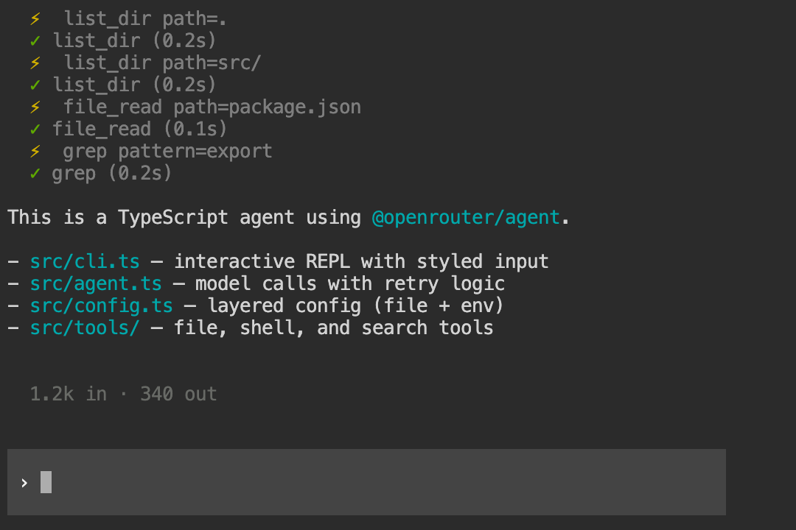
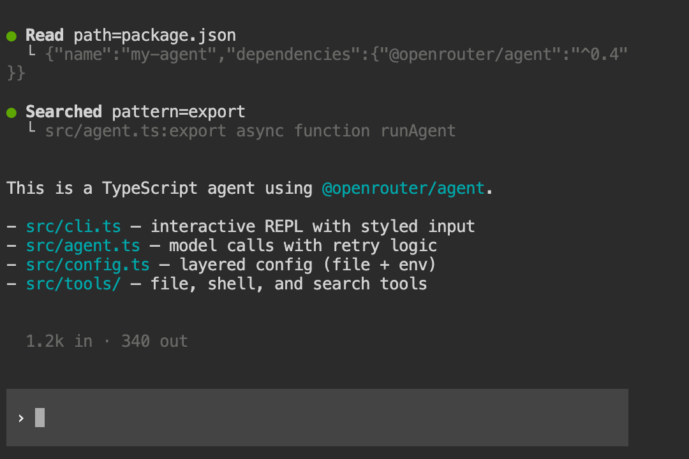
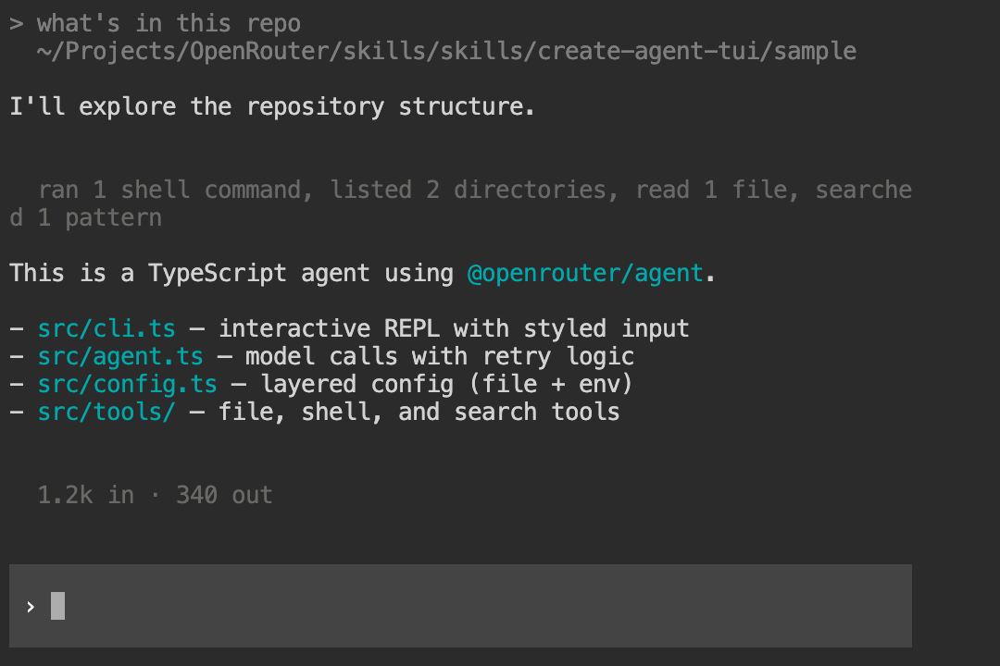
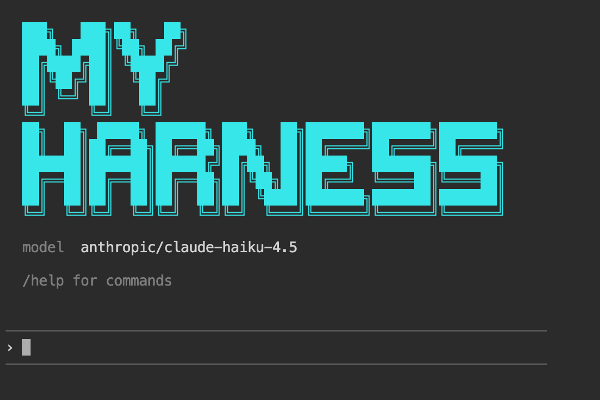
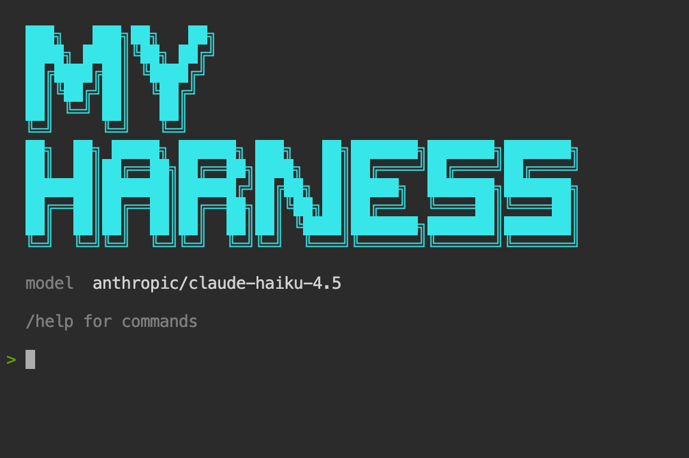

# Create Agent TUI

A skill for AI coding agents (Claude Code, Cursor, etc.) that scaffolds a complete agent TUI in TypeScript — like `create-react-app` but for terminal agents. Tell your coding agent what kind of agent you want, and it generates a runnable project that works with any model and gives you a fully customizable terminal interface, tools, and configuration.


## Quickstart

Install just this skill with the [GitHub CLI](https://cli.github.com/) (v2.90.0+) — works with Claude Code, Cursor, Codex, OpenCode, Gemini CLI, Windsurf, and [many more agents](https://cli.github.com/manual/gh_skill_install):

```bash
gh skill install OpenRouterTeam/skills create-agent-tui
```

Add `--scope user` to install across every project for your current agent, or `--agent claude-code` to target a specific agent.

Or install the full [OpenRouter skills plugin](https://github.com/OpenRouterTeam/skills) in Claude Code:

```
/plugin marketplace add OpenRouterTeam/skills
/plugin install openrouter@openrouter
```

For other install methods (Cursor Rules, OpenCode, etc.) see the [root README](../../README.md#installing).

Then tell your agent to build an agent TUI — it will use this skill automatically.

## What it looks like

Every part of the terminal UI is customizable out of the box.

### Tool display styles

Choose how tool calls appear during agent execution. Set `display.toolDisplay` in your config or pass `--tool-display` at launch:

**Emoji** — per-call markers with tool name, arguments, and timing:



**Grouped** (default) — bold action labels with tree-branch output, consecutive same-type calls merged:



**Minimal** — aggregated one-liner summaries, flushed when text resumes:



**Custom** — describe what you want directly!

There's also a **hidden** mode that suppresses tool output entirely.

### Input styles

Three input styles are available via `display.inputStyle` or `--input`:

| Style | Description |
|-------|-------------|
| **`block`** | Full-width background-colored input box with `›` prompt — adapts to your terminal's color scheme using OSC 11 background detection |
| **`bordered`** | Horizontal `─` lines above and below the input — works on any terminal without background detection |
| **`plain`** | Simple `> ` readline prompt — no raw mode, no escape sequences |

**Block** (default) — full-width background input box that adapts to your terminal theme:


**Bordered** — horizontal line frame that works on any terminal:



**Plain** — simple readline prompt, no escape sequences:



**Custom** — describe what you want directly!

The `block` style automatically detects your terminal's background color and alpha-blends a subtle tint over it, so it looks right on both dark and light themes.

### Loader animations

Three loader styles shown while waiting for the model. Set `display.loader.style` and `display.loader.text`:

**Spinner** (default) — braille dot animation to the left:


**Gradient** — scrolling color shimmer over the text:


**Minimal** — trailing dots:


**Custom** — describe what you want directly!

### ASCII banner

Enable `showBanner` to display a custom ASCII art logo on startup. The skill generates block-letter art for your project name using the `█` character, colored and sized to fit a 60-column terminal. The text-only fallback banner shows your agent name and model in a bordered box.

## When to use this

Building your own agent TUI makes sense when:

- **You want to customize the look** — create a fun UI or a custom one for your project/team!
- **You need custom tools** — your agent interacts with your own APIs, databases, or domain-specific systems that generic agents can't reach
- **You want control over the loop** — you need custom stop conditions, approval flows, cost limits, or model selection logic that hosted agents don't expose
- **You're shipping a product** — the agent is part of your application, not a developer tool, and you need to own the entry point (CLI, API server, embedded)
- **You want to learn** — understanding how agents work at the tool-execution level makes you better at using and debugging them

## Features you can customize

The skill presents an interactive checklist when invoked. You pick what you need:

### Server tools (executed by OpenRouter, zero client code)

| Tool | Default | What it does |
|------|---------|-------------|
| Web Search | on | Real-time web search via `openrouter:web_search` |
| Datetime | on | Current date/time via `openrouter:datetime` |
| Image Generation | off | Generate images via `openrouter:image_generation` |

### User-defined tools (your code, executed locally)

| Tool | Default | What it does |
|------|---------|-------------|
| File Read | on | Read files with offset/limit, detect images |
| File Write | on | Create/overwrite files, auto-create directories |
| File Edit | on | Search-and-replace with diff output |
| Glob/Find | on | Find files by pattern |
| Grep/Search | on | Search file contents by regex |
| Directory List | on | List directory entries |
| Shell/Bash | on | Execute commands with timeout |
| JS REPL | off | Persistent Node.js environment |
| Sub-agent Spawn | off | Delegate tasks to child agents |
| Plan/Todo | off | Track multi-step task progress |
| Request User Input | off | Ask structured questions |
| Web Fetch | off | Fetch and extract text from URLs |
| View Image | off | Read local images as base64 |
| Custom Tool Template | on | Empty skeleton for your domain |

### Harness modules (architectural components)

| Module | Default | What it does |
|--------|---------|-------------|
| Session Persistence | on | JSONL append-only conversation log |
| Context Compaction | off | Summarize old messages when context gets long |
| System Prompt Composition | off | Build instructions from static + dynamic context files |
| Tool Permissions | off | Gate dangerous tools behind user approval |
| Structured Logging | off | Emit events for tool calls, API requests, errors |

## What `@openrouter/agent` handles

The generated TUI doesn't reimplement the agent loop — [`@openrouter/agent`](https://www.npmjs.com/package/@openrouter/agent) handles all of that:

| Concern | How `@openrouter/agent` handles it |
|---------|-------------------------------------|
| **Model calls** | `client.callModel()` — one call, any model on OpenRouter |
| **Tool execution** | Automatic — define tools with `tool()` and Zod schemas, the SDK validates input and calls your `execute` function |
| **Multi-turn** | Automatic — the SDK loops (call model → execute tools → call model) until a stop condition fires |
| **Stop conditions** | `stepCountIs(n)`, `maxCost(amount)`, `hasToolCall(name)`, or custom functions |
| **Streaming** | `result.getTextStream()` for text deltas, `result.getToolCallsStream()` for tool calls |
| **Cost tracking** | `result.getResponse().usage` with input/output token counts |
| **Dynamic parameters** | Model, temperature, and other params can be functions of conversation context |
| **Shared context** | Type-safe shared state across tools via `sharedContextSchema` |
| **Turn lifecycle** | `onTurnStart` / `onTurnEnd` callbacks for logging, compaction triggers, etc. |

The TUI you build provides everything *around* that loop: configuration, tool definitions, session persistence, the entry point (CLI or API server), and any modules you select from the checklist.

## Generated project structure

With all defaults selected, the TUI produces:

```
my-agent/
  package.json              @openrouter/agent, zod, tsx
  tsconfig.json             ES2022, Node16, strict
  .env.example              OPENROUTER_API_KEY=
  src/
    config.ts               Layered config (defaults -> file -> env)
    agent.ts                Core runner with retry
    cli.ts                  Interactive REPL
    session.ts              JSONL conversation persistence
    terminal-bg.ts          Adaptive background detection
    renderer.ts             Tool display renderer
    tools/
      index.ts              Tool registry + server tools
      file-read.ts          Read files
      file-write.ts         Write files
      file-edit.ts          Search-and-replace with diff
      glob.ts               Find files by pattern
      grep.ts               Search content by regex
      list-dir.ts           List directories
      shell.ts              Execute commands
```

## Sample

A complete working TUI with all defaults is in [`sample/`](sample/). It includes a clean terminal UI with streaming output, token counts, and session persistence.

```bash
cd sample
npm install
OPENROUTER_API_KEY=your-key-here npm start
```

Customize at launch:

```bash
npm start -- --banner "Acme Bot" --model anthropic/claude-sonnet-4.6 --input bordered --tool-display emoji
```
