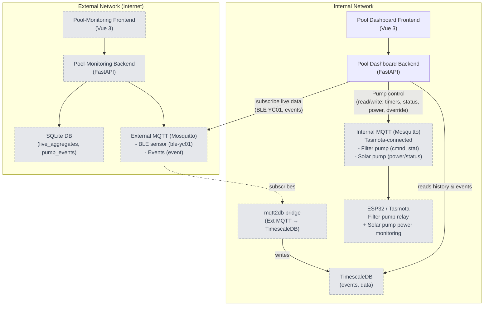
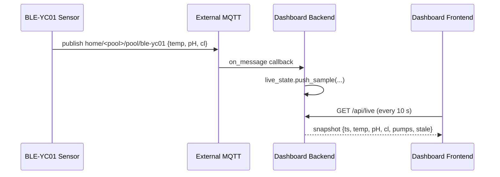
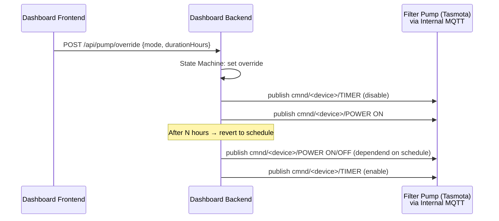
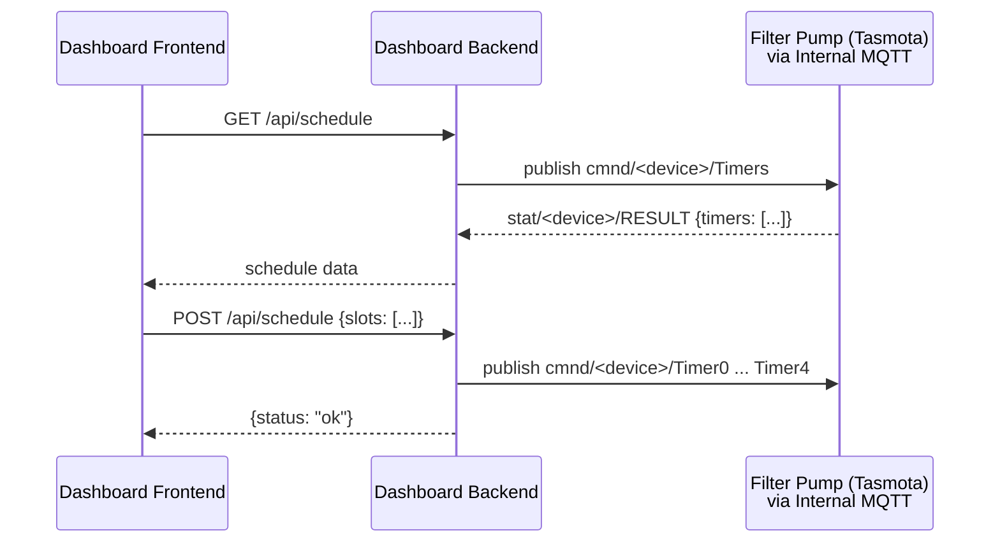
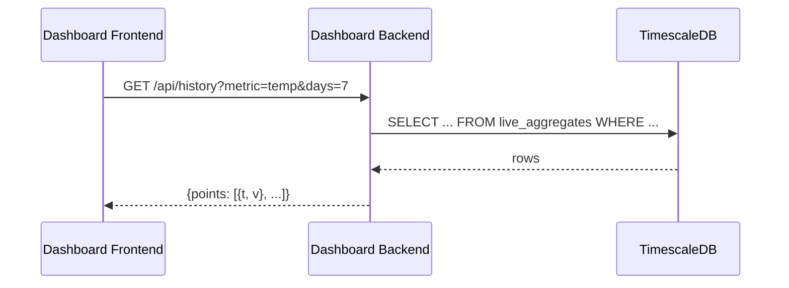
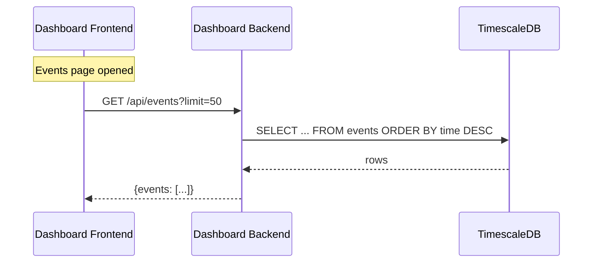
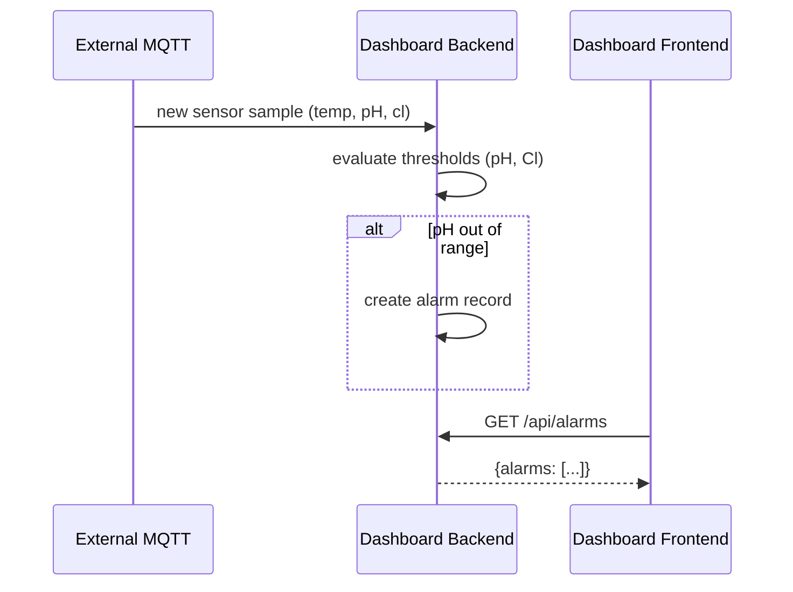
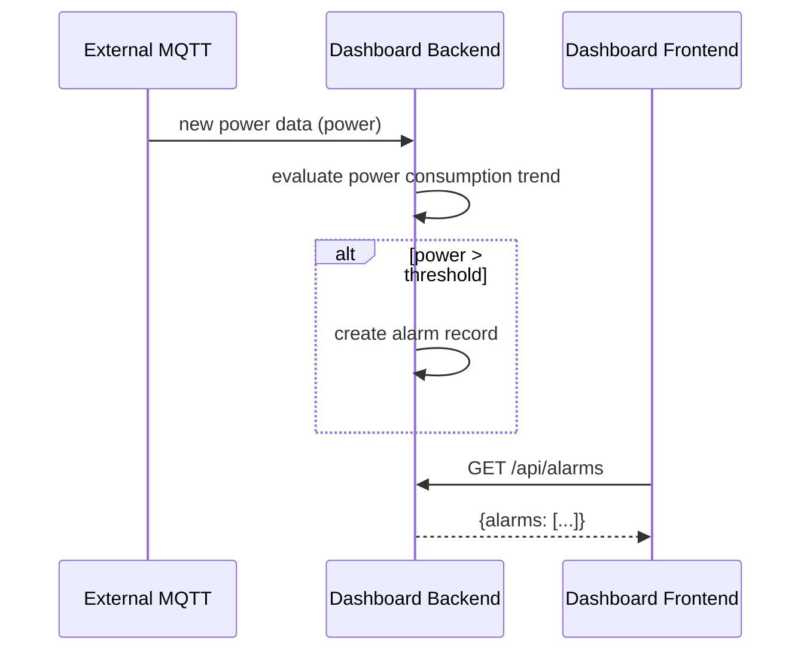
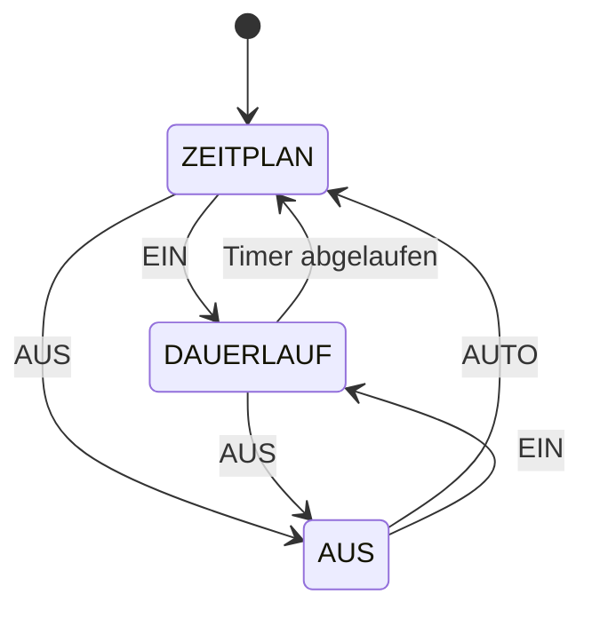

# Functional Specification: Pool Dashboard

---

## 1. Overview

### 1.1 Purpose

Web Dashboard for:

- controlling and monitoring the filter pump and solar pump,
- displaying current water parameters (temperature, pH, chlorine) from a BLE-YC01 sensor via MQTT,
- showing historical data (7-day trend chart) and trend indicators,
- displaying alarm messages (e.g. pH too high, chlorine dropping) and trend alarms (e.g. "chlorine falling, refill soon"),
- listing operational events (e.g. "water refilled on 2026-06-30"),
- providing a schedule view and editor for the filter pump timer plan.

### 1.2 Core Features

- **Dashboard (default landing):** Current sensor values (temp, pH, Cl), pump status (main + solar), 7-day trend chart, active alarms, schedule summary, action buttons for pump control
- **Schedule page:** Single-day view with 15-minute slots, read AND write timer configuration to Tasmota via MQTT, edit-mode toggle to prevent accidental changes
- **Alarm / Event overview:** Current and past alarms, event list from TimescaleDB (read-only, updated on page open)
- **Configuration page:** MQTT servers & topics, chemistry thresholds, pump power threshold, manual-override duration

### 1.3 Scope Boundaries

- No automatic control of pool equipment beyond pump on/off/override
- No cloud connectivity, everything runs in the internal network
- Solar pump temperature controller is not part of this project
- No login required (internal network)
- No user management or authentication
- No PWA features (kiosk-style browser app on a dedicated tablet)

---

## 2. Architecture

### 2.1 System Overview



Legende: Komponenten mit `:::ext` (gepunkteter Rahmen, grau) werden nicht in diesem Projekt entwickelt – sie sind bestehende Infrastruktur (Pool-Monitoring, MQTT-Broker, TimescaleDB, Tasmota). Nur **Pool Dashboard Frontend** und **Pool Dashboard Backend** sind Teil dieses Projekts.

### 2.2 Communication Flow

**Live Sensor Data: External MQTT → Dashboard Backend (direct subscription)**



**Pump Control: Frontend → Backend → Internal MQTT → Tasmota**



**Schedule Read/Write: Backend ↔ Tasmota via MQTT**



**Historical Data: Read from TimescaleDB**



**Events: Read from TimescaleDB**



**Alarm Evaluation: Backend (on every new sensor sample from MQTT)**






### 2.3 Technology Stack

| Component     | Technology                                             |
| ------------- | ------------------------------------------------------ |
| Frontend      | Vue.js 3 (Composition API, JavaScript), Tailwind CSS, Vite |
| Charts        | uPlot (Canvas-based, touch zoom/pan)                   |
| Backend       | Python FastAPI, paho-mqtt, psycopg2 (TimescaleDB)       |
| DB            | TimescaleDB (read-only, existing container)             |
| MQTT (Ext)    | External Mosquitto broker (shared with Pool-Monitoring, existing container) |
| MQTT (Int)    | Internal Mosquitto broker (Tasmota-connected, existing, existing container) |
| MQTT→DB Bridge| mqtt2db (subscribes Ext MQTT, writes to TimescaleDB, existing container)   |
| Infrastructure| Docker Compose, Caddy (sub-path routing), Nginx         |

---

## 3. Frontend

### 3.1 View Switching (No Router)

`App.vue` holds `const view = ref('dashboard')` and renders conditionally.
Target state set: `dashboard | schedule | alarms | config`.

```js
const navigationEntries = [
  { key: 'dashboard', label: 'Dashboard' },
  { key: 'schedule',  label: 'Zeitplan' },
  { key: 'alarms',    label: 'Alarme & Ereignisse' },
  { key: 'config',    label: 'Konfiguration', separator: true },
]
```

```vue
<template>
  <div class="flex min-h-svh items-center justify-center bg-slate-50 p-4">
    <DashboardView v-if="view === 'dashboard'" />
    <ScheduleView  v-else-if="view === 'schedule'" />
    <AlarmEventView v-else-if="view === 'alarms'" />
    <ConfigPanel  v-else-if="view === 'config'" @close="view = 'dashboard'" />
  </div>
</template>
```

### 3.2 UI Design

- **Primary:** #0EA5E9 (Sky Blue) | **Success:** #22C55E | **Warning:** #F59E0B | **Error:** #EF4444
- **Background:** #F8FAFC | **Surface:** #FFFFFF | **Text:** #0F172A / #64748B
- **Font:** System stack (Inter, -apple-system, Segoe UI, Roboto)
- **Touch targets:** Minimum 44×44 px, large clear buttons
- **Layout:** Optimized for 1024×800 tablet in landscape orientation
- **Spacing:** 4px base (4, 8, 12, 16, 24, 32, 48, 64)

**TODO**
> **Layout detail:**  to be selected from `Dashboard/docs/dashboard-examples/` (11 variants available: original, dark, central, columns, glass, kiosk, integrated, bento, compass, timeline, scan, morning)

### 3.3 Dashboard (Main View)

Landing page showing an overview of all relevant data at a glance:

#### 3.3.1 Cards

| Card | Source | Display | Update |
|------|--------|---------|--------|
| **Temperatur** | Latest raw sample from RAM | Large number, °C, "letzte Messung HH:MM" label | Every 10 s |
| **pH** | Mean of last 5 raw samples | Number with "ø 5 M." subtitle, color-coded (green/yellow/red) | Every 10 s |
| **Chlor** | Mean of last 5 raw samples | Number with "ø 5 M." subtitle, color-coded, mg/l | Every 10 s |
| **Filterpumpe** | Backend state machine + Tasmota status | Icon, mode label (AUTOMATIK / DAUERLAUF / AUS), state (LÄUFT / AUS), running time | Every 10 s |
| **Solarpumpe** | Derived from Tasmota power consumption | Icon, state (LÄUFT / AUS), "läuft seit HH:MM" | Every 10 s |
| **Trend chart** | Per-hour aggregates from TimescaleDB | uPlot, 3 panels (temp/pH/cl), zoom/pan, 7-day window | On mount, manual refresh |

#### 3.3.2 Color Coding

| Parameter | Green (Ideal) | Yellow (Acceptable) | Red (Critical) |
|-----------|---------------|--------------------|----------------|
| pH | 7.0 – 7.4 | 6.8 – 7.6 | < 6.8 or > 7.6 |
| Chlorine | 0.6 – 1.0 mg/l | 0.3 – 1.5 mg/l | < 0.3 or > 1.5 mg/l |
| Temperature | – | – | Informational only |

#### 3.3.3 Action Buttons (Filter Pump)

| Action | Behavior |
|--------|----------|
| **AUTO** | Switch back to schedule (Tasmota timers enabled) |
| **EIN** | Start manual run for N hours (configurable, default 2h) |
| **AUS** | Stop pump immediately (override) |
| **DAUERLAUF** | Quick-set: 2h manual run (one-tap action) |

#### 3.3.4 Stale Behavior

If no new sample arrives for `LIVE_STALE_AFTER_SECONDS` (default 600 s = 10 min), displayed values are kept but marked with a grey "Stale vor X min" badge. A persistent connection error shows a red banner with a "Erneut versuchen" button.

#### 3.3.5 Empty / Loading States

- **No data yet:** Centered "Warte auf Daten…"
- **Connection error:** Red banner "Verbindung fehlgeschlagen" with retry button
- **No trend data:** "Noch keine Daten" placeholder in chart frame

### 3.4 Schedule Page

- **Single-day view** (same schedule for all days of the week)
- 15-minute time slot grid (24h × 4 slots/h = 96 slots)
- Each slot toggled between ON (coloured) and OFF (empty)
- **Edit mode toggle:** Button to enable/disable editing (prevent accidental changes)
- Save button sends modified schedule to Tasmota via MQTT
- Cancel reverts to last saved state

#### 3.4.1 Tasmota Timer Mapping

Tasmota supports up to 16 timers (`Timer0` – `Timer15`), each with:
- Arm time (HH:MM)
- Action (ON/OFF)
- Days of week (bitmask)

The Dashboard maps 15-min slot grid to Tasmota Timer commands:
- ON slots → `TimerN` with time and action=ON
- OFF slots → `TimerN` with time and action=OFF
- Max 16 timer slots (Tasmota hardware limit)
- ==> aneinanderliegende slotts müssen zusammengefasst werden (max. 8 aktive zeit slotts)

### 3.5 Alarm / Event Overview

#### 3.5.1 Alarms

Alarms are evaluated by the Dashboard Backend and served via API:

| Alarm Type | Trigger | Auto-resolve |
|-----------|---------|-------------|
| pH zu hoch | pH > upper threshold | Yes, when back in range |
| pH zu niedrig | pH < lower threshold | Yes, when back in range |
| Chlor zu hoch | Cl > upper threshold | Yes, when back in range |
| Chlor zu niedrig | Cl < lower threshold | Yes, when back in range |
| Chlor sinkt (Trend) | Cl dropping over last 24h | Yes, when trend reverses |
| Pump power anomaly | Power > configured threshold | Manual acknowledge |

Display:
- Active alarms: highlighted, with timestamp and current value
- Past alarms: dimmed, with start/end timestamps
- Acknowledge button for non-auto-resolving alarms

#### 3.5.2 Events

Events are read from TimescaleDB (written by an existing service that subscribes to `<base>/event` MQTT topic from Pool-Monitoring).

Event types (from Pool-Monitoring):
- `chlorine` – Chlor zugegeben
- `ph_plus` – pH-Plus zugegeben
- `ph_minus` – pH-Minus zugegeben
- `flocculant` – Flockungsmittel zugegeben
- `refill` – Wasser nachgefüllt
- `backwash` – Rückspülung
- `winter` – Einwinterung

Display:
- Reverse-chronological list
- Date/time, event type (German label), amount + unit where applicable
- Events are fetched when the page is opened (no live updates)

### 3.6 Configuration Page

Settings are stored in the Dashboard Backend (no localStorage – settings are server-side):

| Setting | Type | Default | Description |
|---------|------|---------|-------------|
| External MQTT Host | text | – | MQTT broker for sensor data |
| External MQTT Port | number | 1883 | – |
| External MQTT Topics | text | `home/+/pool/ble-yc01` | Topic pattern for sensor data |
| Internal MQTT Host | text | – | MQTT broker for Tasmota |
| Internal MQTT Port | number | 1883 | – |
| Tasmota Device Topic | text | – | Base topic for pump Tasmota device |
| pH Ideal Min | number | 7.0 | – |
| pH Ideal Max | number | 7.4 | – |
| pH Critical Min | number | 6.8 | – |
| pH Critical Max | number | 7.6 | – |
| Cl Ideal Min | number | 0.6 | – |
| Cl Ideal Max | number | 1.0 | – |
| Cl Critical Min | number | 0.3 | – |
| Cl Critical Max | number | 1.5 | – |
| Pump Power Threshold | number | 500 | Watts, triggers anomaly alarm |
| Manual Override Duration | number | 120 | Minutes before reverting to schedule |

---

## 4. Backend

### 4.1 File Structure

```
dashboard/backend/
├── main.py              # FastAPI app, all routes, Pydantic models, config, auth
├── mqtt_ext.py          # External MQTT client (live sensor data subscription)
├── mqtt_int.py          # Internal MQTT client (Tasmota pump control)
├── live_state.py        # In-memory ring buffer for sensor samples
├── pump_state.py        # Pump state machine (auto/manual/off)
├── alarms.py            # Alarm evaluation logic
├── db_timescale.py      # TimescaleDB reader (live, history, events)
├── requirements.txt
└── Dockerfile
```

### 4.2 REST API

#### GET /api/live

**Response 200:**

```json
{
  "ts": 1755724982,
  "stale": false,
  "staleSeconds": 5,
  "temp": 28.4,
  "pH": 7.18,
  "cl": 0.72,
  "pump": {
    "main": { "mode": "auto", "state": true, "runningSince": 1755724000 },
    "solar": { "state": false, "power": 0 }
  }
}
```

#### GET /api/history?metric=temp&days=7

**Response 200:**

```json
{
  "metric": "temp",
  "unit": "°C",
  "points": [
    { "t": 1755723600, "v": 27.8 },
    { "t": 1755727200, "v": 28.1 }
  ]
}
```

#### GET /api/pump/status

**Response 200:**

```json
{
  "main": { "mode": "auto", "state": true, "runningSince": 1755724000, "overrideRemaining": null },
  "solar": { "state": false, "power": 0, "powerStatus": "off" }
}
```

#### POST /api/pump/override

**Request:**

```json
{
  "mode": "manual",
  "durationMinutes": 120
}
```

Modes: `"auto"` (schedule), `"manual"` (timed override), `"off"` (stop).

**Response 200:** `{ "status": "ok", "mode": "manual", "durationMinutes": 120 }`

#### GET /api/schedule

**Response 200:**

```json
{
  "slots": [
    { "start": "08:00", "end": "08:15", "state": "on" },
    { "start": "08:15", "end": "08:30", "state": "off" }
  ]
}
```

Reads from Tasmota via MQTT command, caches result for 30 seconds.

**Note:** `/api/history` reads from TimescaleDB (not SQLite). The `mqtt2db` bridge continuously writes sensor data from External MQTT into TimescaleDB.

#### POST /api/schedule

**Request:**

```json
{
  "slots": [
    { "start": "08:00", "end": "08:15", "state": "on" },
    { "start": "08:15", "end": "08:30", "state": "off" }
  ]
}
```

Converts slot grid to Tasmota Timer commands and publishes them to internal MQTT.
Max 16 timer slots (Tasmota hardware limit).

**Response 200:** `{ "status": "ok", "timerCount": 12 }`

#### GET /api/alarms

**Response 200:**

```json
{
  "alarms": [
    {
      "id": 1,
      "type": "ph_high",
      "message": "pH zu hoch: 7.8",
      "severity": "critical",
      "time": 1755724982,
      "resolved": false
    }
  ]
}
```

#### POST /api/alarms/:id/ack

**Response 200:** `{ "status": "ok" }`

#### GET /api/events?limit=50&offset=0

**Response 200:**

```json
{
  "events": [
    {
      "time": 1780577400,
      "type": "chlorine",
      "amount": 120.0,
      "unit": "g",
      "note": "Chlortabletten 200g Dose"
    }
  ],
  "total": 127,
  "limit": 50,
  "offset": 0
}
```

#### GET /api/config

**Response 200:**

```json
{
  "mqttExt": { "host": "mqtt-ext.local", "port": 1883 },
  "mqttInt": { "host": "mqtt-int.local", "port": 1883 },
  "thresholds": {
    "ph": { "idealMin": 7.0, "idealMax": 7.4, "criticalMin": 6.8, "criticalMax": 7.6 },
    "cl": { "idealMin": 0.6, "idealMax": 1.0, "criticalMin": 0.3, "criticalMax": 1.5 },
    "pumpPower": 500
  },
  "overrideDurationMinutes": 120
}
```

#### POST /api/config

**Request:** Same schema as response.

**Response 200:** `{ "status": "ok" }`

### 4.3 MQTT Integration

#### 4.3.1 mqtt2db Bridge (External MQTT → TimescaleDB)

#### 4.3.1 External MQTT (Live Sensor Data)

The Dashboard Backend subscribes **directly** to the External MQTT broker for live sensor data.
Historical data and events are served by a dedicated `mqtt2db` bridge (see below).

| Direction | Component | Topic | Purpose |
|-----------|-----------|-------|---------|
| Subscribe | Dashboard Backend | `home/+/pool/ble-yc01` | BLE-YC01 sensor: temp, pH, Cl |
| Subscribe | Dashboard Backend | `home/+/pool/pump` | Pump state from ESP32 relay |
| Subscribe | mqtt2db bridge | `home/+/pool/ble-yc01` | Persist sample to TimescaleDB |
| Subscribe | mqtt2db bridge | `+/event` | Persist event to TimescaleDB |
| Write | mqtt2db bridge | TimescaleDB | INSERT sample/event row |

Payloads match the Pool-Monitoring protocol (see FSD §4.3).

#### 4.3.2 Internal MQTT (Tasmota Pump Control)

| Direction | Topic | Purpose |
|-----------|-------|---------|
| Subscribe | `stat/<device>/RESULT` | Tasmota command responses |
| Subscribe | `stat/<device>/POWER` | Pump relay state changes |
| Subscribe | `tele/<device>/SENSOR` | Energy monitoring data |
| Publish | `cmnd/<device>/POWER` | Set pump relay ON/OFF |
| Publish | `cmnd/<device>/Timer0`...`Timer15` | Set timer configuration |
| Publish | `cmnd/<device>/Timers` | Read all timers |

### 4.4 Pump State Machine



Transitions:
- **ZEITPLAN → DAUERLAUF:** User action "EIN" or "DAUERLAUF" with duration
- **DAUERLAUF → ZEITPLAN:** Timer expires (automatic)
- **ZEITPLAN → AUS:** User action "AUS"
- **AUS → ZEITPLAN:** User action "AUTO"
- **AUS → DAUERLAUF:** User action "EIN"
- **DAUERLAUF → AUS:** User action "AUS"

### 4.5 Alarm Evaluation

Evaluated on every new sensor sample from external MQTT:

1. **Range alarms:** Check pH and Cl against configured thresholds
2. **Trend alarms:** Track Cl slope over last 24h; if consistently negative → "Chlor sinkt, bald nachfüllen"
3. **Power alarms:** Compare Tasmota power reading against configured threshold
4. **Duplicate suppression:** Same alarm type not re-created within 60 minutes

Alarms are held in-memory with a configurable retention (default 7 days).

### 4.6 Configuration

Settings are persisted to a local JSON file in the container (`/data/config.json`), loaded on startup, and written on config changes via the API.

## 5. Non-Functional Requirements

| Requirement | Target |
|-------------|--------|
| Live data refresh | Every 10 seconds |
| Chart data source | 7-day window, per-hour aggregates |
| Schedule sync with Tasmota | On save, plus automatic re-read every 60s |
| `/api/live` response | < 50ms (RAM-only) |
| `/api/history` response | < 200ms (TimescaleDB read-only, ≤ 168 points) |
| MQTT publish latency | < 200ms |
| Tablet resolution | 1024×800 (landscape) |
| Touch target size | Minimum 44×44 px |
| UI language | German |

## 6. Deployment

### 6.1 Docker Compose

Existing services (unchanged):
- `frontend` (Pool-Monitoring Vue SPA)
- `backend` (Pool-Monitoring FastAPI)
- `caddy` (reverse proxy)
- `mqtt2mail_pool` (email reports)
- `mosquitto` (dev / external MQTT)

New services:
- `dashboard-frontend`: Vue 3 SPA, served via Nginx
- `dashboard-backend`: Python FastAPI
- `mqtt2db`: MQTT→TimescaleDB bridge (subscribes Ext MQTT, writes sensor data and events)

### 6.2 Caddy Routing

```caddy
handle_path /dashboard/api/* {
    reverse_proxy dashboard-backend:8000
}
handle_path /dashboard/* {
    reverse_proxy dashboard-frontend:80
}
```

### 6.3 Volumes

No dedicated volume mounts for `dashboard-backend` – all data is read from TimescaleDB (existing container).
The `mqtt2db` bridge requires no persistent storage.

## 7. Error Handling

### 7.1 Frontend

| Error | Behavior |
|-------|----------|
| Network error (API unreachable) | Red banner "Verbindung fehlgeschlagen" with retry button |
| MQTT sensor stale | Grey "Stale" badge on cards |
| Tasmota unreachable | "Pumpe nicht erreichbar" warning on pump card |
| Schedule write failure | Error toast "Zeitplan konnte nicht gespeichert werden" |

### 7.2 Backend

| Error | Behavior |
|-------|----------|
| External MQTT lost | Reconnect (exponential backoff, max 5 min); live data goes stale |
| Internal MQTT lost | Reconnect (exponential backoff, max 5 min) |
| mqtt2db bridge lost | History/events not updated (TimescaleDB data grows stale) |
| TimescaleDB unreachable | Dashboard shows error "Datenbank nicht erreichbar" on history/events views |
| Tasmota command timeout | Return error to frontend, log event |

## 8. Future Enhancements

- Multi-pool support (currently single-pool focus)
- Trend alarm for pH (currently Cl-only)
- Solar pump historical runtime statistics
- Pump energy consumption chart (kWh per day/week)
- Dark mode toggle
- Export schedule as backup

## 9. Glossary

| Term | Definition |
|------|-----------|
| Tasmota | Open-source firmware for ESP32/ESP8266 devices, provides MQTT relay control and energy monitoring |
| External MQTT | Shared Mosquitto broker for sensor data and Pool-Monitoring events |
| Internal MQTT | Mosquitto broker for Tasmota/pump communication (isolated network) |
| Dauerlauf | Fixed-duration manual pump override that reverts to schedule after expiry |
| TimescaleDB | Time-series database on PostgreSQL, existing container for event persistence |
| uPlot | Canvas-based charting library (~50 KB) with touch zoom/pan support |
