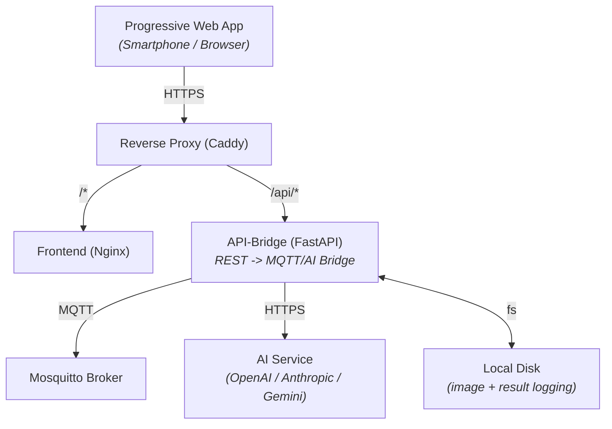
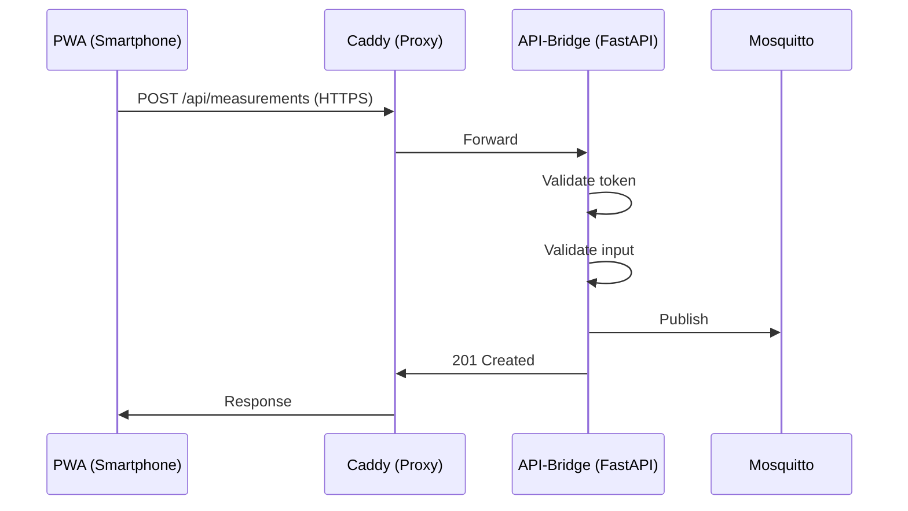
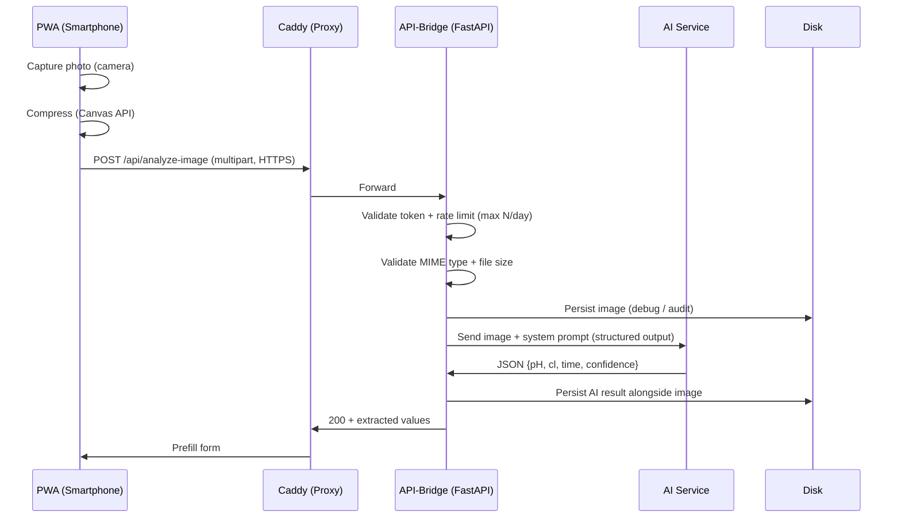
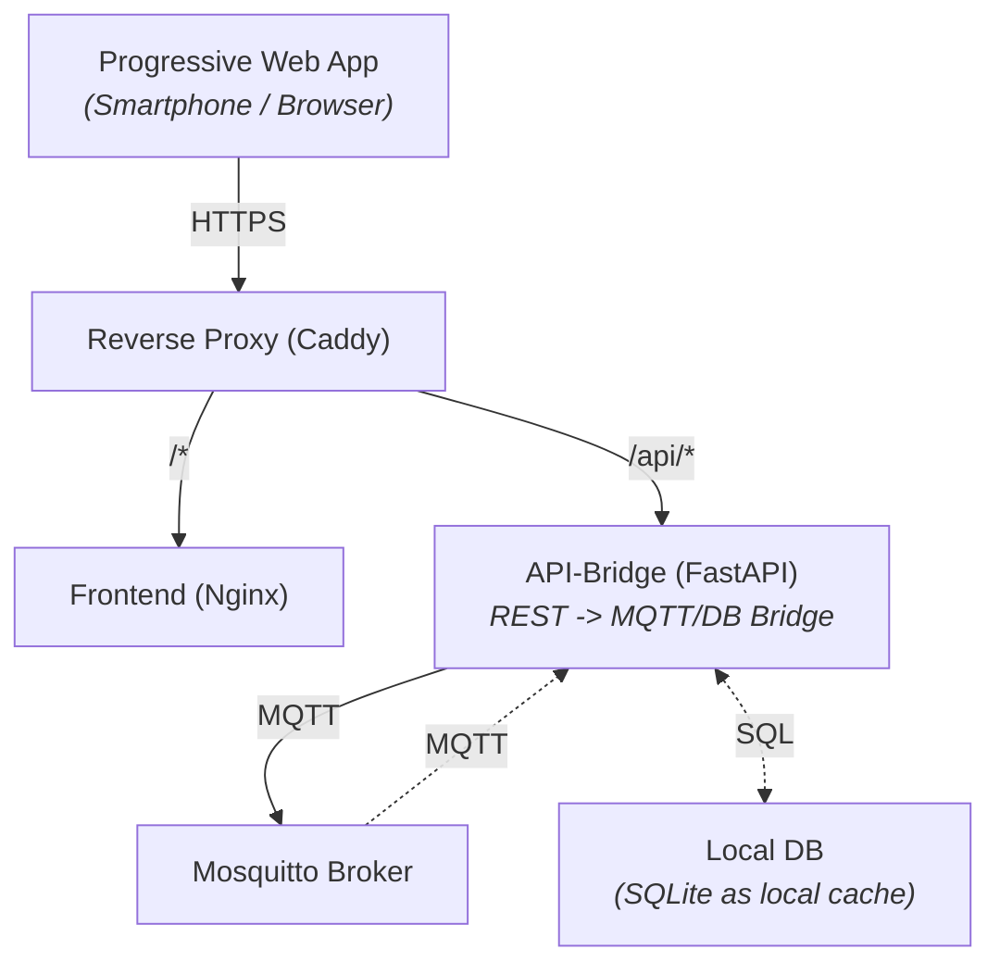

# Functional Specification: Pool-Monitoring PWA

---

## 1. Overview

### 1.1 Purpose

Progressive Web App (PWA) for manual entry of pool measurements (pH, chlorine, temperature), transmission via Python backend bridge to an MQTT broker, and comparison with automatic sensor data.

### 1.2 Core Features

- Manual data entry at the pool via smartphone
- **Automatic Image Analysis:** Capture a photo of test strips + reference scale, extract pH/chlorine via multimodal AI, prefill form fields
- Comparison of manual vs. automatic measurements (data foundation)
- Sensor drift analysis and calibration (prepared, not part of this project)

### 1.3 Scope Boundaries

- No automatic control of pool equipment
- No cloud connectivity, everything runs locally on a dedicated vServer
- Sensor drift analysis is not part of this project

---

## 2. Architecture

### 2.1 System Overview



### 2.2 Communication Flow

**Send Measurements**



**Analyze Test Strip Image**



### 2.3 Technology Stack

| Component     | Technology                                             |
| ------------- | ------------------------------------------------------ |
| Frontend      | Vue.js 3 (Composition API), Tailwind CSS, Vite, Chart.js |
| Backend       | Python FastAPI, paho-mqtt, httpx (AI client)           |
| AI Service    | Multimodal LLM (OpenAI / Anthropic / Gemini) – pluggable via env |
| Infrastructure| Docker Compose, Caddy (SSL), Mosquitto, Nginx          |

---

## 3. Frontend

### 3.1 Measurement Entry (Main View)

In addition to manual data entry, the form offers a **"Analyze Photo"** action that opens
the camera, lets the user capture a test-strip photo, and prefills pH/chlorine/time from
the AI result. Manual correction remains possible before submitting.

#### 3.1.1 Form Fields

| Field          | Type                                           | Default         | Step  | Range           | Validation                 |
| -------------- | ---------------------------------------------- | --------------- | ----- | --------------- | -------------------------- |
| **Date/Time**  | datetime-local (UI) / Unix timestamp (Message) | <Current Time>  | -     | -               | Valid date format          |
| **Pool**       | select                                         | 1st Item        | -     | -               | Must exist in backend list |
| **Notes**      | text (textarea)                                | -               | -     | Max 500 chars   | Optional free text         |
| **Temperature**| number                                         | 20.0            | 0.2   | 5.0 – 45.0 °C   | 1 decimal place            |
| **pH Value**   | number                                         | 7.0             | 0.1   | 0.0 – 14.0      | 1 decimal place            |
| **Chlorine**   | number                                         | 1.0             | 0.1   | 0.0 – 10.0 mg/l | 1 decimal place            |

#### 3.1.2 UI Behavior

- Modern, bright design for outdoor use
- Numeric fields: combined number input with +/- stepper buttons
- Touch-optimized (buttons ≥ 44x44px)
- Direct value entry via number input or incremental adjustment via stepper
- Real-time validation with visual error display
- After successful submission: toast notification, form reset
- On error: show error message, preserve values, allow retry

### 3.2 UI Design

- **Primary:** #0EA5E9 (Sky Blue) | **Success:** #22C55E | **Warning:** #F59E0B | **Error:** #EF4444
- **Background:** #F8FAFC | **Surface:** #FFFFFF | **Text:** #0F172A / #64748B
- **Font:** System stack (Inter, -apple-system, Segoe UI, Roboto)
- **Layout:** Centered block (also on desktop)
  - Title centered
  - Labels left-aligned
  - Inputs centered, buttons stacked vertically
- **Spacing:** 4px base (4, 8, 12, 16, 24, 32, 48, 64)

### 3.3 Navigation

- **Main page:** Measurement form
  - "SEND" button below form
  - Gear icon top-right → Settings

- **Settings page:**
  - "Abbrechen" (Cancel) and "Speichern" (Save) buttons at bottom
  - Cancel reverts unsaved changes, Save persists + toast confirmation

- Dashboard tab in a later version

### 3.3.1 Measurement Page (Wireframe)

```
┌─────────────────────────────┐
│  Pool Monitor          [⚙️] │
├─────────────────────────────┤
│  📅 Date/Time (editable)    │
│  [2026-05-16 14:30    ]     │
│  🏊 Pool                    │
│  [Pool 1              ▼]    │
│  [Foto]      [Datei]        │
│  🌡️ Temperature (°C)       │
│  [  -  ] [20.0] [  +  ] °C  │
│  💧 pH Value                │
│  [  -  ] [7.0 ] [  +  ]     │
│  🧪 Chlorine (mg/l)         │
│  [  -  ] [1.0 ] [  +  ] mg/l│
│  ▼ Notes / Status (collapsible)
│  ┌─────────────────────┐    │
│  │     SEND            │    │
│  └─────────────────────┘    │
└─────────────────────────────┘
```

Numeric fields combine a direct number input (center) with +/- stepper buttons for touch-friendly incremental adjustment.
On mobile with camera: "Foto" + "Datei" buttons shown side-by-side. On desktop or no camera: only "Datei" button.

### 3.1.3 Image Analysis Flow

1. User taps **Foto** (camera) or **Datei** (file picker) → camera or file dialog opens.
2. Captured image is **client-side compressed** (Canvas API, max 1920 px on long edge,
   JPEG quality ~0.8) to minimize upload size and latency.
3. Loading overlay is shown while the request runs (analysis can take several seconds
   due to model latency, see TSD).
4. On success: `pH`, `cl` prefilled into the form fields, a toast indicates
   "Values extracted – please verify". The user **must** still press SEND.
   If the AI returns `-1` for a value (could not read reliably), an error message is shown
   and no values are applied. AI warnings (e.g., poor lighting) are shown as a warning toast.
5. On error: error message in the modal (rate limit, AI refusal, timeout, no values detected).
   Form remains unchanged so the user can fall back to fully manual entry.

User-facing error variants:

| Cause                       | Message in modal                                             |
| --------------------------- | ------------------------------------------------------------ |
| Daily rate limit reached    | "Daily image-analysis limit reached"                         |
| AI refusal / safety filter  | "AI could not analyze the image"                             |
| AI timeout / network        | "Error [status]"                                             |
| AI could not read pH or Cl  | "AI could not reliably read: pH, Cl"                        |
| File too large / wrong type | Handled by backend: 400 error                                |
| Network error               | "Network error"                                              |

### 3.4 Settings

Settings are stored locally on the smartphone or in the browser.

| Setting     | Type     | Default                  | Description                |
| ----------- | -------- | ------------------------ | -------------------------- |
| API Token   | password | -                        | Bearer token for backend   |

> **Note on Backend URL:** The backend URL is hardcoded as `/api`. A configurable URL was removed in favor of simplicity since the PWA is always served from the same origin as the API.

#### 3.4.1 Storage Behavior

- localStorage for settings, token Base64-encoded (obfuscation, not cryptographic protection)
- Settings are written to localStorage reactively on every change

### 3.5 Authentication & Security

- Bearer token in header: `Authorization: Bearer <token>`
- Server-side as environment variable
- HTTPS required (Caddy/Let's Encrypt, HSTS)
- MQTT auth via username/password (backend-internal)

#### 3.5.1 localStorage vs httpOnly Cookie

| Aspect            | localStorage (used)          | httpOnly Cookie                    |
| ---------------- | ---------------------------- | --------------------------------- |
| JavaScript access | Yes (read/write)             | No (HTTP-only)                    |
| XSS risk          | Token extractable via XSS    | Token protected against XSS       |
| Automatic send    | Manual: `Authorization` header | Automatic: browser sends cookie    |
| Server control    | Client-only                  | Server sets/clears via HTTP headers |
| Use case fit      | Settings, non-sensitive data | User sessions, critical auth      |

> **Why localStorage?** This is a private pool monitoring tool with a shared secret token—no personal accounts or sessions. The token is not sensitive cryptographic material. localStorage is simpler and sufficient for this self-hosted, low-risk use case. httpOnly cookies would add unnecessary complexity (login flow, session management) for no security benefit in this context.

### 3.6 Progressive Web App

- Manifest: "Pool Monitor", standalone, icons 192/512px
- Service Worker: Cache-first for static assets (app shell)
- Support: Android Chrome ≥ 100, desktop current, iOS Safari ≥ 16

---

## 4. Backend

### 4.1 REST API

#### GET /api/pools

**Response 200:** `[{"name": "Pool 1"}, {"name": "Pool 2"}]`

#### POST /api/measurements

**Request:** `Authorization: Bearer <token>`, JSON body

```json
{
  "time": 1755724982,
  "name": "Pool 1",
  "sensorType": "manual",
  "pH": 7.2,
  "cl": 1.0,
  "temp": 24.6,
  "status": "Water slightly cloudy"
}
```

**Response 201:** `{ "status": "success", "message": "Measurement published to MQTT" }`
**Errors:** 400 (invalid), 401 (unauthorized), 503 (MQTT down)

#### POST /api/analyze-image

Analyzes a photo of a pool test strip + reference scale and returns extracted values.

**Request:** `Authorization: Bearer <token>`, `Content-Type: multipart/form-data`

| Part      | Type    | Description                                            |
| --------- | ------- | ------------------------------------------------------ |
| `image`   | file    | JPEG or PNG, max 10 MB                                 |

**Response 200:**

```json
{
  "ph": 7.2,
  "cl": 1.0,
  "refusal": null,
  "warnings": null,
  "requestsRemainingToday": 7
}
```

`ph` and `cl` may be `-1.0` if the AI could not reliably read them.
`refusal` is non-null when the AI refused to analyze (safety filter).
`warnings` is a list of image quality issues when significant problems are detected.

**Errors:**

| Status | Cause                                                                |
| ------ | -------------------------------------------------------------------- |
| 400    | Missing/invalid file, wrong MIME type, file too large                |
| 401    | Invalid / missing token                                              |
| 422    | AI refused (safety) or returned no usable values (-1 for both)       |
| 429    | Per-IP / global daily rate limit reached                             |
| 502    | AI service returned an unrecoverable error (auth, schema mismatch)   |
| 503    | AI service unreachable / timeout                                     |

#### GET /api/status

**Response 200:** `{ "status": "healthy", "mqttConnected": true, "aiConfigured": true, "imageAnalysisRequestsToday": 3, "uptime": 3600, "version": "1.0.0" }`

### 4.2 Configuration

Settings are set via environment variables.

| Setting                      | Type     | Default          | Description                                                       |
| ---------------------------- | -------- | ---------------- | ----------------------------------------------------------------- |
| API Token                    | password | -                | Bearer token for backend                                          |
| MQTT Server                  | text     | mqtt://localhost | MQTT server URL                                                   |
| MQTT User                    | text     | -                | MQTT username                                                     |
| MQTT Password                | password | -                | MQTT password                                                     |
| POOL_LIST                    | JSON     | '[{"name":"Pool","topic":"pool/manual"}]' | JSON array mapping pool names to MQTT topics    |
| AI_PROVIDER                  | text     | `openrouter`     | One of `openrouter`, `openai`, `anthropic`, `gemini`               |
| AI_API_KEY                   | password | -                | API key for the chosen provider (kept server-side only)           |
| AI_MODEL                     | text     | `google/gemini-3-flash-preview` | Concrete model identifier (e.g. `openai/gpt-4o`, `anthropic/claude-sonnet-4`) |
| AI_MAX_REQUESTS_PER_DAY      | int      | `10`             | Hard cap on `/api/analyze-image` calls per UTC day (security)     |
| AI_TIMEOUT_SECONDS           | int      | `30`             | HTTP timeout for AI calls                                         |
| AI_IMAGE_STORAGE_PATH        | path     | `/data/ai`       | Directory for persisted images + AI responses (logging / debug)   |
| AI_IMAGE_RETENTION_DAYS      | int      | `30`             | Auto-cleanup age for stored images                                |
| AI_MAX_IMAGE_BYTES           | int      | `10485760`       | Upload size limit in bytes (10 MB default)                        |

### 4.3 MQTT Integration

Measurements are sent to the preconfigured MQTT topic.
Data is validated in the backend and a new JSON message is generated to prevent malformed data and code injection.

Same validation ranges as the frontend (see frontend form field table).
The MQTT topic is dynamically selected based on the submitted pool `name` mapping in `POOL_LIST`.

---

## 5. Non-Functional Requirements

| Requirement              | Target                       |
| ------------------------ | ---------------------------- |
| Load time (FCP)          | < 2s over 4G                 |
| API response (p95)       | < 500ms                      |
| MQTT publish             | < 200ms                      |
| Image analysis (p95)     | < 15s (incl. AI round-trip)  |
| Image upload payload     | < 2 MB after client compression |
| Availability             | 90% (hobby)                  |
| Database                 | Up to 100,000 measurements   |

---

## 6. Deployment

Via Docker Compose.

> The compose file includes a Mosquitto service for local development and testing (port 2883 to avoid host collisions). In production, an existing external Mosquitto broker is used – configure `MQTT_HOST` and `MQTT_PORT` in `.env` accordingly.

---

## 7. Error Handling

### 7.1 Frontend

| Error              | Behavior                                    |
| ------------------ | ------------------------------------------- |
| Network error      | Error message, manual retry                 |
| Invalid input      | Inline validation, form blocked             |
| API 401            | Error toast with token hint, user navigates to settings manually |
| API 429            | Toast: daily limit reached, fall back to manual entry |
| API 422 (AI refusal / no values) | Toast: "AI could not analyze the image", form unchanged |
| API 5xx            | Error message, retry option                 |

### 7.2 Backend

| Error                       | Behavior                                                  |
| --------------------------- | --------------------------------------------------------- |
| MQTT lost                   | Reconnect (exponential backoff, max 5 min)                |
| MQTT down                   | HTTP 503, client informed                                 |
| Invalid token               | HTTP 401, logging                                         |
| DB error                    | HTTP 500, health check = unhealthy                        |
| AI rate limit reached       | HTTP 429, no upstream call, log event                     |
| AI authentication / 4xx     | HTTP 502, no retry, log redacted error                    |
| AI timeout / network        | HTTP 503, no retry, log event                             |
| AI safety refusal           | HTTP 422, no fields prefilled, log refusal reason         |
| AI schema violation         | HTTP 502, log raw response (truncated), do not crash      |
| AI returns implausible vals | HTTP 422 (out of FSD ranges) – frontend warns user        |

---

## 8. Tests

| Level                | Framework                | Coverage                                    |
| -------------------- | ------------------------ | ------------------------------------------- |
| Frontend Unit        | Vitest                   | Composables, utils, validation              |
| Frontend Components  | Vitest + @vue/test-utils | StepperInput component, ImageCapture flow   |
| Backend Unit         | pytest                   | Models, validation, MQTT, AI client (mocked)|
| Backend API          | httpx + pytest           | All endpoints incl. `/api/analyze-image` (rate limit, refusal, timeout via mocks) |

---

## 9. Release & Versioning

- Semantic versioning (MAJOR.MINOR.PATCH)
- Version visible in settings

---

## 10. Glossary

| Term    | Definition                                     |
| ------- | ---------------------------------------------- |
| PWA     | Progressive Web App                            |
| MQTT    | Message Queuing Telemetry Transport            |
| QoS     | Quality of Service (MQTT)                      |
| Stepper | UI element for incremental adjustment (+/-)    |
| Caddy   | Web server with automatic HTTPS                |

---

## 11. Appendix

### 11.1 Target Values

| Parameter       | Ideal     | Acceptable | Critical         |
| --------------- | --------- | ---------- | ---------------- |
| pH              | 7.0 – 7.4 | 6.8 – 7.6  | < 6.8 or > 7.6   |
| Chlorine (mg/l) | 0.6 – 1.0 | 0.3 – 1.5  | < 0.3 or > 1.5   |
| Temperature (°C)| -         | -          | Informational    |

---

## 12. Future Enhancements

> History and charts are not part of the first version. The architecture (SQLite, GET /api/measurements) is designed to be easily extensible later.

### 12.1 Extended System Overview



### 12.2 UI Extensions

#### 12.2.1 History

- Table of the last 50 measurements (newest first)
- Color coding: pH 7.0-7.4 green, 6.8-7.6 yellow, else red | Chlorine 0.6-1.0 green, 0.3-1.5 yellow, else red (thresholds configurable)

#### 12.2.2 Charts

- Chart.js line chart (last 30 measurements)
- Switchable pH/chlorine/temperature, ideal range as band
- Tooltip on touch/hover

### 12.3 REST API

#### GET /api/measurements

**Query:** `limit` (default 50, max 500), `offset`, `from`, `to`
**Response 200:** `{ "measurements": [{ "time": 1755724982, ... }], "total": 127, "limit": 50, "offset": 0 }`

### 12.4 Data Persistence (SQLite)

#### 12.4.1 Measurements Table

```sql
CREATE TABLE measurements (
    id INTEGER PRIMARY KEY AUTOINCREMENT,
    time INTEGER NOT NULL,
    name TEXT NOT NULL,
    sensor_type TEXT NOT NULL,
    ph REAL NOT NULL CHECK(ph BETWEEN 0.0 AND 14.0),
    cl REAL NOT NULL CHECK(cl BETWEEN 0.0 AND 10.0),
    temp REAL NOT NULL CHECK(temp BETWEEN 5.0 AND 45.0),
    created_at TEXT DEFAULT CURRENT_TIMESTAMP
);
CREATE INDEX idx_measurements_time ON measurements(time);
```

#### 12.4.2 Sensor Data Caching

- Backend subscribes to all MQTT topics (`pool/#`)
- All incoming sensor data is cached in SQLite
- Enables later comparison of manual vs. automatic measurements
- Auto-cleanup after 90 days (configurable)
