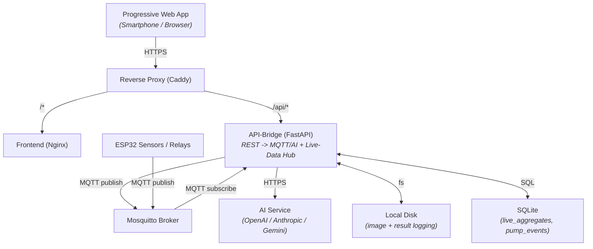
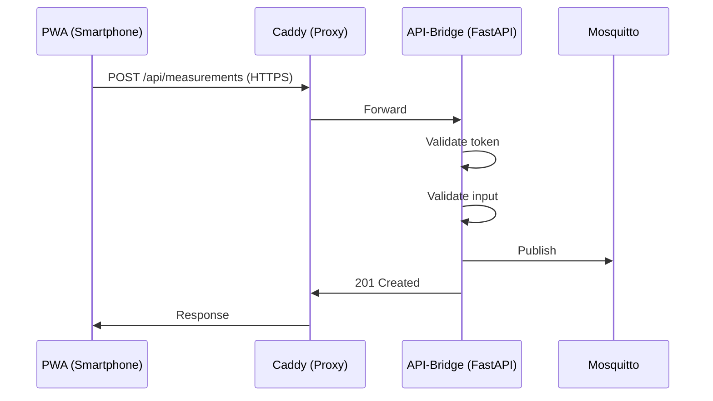
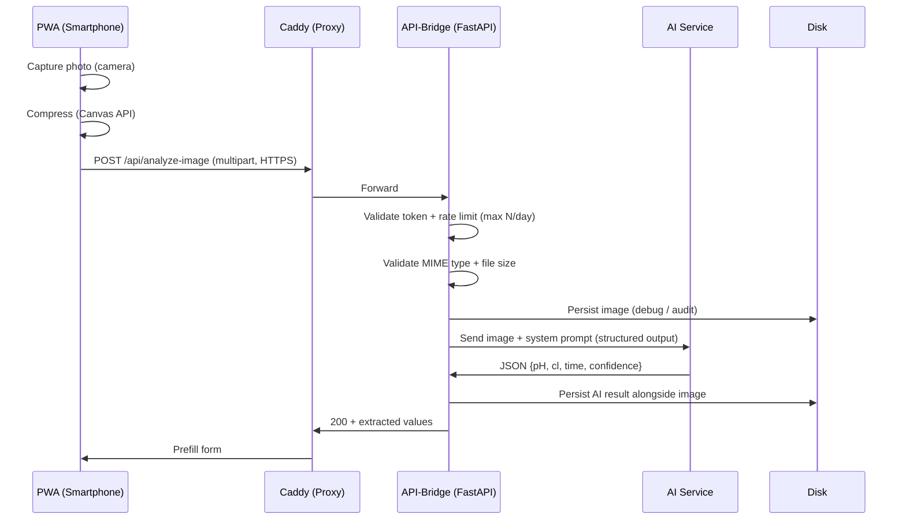
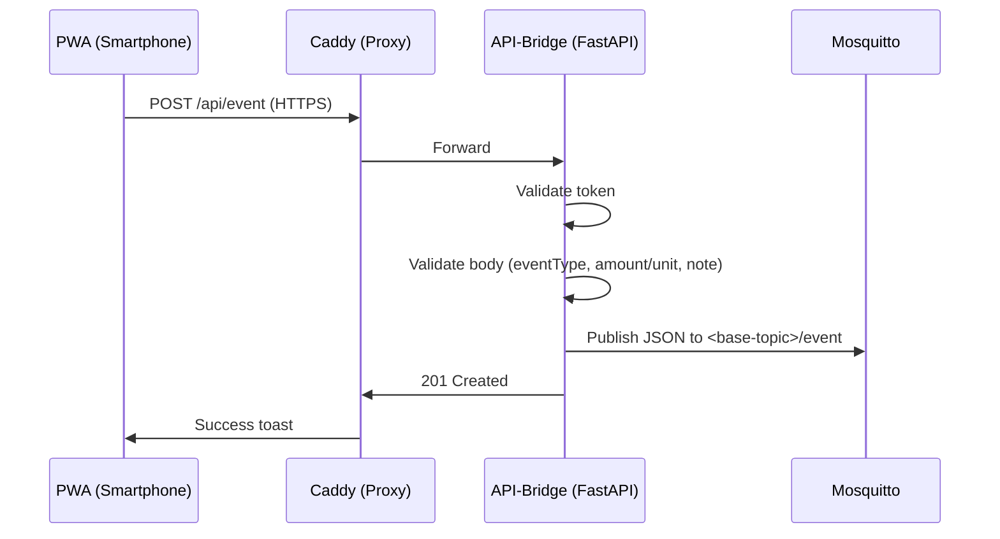
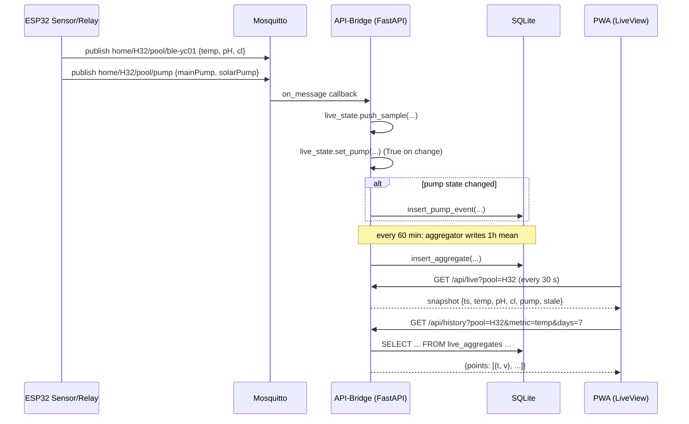

# Functional Specification: Pool-Monitoring PWA

---

## 1. Overview

### 1.1 Purpose

Progressive Web App (PWA) for:

- manual entry of pool measurements (pH, chlorine, temperature),
- manual logging of operational events (chemical additions, refill, backwash, winter care) with optional amount and unit,
- transmission via Python backend bridge to an MQTT broker,
- and comparison with automatic sensor data.

### 1.2 Core Features

- Manual data entry at the pool via smartphone
- **Event Page (default menu entry "Ereignisse"):** Log one operational event per entry — `chlorine`, `ph_plus`, `ph_minus`, `flocculant`, `refill`, `backwash`, `winter` — with date/time, optional amount + unit, and an optional note
- **Automatic Image Analysis:** Capture a photo of test strips + reference scale, extract pH/chlorine via multimodal AI, prefill form fields
- **Dashboard (default landing, menu entry "Dashboard"):** Real-time data dashboard fed by BLE sensor and pump MQTT topics – main temperature, 5-sample means for pH/Cl, pump status icons, 7-day zoomable trend chart
- Comparison of manual vs. automatic measurements (data foundation)
- Sensor drift analysis and calibration (prepared, not part of this project)

### 1.3 Scope Boundaries

- No automatic control of pool equipment
- No cloud connectivity, everything runs locally on a dedicated vServer
- Sensor drift analysis is not part of this project

---

## 2. Architecture

### 2.1 System Overview



### 2.2 Communication Flow

**Send Measurements**



**Analyze Test Strip Image**



**Log Operational Event**



**Live Data: Sensor → Backend → PWA**



### 2.3 Technology Stack

| Component     | Technology                                             |
| ------------- | ------------------------------------------------------ |
| Frontend      | Vue.js 3 (Composition API), Tailwind CSS, Vite |
| Backend       | Python FastAPI, paho-mqtt, httpx (test client) + openrouter SDK (AI analysis)           |
| AI Service    | Multimodal LLM (OpenAI / Anthropic / Gemini) – pluggable via env |
| Infrastructure| Docker Compose, Caddy (SSL), Mosquitto, Nginx          |

---

## 3. Frontend

### 3.1 Measurement Entry (Main View)

In addition to manual data entry, the form offers a **"Analyze Photo"** action that opens
the camera, lets the user capture a test-strip photo, and prefills pH/chlorine/time from
the AI result. Manual correction remains possible before submitting.

#### 3.1.1 Form Fields

| Field          | Type                                           | Default         | Step  | Range           | Validation                 |
| -------------- | ---------------------------------------------- | --------------- | ----- | --------------- | -------------------------- |
| **Date/Time**  | datetime-local (UI) / Unix timestamp (Message) | <Current Time>  | -     | -               | Valid date format          |
| **Pool**       | select                                         | 1st Item        | -     | -               | Must exist in backend list |
| **Status**     | text (textarea)                                | -               | -     | Max 100 chars   | Optional free text         |
| **Temperature**| number                                         | 24.0            | 0.2   | 10.0 – 40.0 °C  | 1 decimal place            |
| **pH Value**   | number                                         | 7.0             | 0.1   | 6.0 – 8.0       | 1 decimal place            |
| **Chlorine**   | number                                         | 1.0             | 0.1   | 0.0 – 5.0 mg/l  | 1 decimal place            |

#### 3.1.2 UI Behavior

- Bright, high-contrast layout optimized for outdoor usage
- Numeric fields use a combined `[-] [Value] [+]` stepper with popover slider
- Touch-optimized controls (minimum target size `44x44px`)
- Tapping the value opens a full-width overlay slider (bottom-sheet style)
- Slider closes on outside click, after 5s inactivity, or 1s after release
- Holding `+/-` starts auto-repeat (500ms initial delay, then every 100ms)
- Real-time validation with inline error feedback
- On successful submit: success toast and form reset
- On failure: preserve entered values and allow retry
- UI labels are German; submitted API enum values are English

### 3.2 UI Design

- **Primary:** #0EA5E9 (Sky Blue) | **Success:** #22C55E | **Warning:** #F59E0B | **Error:** #EF4444
- **Background:** #F8FAFC | **Surface:** #FFFFFF | **Text:** #0F172A / #64748B
- **Font:** System stack (Inter, -apple-system, Segoe UI, Roboto)
- **Layout:** Centered block (also on desktop)
  - Title centered
  - Labels left-aligned
  - Inputs centered, buttons stacked vertically
- **Spacing:** 4px base (4, 8, 12, 16, 24, 32, 48, 64)

### 3.3 Navigation

- **Dashboard page (default landing):**
  - No primary action button (read-only view of live data + history)
  - Burger menu (top-left) opens navigation dropdown
  - Gear icon (top-right) opens Settings

- **Measurement page:**
  - Primary action button "SENDEN"
  - Same burger menu behavior as dashboard
  - Gear icon (top-right) opens Settings

- **Event page:**
  - Primary action button "SENDEN"
  - Same burger menu behavior as dashboard
  - Gear icon (top-right) opens Settings
  - Switching between Measurement and Event preserves entered values until submit/reset

- **Navigation dropdown (burger menu):**
  - Dashboard *(default landing)*
  - Messungen
  - Ereignisse
  - separator
  - Einstellungen

- **Settings page:**
  - "Abbrechen" (Cancel) and "Speichern" (Save) buttons at the bottom
  - Cancel discards unsaved changes, Save persists changes and shows confirmation toast

### 3.3.1 Measurement Page (Wireframe)

```
┌─────────────────────────────┐
│ ≡ Pool Monitor          [⚙️] │
├─────────────────────────────┤
│ Measurements                 │
│  📅 Date/Time (editable)    │
│  [2026-05-16 14:30    ]     │
│  🏊 Pool                    │
│  [Pool 1              ▼]    │
│  [Foto]      [Datei]        │
│  🌡️ Temperature (°C)       │
│  [  -  ] [20.0] [  +  ] °C  │
│  💧 pH Value                │
│  [  -  ] [7.0 ] [  +  ]     │
│  🧪 Chlorine (mg/l)         │
│  [  -  ] [1.0 ] [  +  ] mg/l│
│  ▼ Status (collapsible)
│  ┌─────────────────────┐    │
│  │     SEND            │    │
│  └─────────────────────┘    │
└─────────────────────────────┘
```

Numeric fields combine a stepper `[-] [24.0°C] [+]` with a popover slider on value click for touch-friendly adjustment.
On mobile with camera: "Foto" + "Datei" buttons shown side-by-side. On desktop or no camera: only "Datei" button.

### 3.3.2 Ereignis (Event) Page (Wireframe)

```
┌─────────────────────────────┐
│ ≡ Pool Monitor          [⚙️] │
├─────────────────────────────┤
│ Ereignis                    │
│  📅 Datum/Uhrzeit (editable)│
│  [2026-06-04 18:45    ]     │
│  🏊 Pool                    │
│  [Pool 1              ▼]    │
│  🧪 Ereignis                │
│  [Chlor           ▼]        │
│  🔢 Menge (optional)        │
│  [ - ] [10.0 ] [ + ]  [g ▼] │
│  ▼ Notiz (optional)         │
│  ┌─────────────────────┐    │
│  │     SENDEN          │    │
│  └─────────────────────┘    │
└─────────────────────────────┘
```

Amount uses the same stepper + popover-slider interaction pattern as other numeric inputs.
Unit is selected via dropdown.
Setting the amount to `0` clears the optional amount and unit selection in the UI.
The "Notiz" block is collapsed by default and can be expanded for an optional free-text note (max 500 chars).


### 3.3.3 Ereignis (Event) Field Definition

| Field              | Type                                           | Default         | Validation |
| ------------------ | ---------------------------------------------- | --------------- | ---------- |
| **Datum/Uhrzeit**  | datetime-local (UI) / Unix timestamp (API)    | <Current Time>  | Required, valid date |
| **Pool**           | select                                         | 1st Item        | Must exist in backend list |
| **Ereignis**       | select                                         | `chlorine`      | Required enum: `chlorine`, `ph_plus`, `ph_minus`, `flocculant`, `refill`, `backwash`, `winter` |
| **Menge**          | number                                         | empty           | Optional, UI range `0.0-100.0`, API value > 0, step grid below |
| **Einheit**        | select                                         | per event type  | Required when `Menge` is set; enum: `g`, `kg`, `l`, `tabs`, `min` |
| **Notiz**          | textarea (collapsible)                         | empty           | Optional, max 500 chars |

Step grid (UI stepper):

- `g`, `kg`, `l`: `0.1` for values `< 1`, `1` for values `1-9`, `10` for values `≥ 10`.
- `tabs`, `min`: `1` for values `< 10`, `10` for values `≥ 10`.
- Decrement button uses the previous range's step to allow stepping off thresholds (e.g. `10 g` − → `9 g`, `1 l` − → `0.9 l`).
- Increment uses the current range's step.

Default unit per event type:

| Event | Default unit |
| ----- | ------------ |
| `chlorine`, `ph_plus`, `ph_minus`, `flocculant` | `g` |
| `refill` | `l` |
| `backwash` | `min` |
| `winter` | `min` |

Consistency rules:

- If `amount` is set, `unit` must be set.
- If `unit` is set, `amount` must be set.
- `pH-Minus` events negate the `amount` field before publishing to MQTT (the wire payload carries the signed value).

### 3.3.4 UI Label Mapping (DE -> API enum)

| UI label          | API value    | default unit | amount sign |
| ----------------- | ------------ | ------------ | ----------- |
| Chlor             | `chlorine`   | `g`          | positive    |
| pH-Plus           | `ph_plus`    | `g`          | positive    |
| pH-Minus          | `ph_minus`   | `g`          | negative    |
| Flockungsmittel   | `flocculant` | `g`          | positive    |
| Nachfüllen        | `refill`     | `l`          | positive    |
| Rückspülung       | `backwash`   | `min`        | positive    |
| Einwinterung      | `winter`     | `min`        | positive    |

### 3.3.5 Image Analysis Flow (Measurement Page)

1. User taps **Foto** (camera) or **Datei** (file picker) → camera or file dialog opens.
2. Captured image is **client-side compressed** (Canvas API, max 1920 px on long edge,
   JPEG quality ~0.8) to minimize upload size and latency.
3. Loading overlay is shown while the request runs (analysis can take several seconds
   due to model latency, see TSD).
4. On success: `pH`, `cl` prefilled into the form fields, a toast indicates
   "Values extracted – please verify". The user **must** still press SEND.
   If the AI returns `-1` for a value (could not read reliably), an error message is shown
   and no values are applied. AI warnings (e.g., poor lighting) are shown as a warning toast.
5. On error: error message in the modal (rate limit, AI refusal, timeout, no values detected).
   Form remains unchanged so the user can fall back to fully manual entry.

User-facing error variants:

| Cause                       | Message in modal                                             |
| --------------------------- | ------------------------------------------------------------ |
| Daily rate limit reached    | "Daily image-analysis limit reached"                         |
| AI refusal / safety filter  | "AI could not analyze the image"                             |
| AI timeout / network        | "Error [status]"                                             |
| AI could not read pH or Cl  | "AI could not reliably read: pH, Cl"                        |
| File too large / wrong type | Handled by backend: 400 error                                |
| Network error               | "Network error"                                              |

### 3.4 Settings

Settings are stored locally on the smartphone or in the browser.

| Setting     | Type     | Default                  | Description                |
| ----------- | -------- | ------------------------ | -------------------------- |
| API Token   | password | -                        | Bearer token for backend   |

> **Note on Backend URL:** The backend URL is hardcoded as `/api`. A configurable URL was removed in favor of simplicity since the PWA is always served from the same origin as the API.

#### 3.4.1 Storage Behavior

- localStorage for settings, token Base64-encoded (obfuscation, not cryptographic protection)
- Settings are written to localStorage reactively on every change

### 3.5 Authentication & Security

- Bearer token in header: `Authorization: Bearer <token>`
- Server-side as environment variable
- HTTPS required (Caddy/Let's Encrypt, HSTS)
- MQTT auth via username/password (backend-internal)

#### 3.5.1 localStorage vs httpOnly Cookie

| Aspect            | localStorage (used)          | httpOnly Cookie                    |
| ---------------- | ---------------------------- | --------------------------------- |
| JavaScript access | Yes (read/write)             | No (HTTP-only)                    |
| XSS risk          | Token extractable via XSS    | Token protected against XSS       |
| Automatic send    | Manual: `Authorization` header | Automatic: browser sends cookie    |
| Server control    | Client-only                  | Server sets/clears via HTTP headers |
| Use case fit      | Settings, non-sensitive data | User sessions, critical auth      |

> **Why localStorage?** This is a private pool monitoring tool with a shared secret token—no personal accounts or sessions. The token is not sensitive cryptographic material. localStorage is simpler and sufficient for this self-hosted, low-risk use case. httpOnly cookies would add unnecessary complexity (login flow, session management) for no security benefit in this context.

### 3.6 Progressive Web App

- Manifest: "Pool Monitor", standalone, icons 192/512px
- Service Worker: Cache-first for static assets (app shell)
- Support: Android Chrome ≥ 100, desktop current, iOS Safari ≥ 16

### 3.7 Live View

The Live View is the **default landing page** of the PWA. It is a real-time data
dashboard fed by two MQTT topics per pool in `POOL_LIST`:

- `home/<pool>/pool/ble-yc01` – sensor payload `{temp, pH, cl, [bat]}` published
  periodically by the ESP32 sensor.
- `home/<pool>/pool/pump` – pump payload `{mainPump, solarPump, time}` published by
  the ESP32 relay controller on every state change.

The backend subscribes to the wildcard topic `<base>/+` (which matches both the BLE sensor and pump device suffixes), holds a 5-sample ring buffer per metric in
memory, and writes per-hour means plus pump-state changes to a local SQLite database.
The frontend polls the backend every 30 seconds.

#### 3.7.1 Live View Layout

```
┌─────────────────────────────┐
│ ≡ Pool Monitor          [⚙] │
├─────────────────────────────┤
│ Pool: [H32   ▼]  12:23:01   │
│                             │
│  ┌─────────────────────┐    │
│  │  🌡  TEMPERATUR      │    │
│  │       28.4 °C        │    │
│  │  letzte Messung …   │    │
│  └─────────────────────┘    │
│  ┌──────────┐ ┌──────────┐  │
│  │   pH     │ │   Cl     │  │
│  │  7.18    │ │  0.72    │  │
│  │ Ø 5 M.   │ │ Ø 5 M.   │  │
│  └──────────┘ └──────────┘  │
│  ┌──────────┐ ┌──────────┐  │
│  │ ⚙ MAIN   │ │ ☀ SOLAR  │  │
│  │  LÄUFT   │ │   AUS    │  │
│  └──────────┘ └──────────┘  │
│                             │
│  Trend (letzte 7 Tage)      │
│  ┌─────────────────────┐    │
│  │   [zoombarer Chart] │    │
│  └─────────────────────┘    │
└─────────────────────────────┘
```

#### 3.7.2 Card Specifications

| Card | Source | Display | Update |
|------|--------|---------|--------|
| **Temperatur (main)** | Latest raw sample from RAM | Big number, °C, label "letzte Messung HH:MM" | Every 30 s |
| **pH (side)** | Mean of last 5 raw samples in RAM | Number with "Ø 5 M." subtitle | Every 30 s |
| **Cl (side)** | Mean of last 5 raw samples in RAM | Number with "Ø 5 M." subtitle | Every 30 s |
| **Main pump** | Current boolean in RAM | Large gear icon, label "HAUPTPUMPE", state "LÄUFT" (success) / "AUS" (slate) | Every 30 s |
| **Solar pump** | Current boolean in RAM | Large sun icon, label "SOLARPUMPE", state "LÄUFT" (success) / "AUS" (slate) | Every 30 s |
| **Trend chart** | Per-hour aggregates from SQLite | uPlot, 3 separate panels (temp, pH, cl) with per-metric Y-axis, zoom/pan via mouse and touch (single-finger pan, two-finger pinch, double-tap reset) | On pool change |

The temperature card is intentionally the visual focal point (largest number, ~64 px).
pH and Cl side cards use the same number style at ~32 px.

#### 3.7.3 Stale Behavior

If no new sample arrives for `LIVE_STALE_AFTER_SECONDS` (default 600 s = 10 min), the
displayed values are kept but marked with a grey "Stale vor X min" badge. The chart
keeps rendering with existing data; new pump events are still highlighted when
received. A persistent connection error shows a red banner with a "Erneut versuchen"
button.

#### 3.7.4 Empty / Loading States

- **No data yet** (first launch, no MQTT messages): centered "Warte auf Daten…"
- **Connection error** (backend unreachable): red banner "Verbindung fehlgeschlagen"
  with retry button. The polling loop continues in the background.
- **No trend data** (chart): "Noch keine Daten" placeholder inside the chart frame.

#### 3.7.5 Multi-Pool Behavior

If `POOL_LIST` contains more than one pool, a pool selector dropdown is shown at the
top. Switching the pool:

- triggers an immediate `GET /api/live?pool=<new>`
- resets the 30 s polling interval
- re-fetches the chart data for the new pool

The selector is hidden when only one pool is configured.

#### 3.7.6 Polling Cadence

| Action | Cadence |
|--------|---------|
| Initial fetch on view open | Immediate |
| Subsequent fetches | Every 30 s |
| Cleanup on view change | `clearInterval` in `onBeforeUnmount` |

Polling, not SSE/WebSocket, is used because (a) the architecture principle prefers
simple, stateless solutions, (b) the 30 s interval is acceptable for a manual-entry
companion app, and (c) no service-worker buffering complexity is introduced.

#### 3.7.7 Offline Behavior

No offline support: when the PWA cannot reach the backend, the last successful
snapshot is discarded (no localStorage caching) and a red error banner is shown. The
underlying data is always live in the backend, so reconnecting simply resumes the
display. This avoids subtle bugs from showing stale data without a clear indicator.

#### 3.7.8 Trend Chart Interaction (Mouse + Touch)

The trend chart offers equivalent interaction on desktop and mobile, so a user can
inspect historical data on the phone without losing precision to small touch targets.

| Input | Desktop | Touch |
|-------|---------|-------|
| Zoom in / out | Mouse wheel (no modifier) over the chart | Two-finger pinch, anchored on the pinch midpoint |
| Pan | Click + drag left / right (custom handler, cursor.drag.setScale = false) | One-finger drag |
| Reset to 7-day window | Double-click on the chart | Double-tap on the chart (within 300 ms and 24 px of the previous tap) |
| Cross-chart sync | The setScale hook on each chart propagates the new X range to the other two via a manual `broadcastScale()` call (sibling `setScale` hooks re-skip recursion via the `isPropagating` flag) | Same as desktop |

All three charts share the same X range at all times; the Y axes are independent per
metric (°C, pH unitless, mg/l). Panning right is clamped at "now" (the chart's right
edge is capped at `capSec = max(now, last_data_point)`) so the user never sees an empty
future. Panning left close to the oldest loaded point triggers a backfill fetch with
`before_ts` for the next 7-day window; this repeats until the server returns no
older rows.

---

## 4. Backend

### 4.1 REST API

#### GET /api/pools

**Response 200:** `[{"name": "Pool 1"}, {"name": "Pool 2"}]`

#### POST /api/measurements

**Request:** `Authorization: Bearer <token>`, JSON body

```json
{
  "time": 1755724982,
  "name": "Pool 1",
  "sensorType": "manual",
  "pH": 7.2,
  "cl": 1.0,
  "temp": 24.6,
  "status": "Water slightly cloudy"
}
```

**Response 201:** `{ "status": "success", "message": "Measurement published to MQTT" }`
**Errors:** 400 (invalid), 401 (unauthorized), 503 (MQTT down)

#### POST /api/analyze-image

Analyzes a photo of a pool test strip + reference scale and returns extracted values.

**Request:** `Authorization: Bearer <token>`, `Content-Type: multipart/form-data`

| Part      | Type    | Description                                            |
| --------- | ------- | ------------------------------------------------------ |
| `image`   | file    | JPEG or PNG, max 10 MB                                 |

**Response 200:**

```json
{
  "ph": 7.2,
  "cl": 1.0,
  "warnings": null,
  "image": null,
  "requestsRemainingToday": 7
}
```

`ph` and `cl` may be `-1.0` if the AI could not reliably read them.
`image` is a path to the persisted image file (or null if storage is not configured).
`warnings` is a list of image quality issues when significant problems are detected.

**Errors:**

| Status | Cause                                                                |
| ------ | -------------------------------------------------------------------- |
| 400    | Missing/invalid file, wrong MIME type, file too large                |
| 401    | Invalid / missing token                                              |
| 422    | AI refused (safety), AI schema mismatch, or returned no usable values (-1 for both) |
| 429    | Per-IP / global daily rate limit reached                             |
| 502    | AI service returned an unrecoverable error (auth)                    |
| 503    | AI service unreachable / timeout                                     |

#### POST /api/event

Logs exactly one operational event (chemical addition, refill, backwash, winter care).

**Request:** `Authorization: Bearer <token>`, JSON body

```json
{
  "time": 1780577400,
  "name": "Pool 1",
  "eventType": "chlorine",
  "amount": 120.0,
  "unit": "g",
  "note": "Chlortabletten 200g Dose"
}
```

`amount` and `unit` are both optional, but must be set together when present. `note` is optional (max 500 chars). For `ph_minus` events the backend negates the `amount` field on the wire payload (so the JSON above already carries the signed value, e.g. `-120.0` for `pH-Minus`).

**Response 201:** `{ "status": "success", "message": "Event published to MQTT" }`

**Errors:**

| Status | Cause |
| ------ | ----- |
| 401    | Invalid / missing token |
| 422    | Validation error (pool name, eventType enum, amount/unit consistency, note length) |
| 503    | MQTT unavailable |

#### GET /api/status

**Response 200:** `{ "status": "healthy", "mqttConnected": true, "aiConfigured": true, "imageAnalysisRequestsToday": 3, "liveDataConfigured": true, "uptime": 3600, "version": "2.0" }`

#### GET /api/pools/live

Returns the subset of pools that have at least one sample in the backend's in-memory
state. Used by the Live View to populate the pool selector dropdown.

**Response 200:** `[{"name": "H32", "hasData": true}, {"name": "Pool 2", "hasData": false}]`

**Errors:** 401 (unauthorized)

#### GET /api/live?pool=H32

Returns the current live snapshot for one pool. Served from RAM, not the database.

**Query:** `pool` (required, must exist in `POOL_LIST`)

**Response 200:**

```json
{
  "pool": "H32",
  "ts": 1755724982,
  "stale": false,
  "staleSeconds": 12,
  "temp": 28.4,
  "pH":  7.18,
  "cl":  0.72,
  "pump": { "main": true, "solar": false, "ts": 1755724500 }
}
```

`pH` and `cl` are the mean of the last 5 raw samples (configurable via
`LIVE_SAMPLE_RING_SIZE`). `stale` is `true` when `staleSeconds > LIVE_STALE_AFTER_SECONDS`
(default 600 s). If the pool has no samples yet, the response is `200` with all
numeric fields `null` and `stale: true`.

**Errors:** 401 (unauthorized), 422 (unknown pool)

#### GET /api/history?pool=H32&metric=temp&days=7

Returns the per-hour aggregate series for one metric, sourced from SQLite.

**Query:**

| Param   | Type | Default | Range  | Description                          |
| ------- | ---- | ------- | ------ | ------------------------------------ |
| `pool`  | str  | -       | POOL_LIST | Pool name (required)              |
| `metric`| str  | -       | `temp` \| `pH` \| `cl` | Metric name (required) |
| `days`  | int  | 7       | 1..30  | Lookback window in days              |

**Response 200:**

```json
{
  "pool": "H32",
  "metric": "temp",
  "unit": "°C",
  "points": [
    { "t": 1755723600, "v": 27.8 },
    { "t": 1755727200, "v": 28.1 }
  ]
}
```

**Errors:** 401 (unauthorized), 422 (validation)

#### GET /api/pump-events?pool=H32&days=7

Returns persisted pump state changes. State changes are recorded only on actual
boolean transitions; repeated identical messages do not create new events.

**Query:** `pool` (required), `days` (default 7, range 1..30)

**Response 200:**

```json
{
  "pool": "H32",
  "events": [
    { "pump": "main", "state": 1, "time": 1755724500, "received_at": 1755724501 }
  ]
}
```

### 4.2 Configuration

Settings are set via environment variables.

| Setting                      | Type     | Default          | Description                                                       |
| ---------------------------- | -------- | ---------------- | ----------------------------------------------------------------- |
| API Token                    | password | -                | Bearer token for backend                                          |
| MQTT Server                  | text     | localhost        | MQTT server hostname                                               |
| MQTT User                    | text     | -                | MQTT username                                                     |
| MQTT Password                | password | -                | MQTT password                                                     |
| POOL_LIST                    | JSON     | '[{"name":"Pool","topic":"pool"}]' | JSON array mapping pool names to MQTT base topics (see §4.3) |
| AI_PROVIDER                  | text     | `""`             | One of `openrouter`, `openai`, `anthropic`, `gemini` (empty = disabled) |
| AI_API_KEY                   | password | -                | API key for the chosen provider (kept server-side only)           |
| AI_MODEL                     | text     | `google/gemini-3-flash-preview` | Concrete model identifier (e.g. `openai/gpt-4o`, `anthropic/claude-sonnet-4`) |
| AI_MAX_REQUESTS_PER_DAY      | int      | `10`             | Hard cap on `/api/analyze-image` calls per UTC day (security)     |
| AI_TIMEOUT_SECONDS           | int      | `30`             | HTTP timeout for AI calls                                         |
| AI_IMAGE_STORAGE_PATH        | path     | `/data/ai`       | Directory for persisted images + AI responses (logging / debug)   |
| AI_IMAGE_RETENTION_DAYS      | int      | `30`             | Auto-cleanup age for stored images                                |
| AI_MAX_IMAGE_BYTES           | int      | `10485760`       | Upload size limit in bytes (10 MB default)                        |
| REPORT_TIMES                 | text     | `09:00,12:00,16:00` | Fixed report times for mqtt2mail (comma-separated)             |
| REPORT_INTERVAL_MINUTES      | int      | `15`             | Fallback report interval when REPORT_TIMES is empty                |
| SEND_EMPTY_REPORT            | bool     | `false`          | Send report email even when no data was received in the window     |
| MAIL_SUBJECT                 | text     | `Pool Overview`  | Email subject line for mqtt2mail reports                           |
| MAIL_TO                      | text     | -                | Recipient email address(es) for mqtt2mail                         |
| MAIL_FROM                    | text     | -                | Sender email address for mqtt2mail                                |
| SMTP_HOST                    | text     | `smtp.gmail.com` | SMTP server hostname for mqtt2mail                                |
| SMTP_PORT                    | int      | `587`            | SMTP server port for mqtt2mail                                    |
| SMTP_USER                    | text     | -                | SMTP username for mqtt2mail                                       |
| SMTP_PASS                    | password | -                | SMTP password for mqtt2mail                                       |
| MQTT_TOPICS                  | text     | -                | Override MQTT data topics for mqtt2mail (comma-separated)         |
| MQTT_TOPIC_BASE              | text     | -                | Base topic for mqtt2mail fallback topic resolution                 |
| MQTT_ALERT_TOPICS            | text     | -                | MQTT alert topics for mqtt2mail (comma-separated)                 |
| MQTT_AVAILABILITY_TOPICS     | text     | -                | MQTT availability topics for mqtt2mail (comma-separated)         |
| LIVE_AGGREGATION_WINDOW_MINUTES | int  | `60`             | Window in minutes for per-hour mean aggregation into SQLite     |
| LIVE_RETENTION_DAYS          | int      | `90`             | Auto-cleanup age for `live_aggregates` and `pump_events` rows    |
| LIVE_DB_PATH                 | path     | `/data/history/data.db` | SQLite database file location                              |
| LIVE_SAMPLE_RING_SIZE        | int      | `5`              | Number of most recent raw samples kept in RAM per metric        |
| LIVE_STALE_AFTER_SECONDS     | int      | `600`            | After this many seconds without a new sample, the snapshot is marked `stale` |

### 4.3 MQTT Integration

The `topic` field in each `POOL_LIST` entry is a **base topic** (no suffix).
The backend publishes measurements to `<base>/manual` and operational events to
`<base>/event` (the `/event` suffix is appended to the base topic). The
backend never publishes to the legacy `/chem` suffix — that endpoint and
suffix were renamed in Phase 25.

For inbound data, the backend subscribes to a single wildcard `<base>/+` per
pool and inspects the JSON payload to distinguish measurement vs. pump
messages. Devices publish on concrete suffixes under the base (e.g.
`<base>/ble-yc01` for the BLE sensor, `<base>/pump` for the pump controller).

Data is validated in the backend and a new JSON message is generated to prevent malformed data and code injection.

Same validation ranges as the frontend (see frontend form field table).
The MQTT base topic is selected by matching the submitted pool `name` against the `name` field in `POOL_LIST`.

Examples for `POOL_LIST` entry `{ "name": "Pool 1", "topic": "pool1" }` (base topic):

#### Measurement Example

Measurement topic: `pool1/manual`

Measurement payload example:

```json
{
  "time": 1755724982,
  "name": "Pool 1",
  "sensorType": "manual",
  "pH": 7.2,
  "cl": 1.0,
  "temp": 24.6,
  "status": "Water slightly cloudy"
}
```


#### Event Example

Event topic: `pool1/event` (derived from the base topic by appending `/event`)

Event payload example (chlorine addition with note):

```json
{
  "time": 1780577400,
  "name": "Pool 1",
  "eventType": "chlorine",
  "amount": 120.0,
  "unit": "g",
  "note": "Chlortabletten 200g Dose"
}
```

Event payload example (pH-Minus — backend negates `amount` before publish):

```json
{
  "time": 1780577400,
  "name": "Pool 1",
  "eventType": "ph_minus",
  "amount": -150.0,
  "unit": "g"
}
```

#### Live-Data Subscription

In addition to publishing, the backend **subscribes** to a single wildcard
topic per pool in `POOL_LIST`: `<base>/+`, where `<base>` is the pool's base
topic (the `topic` field in `POOL_LIST`). Devices publish on concrete suffixes
under the base:

| Purpose | Concrete topic | Direction | QoS |
|---------|----------------|-----------|-----|
| BLE sensor | `<base>/ble-yc01` (e.g. `home/H32/pool/ble-yc01`) | inbound | 1 |
| Pump state | `<base>/pump` (e.g. `home/H32/pool/pump`) | inbound | 1 |

The backend does not dispatch on the topic suffix; it inspects the JSON payload
to route recognised metric fields (`temp`, `pH`, `cl`) to the in-memory ring
buffer and recognised pump fields (`mainPump`, `solarPump`) to the pump state.

**BLE sensor payload** (published periodically by the ESP32 sensor, typically every
30–60 s):

```json
{
  "time": 1755724982,
  "pH":  7.2,
  "cl":  0.7,
  "temp": 28.4,
  "bat":  2980
}
```

`bat` is optional. The backend keeps `pH`, `cl`, `temp` in a 5-sample ring buffer in
RAM. Temperature is shown as the current value; `pH` and `Cl` are shown as the mean
of the ring (to smooth single-sample noise).

**Pump payload** (published by the ESP32 relay controller on every state change):

```json
{
  "mainPump": true,
  "solarPump": false,
  "time": 1755724982
}
```

Field names are hard-coded as part of the wire protocol (`mainPump`, `solarPump`, `time`).
The backend only writes a `pump_events` row when the boolean state actually changes;
identical re-publishes are ignored.

**Per-hour aggregation**: at the end of every full hour, the backend computes the
mean of the values received during that hour for each (pool, metric) and stores the
result in the local SQLite database. This 1-hour mean is the data source for the
7-day trend chart.

**Retention**: aggregates and pump events older than `LIVE_RETENTION_DAYS` (default
90) are deleted in a single daily job (03:00 UTC).

---

## 5. Non-Functional Requirements

| Requirement              | Target                       |
| ------------------------ | ---------------------------- |
| Load time (FCP)          | < 2s over 4G                 |
| API response (p95)       | < 500ms                      |
| MQTT publish             | < 200ms                      |
| Image analysis (p95)     | < 15s (incl. AI round-trip)  |
| Image upload payload     | < 2 MB after client compression |
| `/api/live` response     | < 50ms (RAM-only)            |
| `/api/history` response  | < 200ms (SQLite, ≤ 168 points) |
| Live-View polling load   | 2 req / pool / 30 s          |
| Availability             | 90% (hobby)                  |

---

## 6. Deployment

Via Docker Compose.

> The compose file includes a Mosquitto service for local development and testing (port 2883 to avoid host collisions). In production, an existing external Mosquitto broker is used – configure `MQTT_HOST` and `MQTT_PORT` in `.env` accordingly.

---

## 7. Error Handling

### 7.1 Frontend

| Error              | Behavior                                    |
| ------------------ | ------------------------------------------- |
| Network error      | Error message, manual retry                 |
| Invalid input      | Inline validation, form blocked             |
| Event amount/unit mismatch | Inline validation, form blocked       |
| API 401            | Error toast with token hint, user navigates to settings manually |
| API 429            | Toast: daily limit reached, fall back to manual entry |
| API 422 (AI refusal / no values) | Toast: "AI could not analyze the image", form unchanged |
| API 5xx            | Error message, retry option                 |

### 7.2 Backend

| Error                       | Behavior                                                  |
| --------------------------- | --------------------------------------------------------- |
| MQTT lost                   | Reconnect (exponential backoff, max 5 min)                |
| MQTT down                   | HTTP 503, client informed                                 |
| Invalid token               | HTTP 401, logging                                         |
| AI rate limit reached       | HTTP 429, no upstream call, log event                     |
| AI authentication / 4xx     | HTTP 502, no retry, log redacted error                    |
| AI timeout / network        | HTTP 503, no retry, log event                             |
| AI safety refusal           | HTTP 422, no fields prefilled, log refusal reason         |
| AI schema violation         | HTTP 502, log raw response (truncated), do not crash      |
| AI returns implausible vals | HTTP 422 (out of FSD ranges) – frontend warns user        |

---

## 8. Tests

| Level                | Framework                | Coverage                                    |
| -------------------- | ------------------------ | ------------------------------------------- |
| Frontend Unit        | Vitest                   | Composables (incl. `useLiveData`), utils, validation |
| Frontend Components  | Vitest + @vue/test-utils | StepperInput, ImageCapture, LiveView, TrendChart |
| Backend Unit         | pytest                   | Models, validation, MQTT, AI client, `db`, `live_state`, `aggregator` (all mocked) |
| Backend API          | httpx + pytest           | All endpoints incl. `/api/analyze-image`, `/api/live`, `/api/history`, `/api/pump-events` (rate limit, refusal, timeout, retention, polling via mocks) |

---

## 9. Release & Versioning

- Semantic versioning (MAJOR.MINOR.PATCH)
- Version visible in settings

---

## 10. Glossary

| Term    | Definition                                     |
| ------- | ---------------------------------------------- |
| PWA     | Progressive Web App                            |
| MQTT    | Message Queuing Telemetry Transport            |
| QoS     | Quality of Service (MQTT)                      |
| Stepper | UI element for incremental adjustment (+/-)    |
| Caddy   | Web server with automatic HTTPS                |

---

## 11. Appendix

### 11.1 Target Values

| Parameter       | Ideal     | Acceptable | Critical         |
| --------------- | --------- | ---------- | ---------------- |
| pH              | 7.0 – 7.4 | 6.8 – 7.6  | < 6.8 or > 7.6   |
| Chlorine (mg/l) | 0.6 – 1.0 | 0.3 – 1.5  | < 0.3 or > 1.5   |
| Temperature (°C)| -         | -          | Informational    |

---

## 12. Future Enhancements

> The Live View (Phase 20) implements the dashboard, chart, and SQLite persistence
> that were previously described as future enhancements. The two manual-entry
> measurement history endpoints (`GET /api/measurements`) and the manual-measurement
> table are still planned for a later phase.

### 12.1 Future Scope: Manual Measurement History

Persistence of manual measurements (independent of MQTT) is not part of Phase 20.
The Phase 20 SQLite tables (`live_aggregates`, `pump_events`) are designed to be
extended by a future `measurements` table without breaking the live-data API
contract.

#### 12.1.1 Planned `measurements` Table

```sql
CREATE TABLE measurements (
    id INTEGER PRIMARY KEY AUTOINCREMENT,
    time INTEGER NOT NULL,
    name TEXT NOT NULL,
    sensor_type TEXT NOT NULL,
    ph REAL NOT NULL CHECK(ph BETWEEN 0.0 AND 14.0),
    cl REAL NOT NULL CHECK(cl BETWEEN 0.0 AND 10.0),
    temp REAL NOT NULL CHECK(temp BETWEEN 5.0 AND 45.0),
    created_at TEXT DEFAULT CURRENT_TIMESTAMP
);
CREATE INDEX idx_measurements_time ON measurements(time);
```

#### 12.1.2 Planned `GET /api/measurements`

**Query:** `limit` (default 50, max 500), `offset`, `from`, `to`
**Response 200:** `{ "measurements": [{ "time": 1755724982, ... }], "total": 127, "limit": 50, "offset": 0 }`

#### 12.1.3 History Table UI

- Table of the last 50 manual measurements (newest first)
- Color coding: pH 7.0-7.4 green, 6.8-7.6 yellow, else red | Chlorine 0.6-1.0 green, 0.3-1.5 yellow, else red (thresholds configurable)

#### 12.1.4 Manual-vs-Auto Compare View

- Side-by-side chart of the last 30 manual measurements and the corresponding
  automatic sensor aggregates from `live_aggregates`
- Switchable pH/chlorine/temperature, ideal range as band
- Tooltip on touch/hover
