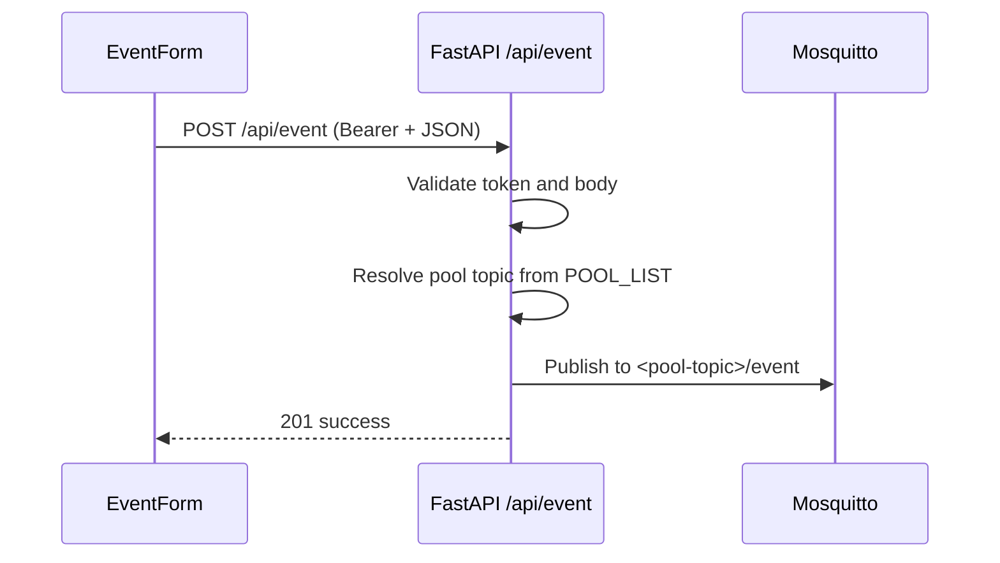

# Technical Specification: Pool-Monitoring PWA

**Version:** 2.0 | **Based on:** FSD 2.0 | **Date:** 2026-06-06

---

## 1. Purpose & Scope

This document describes the concrete technical implementation of FSD v2.0.
Guiding principle: **As flat and simple as possible – as modular as necessary.**
Every file, abstraction, and dependency must justify its place.

**v1 scope:** Measurement form + event form -> MQTT publish. No database access, no dashboard.

**Phase 20 scope (Live Data):** For every pool in `POOL_LIST` the backend subscribes
to a single wildcard `<base>/+` derived from each pool's base topic, dispatches
incoming messages by JSON content (measurement / pump / event), aggregates
per-hour means into SQLite, and serves a Live dashboard (current temperature,
5-sample mean of pH/Cl, pump status, 7-day trend chart) via new REST endpoints.

**Phase 25 scope (Event refactor):** The chemistry update feature was generalised
into an "operational event" feature. The endpoint moved from `POST /api/chem` to
`POST /api/event`, the MQTT topic suffix from `/chem` to `/event`, the wire field
`chemicalType` to `eventType`, and the event type enum was extended with
`refill`, `backwash`, `winter`. The component was renamed
`ChemicalUpdateForm.vue` → `EventForm.vue` and gained an optional `note` field
and a per-event default unit. UI labels are German; enum values remain English.

**Phase 26 scope (UX polish):** Added `kg` unit, asymmetric stepper steps at
range boundaries (1 l − → 0.9, 10 g − → 9), reordered unit dropdown
(Tabs, g, kg, l, Min.), relabelled the menu (Live → Übersicht,
Measurements → Messungen, Chemieupdate → Ereignisse, Settings → Einstellungen),
fully Germanised `MeasurementForm` and `SettingsPanel`, and bumped
`APP_VERSION` to `2.0`.

---

## 2. Technology Stack & Design Decisions

| Area     | Technology | Rationale |
| -------- | ---------- | --------- |
| Frontend | Vue 3 (Composition API), JavaScript | FSD requirement; JS instead of TS avoids tsconfig overhead for a small project |
| Styling  | Tailwind CSS v4 + `@tailwindcss/vite` | Utility-first; v4 needs no `tailwind.config.js` |
| Build    | Vite + `@vitejs/plugin-vue` | Fast, minimally configured |
| PWA      | `vite-plugin-pwa` (Workbox) | Auto-generates service worker + manifest |
| Backend  | Python 3.12, FastAPI | FSD requirement; Pydantic validation included |
| MQTT     | `paho-mqtt ≥ 2.0` | FSD requirement; built-in exponential backoff via `reconnect_delay_set` |
| AI client | `openrouter` (Python SDK) | Official OpenRouter Python SDK – single key, 300+ models, type-safe |
| Multipart | `python-multipart` | Required by FastAPI for `UploadFile` / `Form` parsing |
| DB       | `sqlite3` (Python stdlib) + WAL | Phase 20; no ORM, no async driver, no migrations framework |
| Charts   | `uplot@^1.6` | Phase 20; ~50 KB Canvas 2D, built-in drag-zoom/sync, custom `splits`/`values` callbacks for 0h-aligned tick labels |
| Linting  | Ruff + ESLint | Fast, minimal configuration |

**Deliberately excluded:**

| Excluded | Rationale |
| -------- | --------- |
| Vue Router | A small fixed set of views (`live`, `form`, `event`, `settings`) is handled via `ref` state in `App.vue` |
| Pinia / Vuex | Composable-level `reactive()` is enough for this scope |
| DB / ORM | v1 is stateless (Live Data uses SQLite directly, no ORM); extension prepared in Future Enhancements |
| Separate `config.py` | `os.getenv()` directly in `main.py` – 6 lines instead of a module |
| Axios | Native `fetch()` is sufficient; one less dependency |
| Separate `middleware/` | FastAPI `Depends()` inline on the route – 5 lines instead of a module |
| Other provider SDKs (`openai`, `anthropic`, `google-genai`) | OpenRouter SDK provides unified access to all of them; no need for per-provider SDKs |
| LangChain / LlamaIndex | Heavy abstractions for a single structured-output call – pure overkill |
| Persistent rate-limit store (Redis) | In-process counter (UTC-day bucket) is sufficient for a single-instance hobby deployment |

---

## 3. Directory Structure

```
src/
├── backend/
│   ├── main.py              # FastAPI app, all routes, Pydantic models (incl. Event), auth, rate-limit
│   ├── mqtt.py              # MQTT client (connect, publish, subscribe, reconnect)
│   ├── ai.py                # AI client (provider-agnostic, structured output, image storage)
│   ├── db.py                # SQLite layer (Phase 20): schema, WAL, insert, query, retention
│   ├── live_state.py        # In-memory ring buffer + pump state change (Phase 20)
│   ├── aggregator.py        # Hourly rollup + retention cleanup (Phase 20, asyncio)
│   ├── requirements.txt
│   ├── pyproject.toml       # Ruff/Black configuration
│   └── Dockerfile
├── frontend/
│   ├── src/
│   │   ├── main.js          # App mount, PWA registration
│   │   ├── App.vue          # Root: view toggle (live|form|event|settings), navigationEntries, toast display
│   │   ├── validation.js    # Field constants (min, max, step, default, unit)
│   │   ├── utils/
│   │   │   └── eventStep.js # Step grid + direction-aware stepper logic for EventForm (Phase 26)
│   │   ├── components/
│   │   │   ├── StepperInput.vue       # Generic +/- input stepper (used by TrendChart, not by forms)
│   │   │   ├── ValueSliderInput.vue   # [-] [Wert] [+] Stepper + Popover-Slider combo (supports `stepDown` prop, Phase 26)
│   │   │   ├── MeasurementForm.vue    # Measurement form (German labels, Phase 26)
│   │   │   ├── ImageCaptureModal.vue  # Camera capture, compression, preview, AI call
│   │   │   ├── EventForm.vue          # Event form (Phase 25, refactored from ChemicalUpdateForm.vue)
│   │   │   ├── LiveView.vue           # Live dashboard (Phase 20): default landing
│   │   │   ├── TrendChart.vue         # uPlot, 3 panels, mouse + touch zoom/pan (Phase 20, 22)
│   │   │   ├── PumpStatusCard.vue     # Pump status card with icon (Phase 20)
│   │   │   └── SettingsPanel.vue      # Settings (URL, token, name); German heading (Phase 26)
│   │   └── composables/
│   │       ├── useApi.js      # fetch wrapper with Bearer auth (incl. live, history, postEvent)
│   │       ├── useSettings.js # localStorage read/write (reactive)
│   │       ├── useImage.js    # Canvas-based image compression utility
│   │       ├── useToast.js    # Toast state (module-level singleton)
│   │       ├── useCamera.js   # Camera detection via enumerateDevices
│   │       └── useLiveData.js # 30s polling for /api/live (Phase 20)
│   ├── public/
│   │   └── icons/
│   │       ├── icon-192.png
│   │       └── icon-512.png
│   ├── index.html
│   ├── vite.config.js       # Vite + Vue + Tailwind + PWA
│   ├── nginx.conf           # SPA routing for Nginx
│   ├── Dockerfile
│   └── Dockerfile_production
├── mqtt2mail/
│   ├── .env.example
│   ├── app/
│   │   └── mqtt2mail.py
│   ├── Dockerfile
│   ├── README.md
│   └── requirements.txt
├── docker-compose.yml
├── Caddyfile
├── deploy-prepare.sh
├── .env.example
└── .gitignore
```

**Test files** live alongside source files:

```
backend/tests/
├── test_models.py       # Pydantic: Measurement, Event (incl. EventType, EventUnit, note)
├── test_api.py          # HTTP endpoints via TestClient (MQTT + AI mocked); 404 regression for /api/chem
├── test_auth.py         # verify_token: valid, missing, wrong
├── test_ai.py           # ai.analyze_pool_image: structured-output happy path,
│                        #   refusal -> AIRefusalError, schema mismatch -> AISchemaError,
│                        #   timeout -> AITimeoutError, rate-limit counter rollover
├── test_db.py           # SQLite: schema, insert, query, retention (Phase 20)
├── test_live_state.py   # Ring buffer, pump state change detection (Phase 20)
├── test_mqtt.py         # Subscribe + reconnect re-subscribe (Phase 20); event topic dispatch (Phase 25)
├── test_aggregator.py   # Hourly rollup, retention cleanup (Phase 20)
└── test_api_live.py     # /api/live, /api/history, /api/pump-events, /api/pools/live (Phase 20)

frontend/tests/
├── validation.spec.js           # FIELD_CONFIG boundaries and NAME_CONFIG pattern
├── useSettings.spec.js          # localStorage read/write, defaults, token encoding
├── StepperInput.spec.js         # Stepper logic: steps, min/max boundaries, emit
├── ValueSliderInput.spec.js     # step / stepDown prop, empty value (Phase 26)
├── useApi.spec.js               # API calls: success, 401, network error (incl. postEvent, live, history)
├── useImage.spec.js             # Compression: max edge clamp, JPEG output, byte cap
├── useLiveData.spec.js          # 30s polling, stale detection, cleanup (Phase 20)
├── LiveView.spec.js             # Übersicht render, pool selector (Phase 20)
├── TrendChart.spec.js           # uPlot chart instances, empty state, destroy on unmount, touch gestures (Phase 20, 22)
├── MeasurementForm.spec.js      # German labels, submit, photo button (Phase 26)
└── eventStep.spec.js            # stepFor (both directions), amountDecimals, amountEmptyValue, snapAmount (Phase 26)
```

---

## 4. Frontend

### 4.1 View Switching (No Router)

`App.vue` holds `const view = ref('live')` and renders conditionally.
Target state set: `live | form | event | settings`.
`useToast` is a module-level singleton, callable from any component.
The default landing is `'live'` (Übersicht); the burger menu is the
only navigation entry, defined as a flat `navigationEntries` array.
The Settings shortcut remains top-right (gear icon).

Menu labels are in German; the view key (`'live'`, `'form'`, `'event'`,
`'settings'`) is English and not user-visible.

```js
const navigationEntries = [
  { key: 'live',      label: 'Übersicht' },
  { key: 'form',      label: 'Messungen' },
  { key: 'event',     label: 'Ereignisse' },
  { key: 'settings',  label: 'Einstellungen', separator: true },
]
```

Rendered top-level structure:

```vue
<template>
  <div class="flex min-h-svh items-center justify-center bg-slate-50 p-4">
    <div class="relative w-full max-w-sm overflow-hidden rounded-2xl bg-white shadow-lg">
      <div class="bg-primary px-6 py-4 text-center">
        <h1 class="text-2xl font-bold text-white">Pool Monitor</h1>
      </div>
      <div class="p-6">
        <LiveView        v-if="view === 'live'" />
        <MeasurementForm v-else-if="view === 'form'" />
        <EventForm       v-else-if="view === 'event'" />
        <SettingsPanel   v-else-if="view === 'settings'" @close="view = 'live'" />
      </div>
    </div>

    <!-- Global Toast overlay -->
    <Transition name="toast">
      <div v-if="toast.visible" class="fixed top-6 left-1/2 -translate-x-1/2 rounded-lg px-5 py-3 text-sm font-medium text-white shadow-lg"
           :class="{ 'bg-success': toast.type === 'success', 'bg-error': toast.type === 'error', 'bg-warning': toast.type === 'warning' }">
        {{ toast.message }}
      </div>
    </Transition>
  </div>
</template>
```

`v-if` is used throughout (not `v-show`) — switching between views unmounts the
previous form, which is acceptable because switching from a form back to
`Settings` is rare and form state can be re-entered. The Live dashboard
re-fetches on every mount via the `useLiveData` composable.

The app shell provides a centered card layout with a colored header bar. Primary page navigation is opened via a burger menu in the top-left area (FSD 3.3), while the settings shortcut remains top-right.

### 4.2 Components

| File | Responsibility | Props | Emits |
| ---- | -------------- | ----- | ----- |
| `StepperInput.vue` | Number input +/- stepper *(ersetzt durch ValueSliderInput)* | `modelValue`, `min`, `max`, `step`, `decimals`, `unit` | `update:modelValue` |
| `ValueSliderInput.vue` | `[-] [Wert] [+]` Stepper + Popover-Slider, v-model compatible. Optional `stepDown` prop (default `null` → fallback to `step`) for asymmetric step on `−` (Phase 26) | `modelValue`, `min`, `max`, `step`, `stepDown`, `decimals`, `unit` | `update:modelValue` |
| `MeasurementForm.vue` | Form, validation, submit flow, title, settings gear icon, opens `ImageCaptureModal`. UI fully Germanised (Phase 26) | – | – |
| `EventForm.vue` | Form for one operational event with optional amount + unit + collapsible note (Phase 25; renamed from `ChemicalUpdateForm.vue`) | – | – |
| `ImageCaptureModal.vue` | Camera capture, client-side compression, AI request, result preview | `mode` (String, default `'camera'`) | `close`, `applied` (payload `{pH, cl, image}`) |
| `LiveView.vue` | Live dashboard: pool selector, temperature main card, pH/Cl side cards (5-sample mean), pump status cards, 7-day trend chart (Phase 20) | – | – |
| `TrendChart.vue` | uPlot, 3 separate panels (temp/pH/cl) with per-metric Y-axis, custom pan + wheel-zoom + touch (pan / pinch / double-tap reset), cross-chart x-axis sync, custom `splits`/`values` callbacks align ticks to 0h midnight, infinite-scroll backfill capped at "now" (Phase 20, 21, 22) | `pool` (String) | – |
| `PumpStatusCard.vue` | Pump status card: large icon, label, state, "läuft seit X min" (Phase 20) | `pump` ('main'\|'solar'), `state` (Boolean), `runningSince` (Number\|null) | – |
| `SettingsPanel.vue` | Read/write API token + version display. Heading `Einstellungen` (Phase 26) | – | `close` |

**`ValueSliderInput.vue`** – kombiniert `[-] [Wert] [+]` Stepper mit Popover-Slider:

```vue
<script setup>
import { computed, ref, onMounted, onBeforeUnmount } from 'vue'

const props = defineProps(['modelValue', 'min', 'max', 'step', 'decimals', 'unit'])
const emit = defineEmits(['update:modelValue'])

const showSlider = ref(false)
const idleTimer = ref(null)
const releaseTimer = ref(null)
const isDragging = ref(false)
const holdTimer = ref(null)

const displayValue = computed(() => props.modelValue.toFixed(props.decimals))

// Integer-Range intern (0..N) mapped auf Dezimal-Step
const rangeSteps = computed(() => Math.round((props.max - props.min) / props.step))

function valueToRange(val) { return Math.round((val - props.min) / props.step) }
function rangeToValue(rangeVal) {
  return parseFloat((props.min + rangeVal * props.step).toFixed(props.decimals))
}

function openSlider() { showSlider.value = true; resetIdleTimer() }
function closeSlider() { showSlider.value = false; clearTimers() }

// 5s Idle-Timeout
function resetIdleTimer() { clearTimers()
  idleTimer.value = setTimeout(() => { if (!isDragging.value) closeSlider() }, 5000) }

// 1s Release-Timeout nach Loslassen
function onDragEnd() { isDragging.value = false
  releaseTimer.value = setTimeout(() => closeSlider(), 1000) }

// Gedrückthalten der +/- Buttons: 500ms initial, dann alle 100ms
function onHoldStart(dir) { step(dir)
  holdTimer.value = setTimeout(() => {
    holdTimer.value = setInterval(() => step(dir), 100) }, 500) }
function onHoldEnd() { clearTimers() }

// Klick außerhalb schließt
function onClickOutside(event) {
  if (showSlider.value && overlayRef.value && !overlayRef.value.contains(event.target)) closeSlider()
}

onMounted(() => {
  document.addEventListener('mousedown', onClickOutside)
  document.addEventListener('touchstart', onClickOutside)
})

onBeforeUnmount(() => {
  document.removeEventListener('mousedown', onClickOutside)
  document.removeEventListener('touchstart', onClickOutside)
  clearTimers()
})
</script>

<template>
  <div class="relative w-full">
    <div class="flex items-center justify-center gap-6">
      <button @mousedown.prevent="onHoldStart(-1)" @mouseup="onHoldEnd"
              @mouseleave="onHoldEnd" @touchstart.prevent="onHoldStart(-1)"
              @touchend="onHoldEnd" @touchcancel="onHoldEnd"
              :disabled="modelValue <= min">−</button>
      <button @click="openSlider" class="w-24 ...">{{ displayValue }}<span>{{ unit }}</span></button>
      <button @mousedown.prevent="onHoldStart(+1)" @mouseup="onHoldEnd" ...>+</button>
    </div>

    <!-- Popover-Slider über dem Wert (volle Container-Breite) -->
    <Transition name="slider-popover">
      <div v-if="showSlider" ref="overlayRef" class="slider-popover">
        <div class="slider-value">{{ displayValue }}<span class="unit">{{ unit }}</span></div>
        <input type="range" :min="0" :max="rangeSteps" step="1"
               :value="sliderRangeValue" @input="onSliderInput" ... />
        <div class="slider-labels"><span>{{ min }}</span><span>{{ max }}</span></div>
      </div>
    </Transition>
  </div>
</template>
```

Das component bietet:
- **Normalzustand:** `[-] [Wert] [+]` mit Auto-Repeat bei Gedrückthalten
- **Klick auf Wert:** Overlay-Slider erscheint über dem Feld (absolute Position, volle Container-Breite)
- **Slider:** Integer-Range intern (0..N), mapped automatisch auf Dezimal-Step (z.B. 0..200 für temp 10-40°C mit step 0.2)
- **Timeout:** 5s Inaktivität oder 1s nach Loslassen → schließt automatisch
- **Klick außerhalb:** schließt sofort

**`MeasurementForm.vue`** – contains the full submit flow:

```js
// Internal flow in MeasurementForm.vue (setup)
const { settings } = useSettings()
const { postMeasurement, loading, error } = useApi()
const { show: showToast } = useToast()

// Local form state (reactive, no store)
const form = reactive({
  time: '',         // datetime-local string, initialized to local now
  name: '',         // populated from fetchPools
  temp: FIELD_CONFIG.temp.default,
  pH:   FIELD_CONFIG.pH.default,
  cl:   FIELD_CONFIG.cl.default,
  status: '',       // optional status text
})

const errors = reactive({})   // inline validation errors

function validate() {
  // clears errors, checks name (1-50 chars, alphanumeric + spaces) and time
  // returns true if valid
}

async function submit() {
  if (!validate()) return
  const timestamp = Math.floor(new Date(form.time).getTime() / 1000)
  const ok = await postMeasurement({ ...form, time: timestamp })
  if (ok) {
    showToast('Messung gespeichert', 'success')
    resetForm()
  } else if (error.value === '401') {
    showToast('Nicht autorisiert – Token in den Einstellungen prüfen', 'error')
  } else {
    showToast('Senden der Messung fehlgeschlagen', 'error')
  }
}
```

The form title ("Messungen") is rendered inside `MeasurementForm.vue` (matching the FSD wireframe), not in `App.vue`.

**`SettingsPanel.vue`** – Cancel/Save pattern with token visibility toggle:

```vue
<script setup>
import { reactive, ref } from 'vue'
import { useSettings } from '../composables/useSettings.js'
import { useToast } from '../composables/useToast.js'

const emit = defineEmits(['close'])

const { settings } = useSettings()
const { show: showToast } = useToast()
const APP_VERSION = '2.0'

const original = reactive({ ...settings })
const tokenVisible = ref(false)

const cancel = () => {
  Object.assign(settings, original)
  emit('close')
}

const save = () => {
  showToast('Einstellungen gespeichert', 'success')
  Object.assign(original, settings)
  emit('close')
}
</script>

<template>
  <div class="relative space-y-5">
    <h1 class="text-center text-2xl font-bold text-slate-800">Settings</h1>

    <div class="space-y-4">
      <div class="space-y-1">
        <label class="block text-sm font-medium text-slate-600">API Token</label>
        <div class="relative">
          <input v-model="settings.token" :type="tokenVisible ? 'text' : 'password'"
                 placeholder="Bearer token"
                 class="w-full rounded-lg border border-slate-300 px-3 py-2 pr-10 text-slate-800 focus:border-primary focus:outline-none focus:ring-1 focus:ring-primary" />
          <button type="button" @click="tokenVisible = !tokenVisible"
                  class="absolute right-2 top-1/2 -translate-y-1/2 text-slate-400 hover:text-slate-600">
            <!-- eye / eye-off SVG icons -->
          </button>
        </div>
      </div>
    </div>

    <div class="flex gap-3 pt-2">
      <button type="button" @click="cancel"
              class="flex-1 rounded-lg border border-slate-300 py-2.5 text-slate-600 hover:bg-slate-100 font-medium">Abbrechen</button>
      <button type="button" @click="save"
              class="flex-1 rounded-lg bg-primary py-2.5 text-white font-medium hover:bg-primary/90">Speichern</button>
    </div>

    <p class="text-center text-xs text-slate-400">Version {{ APP_VERSION }}</p>
  </div>
</template>
```

### 4.3 Composables

#### `useSettings.js`

Module-level `reactive` object – initialized once, shared by all components.
`watch` writes to localStorage on every change.
Token is stored Base64-encoded (obfuscation, not a security feature).

```js
import { reactive, watch } from 'vue'

const KEY = 'pool_monitor_settings'
const DEFAULTS = { token: '' }

function load() {
  try {
    const raw = JSON.parse(localStorage.getItem(KEY) ?? '{}')
    return { ...DEFAULTS, ...raw, token: raw.token ? atob(raw.token) : '' }
  } catch { return { ...DEFAULTS } }
}

function save(s) {
  localStorage.setItem(KEY, JSON.stringify({ ...s, token: btoa(s.token) }))
}

// Module-level singleton – created only once
const settings = reactive(load())
watch(settings, save, { deep: true })

export function useSettings() {
  return { settings }
}
```

#### `useApi.js`

Reads `settings.token`. API base path is hardcoded as `/api` (same origin as frontend).
Returns a local `{ loading, error }` per call (no global loading state).
No automatic retry – the user has a retry button (FSD 7.1).

```js
import { ref } from 'vue'
import { useSettings } from './useSettings.js'

export function useApi() {
  const { settings } = useSettings()
  const loading = ref(false)
  const error = ref(null)

  async function fetchPools() {
    try {
      const res = await fetch(`/api/pools`, {
        headers: { 'Authorization': `Bearer ${settings.token}` }
      })
      if (!res.ok) return []
      return await res.json()
    } catch {
      return []
    }
  }

  async function postMeasurement(form) {
    loading.value = true
    error.value = null
    const payload = {
      time:       form.time,
      name:       form.name,
      sensorType: 'manual',
      pH:         form.pH,
      cl:         form.cl,
      temp:       form.temp,
    }
    if (form.status) {
      payload.status = form.status
    }
    if (form.aiPH != null) {
      payload.aiPH = form.aiPH
    }
    if (form.aiCL != null) {
      payload.aiCL = form.aiCL
    }
    if (form.aiImage) {
      payload.aiImage = form.aiImage
    }
    if (form.aiCorrected != null) {
      payload.aiCorrected = form.aiCorrected
    }
    try {
      const res = await fetch(`/api/measurements`, {
        method: 'POST',
        headers: {
          'Content-Type': 'application/json',
          'Authorization': `Bearer ${settings.token}`,
        },
        body: JSON.stringify(payload),
      })
      if (res.status === 401) { error.value = '401'; return false }
      if (!res.ok) { error.value = String(res.status); return false }
      return true
    } catch {
      error.value = 'network'
      return false
    } finally {
      loading.value = false
    }
  }

  async function analyzeImage(file) {
    loading.value = true
    error.value = null
    const fd = new FormData()
    fd.append('image', file)
    try {
      const res = await fetch(`/api/analyze-image`, {
        method: 'POST',
        headers: { 'Authorization': `Bearer ${settings.token}` },
        body: fd,
      })
      if (res.status === 401) { error.value = '401'; return null }
      if (res.status === 422) { error.value = '422'; return null }
      if (res.status === 429) { error.value = '429'; return null }
      if (!res.ok) { error.value = String(res.status); return null }
      return await res.json()
    } catch {
      error.value = 'network'
      return null
    } finally {
      loading.value = false
    }
  }

  return { loading, error, postMeasurement, postEvent, fetchPools, fetchPoolsLive, fetchLive, fetchHistory, fetchPumpEvents, analyzeImage }
}
```

Target event call in `useApi.js` (Phase 25):

```js
async function postEvent(form) {
  const payload = {
    time: form.time,
    name: form.name,
    eventType: form.eventType,
  }
  if (form.amount != null) payload.amount = form.amount
  if (form.unit) payload.unit = form.unit
  if (form.note) payload.note = form.note

  const res = await fetch('/api/event', {
    method: 'POST',
    headers: {
      'Content-Type': 'application/json',
      'Authorization': `Bearer ${settings.token}`,
    },
    body: JSON.stringify(payload),
  })

  return res.ok
}
```

#### `useCamera.js`

Detects whether the device has a camera using `navigator.mediaDevices.enumerateDevices`.
Used by `MeasurementForm.vue` to show camera/file buttons on mobile or file-only button on desktop.

```js
import { ref, onMounted } from 'vue'

export function useCamera() {
  const hasCamera = ref(false)

  onMounted(async () => {
    if (!navigator.mediaDevices?.enumerateDevices) return
    try {
      const devices = await navigator.mediaDevices.enumerateDevices()
      hasCamera.value = devices.some(d => d.kind === 'videoinput')
    } catch {
      hasCamera.value = false
    }
  })

  return { hasCamera }
}
```

#### `useToast.js`

Module-level singleton. `show()` is callable from any component without props/events.
`toast` is only rendered in `App.vue`.

```js
import { reactive } from 'vue'

const toast = reactive({ message: '', type: 'success', visible: false })
let _timer = null

export function useToast() {
  function show(message, type = 'success', duration = 3000) {
    clearTimeout(_timer)
    Object.assign(toast, { message, type, visible: true })
    _timer = setTimeout(() => { toast.visible = false }, duration)
  }
  return { toast, show }
}
```

### 4.4 Validation Constants (`validation.js` + `utils/eventStep.js`)

Central source for all field boundaries. Used by `MeasurementForm.vue` and `StepperInput.vue`.
Backend validation (Pydantic `Field()`) uses the same values.

```js
export const FIELD_CONFIG = {
  temp: { min: 10.0, max: 40.0,  step: 0.2, default: 24.0, decimals: 1, unit: '°C'   },
  pH:   { min: 6.0,  max: 8.0,   step: 0.1, default: 7.0,  decimals: 1, unit: ''     },
  cl:   { min: 0.0,  max: 5.0,   step: 0.1, default: 1.0,  decimals: 1, unit: 'mg/l' },
}

export const NAME_CONFIG = { minLength: 1, maxLength: 50, pattern: /^[a-zA-Z0-9 ]+$/ }
```

#### `utils/eventStep.js` (Phase 26)

Pure, framework-agnostic helpers for the Event form stepper. No Vue
imports — fully testable with `vitest`.

```js
// Amount grid: l/kg = 0, 0.1..0.9, 1..9, 10, 20, .., 100; others = 0, 1..9, 10, 20, .., 100
export function stepFor(unit, value, dir) { /* ... */ }
export function amountDecimals(unit) { /* 1 for l/kg, 0 otherwise */ }
export function amountEmptyValue(unit) { /* '' when not entered, else toFixed(decimals) */ }
export function snapAmount(unit, value) { /* coerce typed value to grid */ }
```

Used by `EventForm.vue` to drive `ValueSliderInput` with a direction-aware
`step` and `stepDown` prop pair (e.g. for `g` at value `10`, `step = 10` and
`stepDown = 1`, so `−` goes to `9` and `+` goes to `20`).

### 4.5 Build Configuration (`vite.config.js`)

`vite-plugin-pwa` generates the service worker (Workbox, `CacheFirst` for static assets)
and `manifest.json` automatically from the configuration.

```js
import { defineConfig } from 'vite'
import vue from '@vitejs/plugin-vue'
import tailwindcss from '@tailwindcss/vite'
import { VitePWA } from 'vite-plugin-pwa'

export default defineConfig({
  plugins: [
    vue(),
    tailwindcss(),
    VitePWA({
      registerType: 'autoUpdate',
      manifest: {
        name: 'Pool Monitor',
        short_name: 'Pool',
        theme_color: '#0EA5E9',
        background_color: '#F8FAFC',
        display: 'standalone',
        icons: [
          { src: 'icons/icon-192.png', sizes: '192x192', type: 'image/png' },
          { src: 'icons/icon-512.png', sizes: '512x512', type: 'image/png' },
        ],
      },
      workbox: {
        globPatterns: ['**/*.{js,css,html,png,svg}'],
        runtimeCaching: [], // v1: app shell only, no API caching
      },
    }),
  ],
})
```

Tailwind CSS v4: no `tailwind.config.js` needed. Only configuration in `src/main.css`:

```css
@import "tailwindcss";

@theme {
  --color-primary: #0EA5E9;
  --color-success: #22C55E;
  --color-warning: #F59E0B;
  --color-error:   #EF4444;
}
```

### 4.6 Frontend Dependencies (`package.json`)

```json
{
  "dependencies": {
    "vue": "^3.5"
  },
  "devDependencies": {
    "@vitejs/plugin-vue": "^5",
    "@tailwindcss/vite": "^4",
    "tailwindcss": "^4",
    "vite": "^6",
    "vite-plugin-pwa": "^0.21",
    "vitest": "^2",
    "@vue/test-utils": "^2",
    "jsdom": "^25"
  }
}
```

`jsdom` is required for `vitest` to run component tests in a simulated DOM environment (`environment: 'jsdom'` in `vite.config.js`).

### 4.7 Image Capture & Analysis Flow

The image-analysis feature lives in **`ImageCaptureModal.vue`** and the
**`useImage`** composable. `MeasurementForm.vue` uses `useCamera()` to detect
camera availability and shows two buttons (Foto/File) on mobile or just File on desktop:

```js
// Inside MeasurementForm.vue (setup)
const { hasCamera } = useCamera()
const showCapture = ref(false)
const captureMode = ref('camera')

function openCapture(mode) {
  captureMode.value = mode
  showCapture.value = true
}

function onCaptureApplied({ pH, cl }) {
  if (pH != null) form.pH = pH
  if (cl != null) form.cl = cl
  showToast('Werte extrahiert – bitte prüfen', 'success')
  showCapture.value = false
}
```

**`ImageCaptureModal.vue`** supports two modes (`mode` prop: `'camera'` or `'file'`).
It compresses the image and sends it to `/api/analyze-image`. The AI can return `-1`
for pH or cl if it cannot reliably read the value – the modal shows an error in that case.
Warnings from the AI (e.g., poor lighting) are shown as a toast.

```vue
<script setup>
import { ref, onMounted } from 'vue'
import { compress } from '../composables/useImage.js'
import { useApi } from '../composables/useApi.js'
import { useToast } from '../composables/useToast.js'

const props = defineProps({ mode: { type: String, default: 'camera' } })
const emit = defineEmits(['applied', 'close'])

const { loading, error, analyzeImage } = useApi()
const { show: showToast } = useToast()
const localError = ref(null)
const cameraInput = ref(null)
const fileInput = ref(null)

onMounted(() => {
  // Auto-open camera or file picker on mount
  if (props.mode === 'camera') {
    cameraInput.value?.click()
  } else {
    fileInput.value?.click()
  }
})

async function onFileChange(e) {
  const file = e.target.files?.[0]
  if (!file) return
  localError.value = null
  try {
    const compressed = await compress(file, { maxEdge: 1920, quality: 0.8 })
    const result = await analyzeImage(compressed)
    if (result) {
      if (result.ph === -1 || result.cl === -1) {
        const parts = []
        if (result.ph === -1) parts.push('pH')
        if (result.cl === -1) parts.push('Cl')
        localError.value = `AI could not reliably read: ${parts.join(', ')}`
        return
      }
      if (result.warnings?.length) {
        showToast(result.warnings.join('; '), 'warning', 5000)
      }
      emit('applied', { pH: result.ph, cl: result.cl, image: result.image })
    } else if (error.value === '401') {
      localError.value = 'Unauthorized – check your token'
    } else if (error.value === '422') {
      localError.value = 'AI could not analyze the image'
    } else if (error.value === '429') {
      localError.value = 'Daily image-analysis limit reached'
    } else if (error.value) {
      localError.value = `Error ${error.value}`
    } else {
      localError.value = 'Network error'
    }
  } catch {
    localError.value = 'Could not read image file'
  }
}
</script>

<template>
  <div class="fixed inset-0 z-50 flex items-center justify-center bg-black/50 p-4">
    <div class="relative w-full max-w-sm rounded-2xl bg-white p-6">
      <!-- Camera input (mobile: opens rear camera) -->
      <input ref="cameraInput" type="file" accept="image/*" capture="environment"
             class="hidden" @change="onFileChange" />
      <!-- File input (desktop fallback) -->
      <input ref="fileInput" type="file" accept="image/*"
             class="hidden" @change="onFileChange" />

      <div v-if="loading" class="flex items-center justify-center gap-2 rounded-lg bg-slate-100 py-4 text-slate-600">
        <svg class="h-5 w-5 animate-spin" fill="none" viewBox="0 0 24 24"><circle class="opacity-25" cx="12" cy="12" r="10" stroke="currentColor" stroke-width="4" /><path class="opacity-75" fill="currentColor" d="M4 12a8 8 0 018-8V0C5.373 0 0 5.373 0 12h4z" /></svg>
        Analyzing image…
      </div>

      <div v-if="localError" class="rounded-lg bg-error/10 px-4 py-3 text-sm text-error">
        {{ localError }}
      </div>

      <button type="button" @click="emit('close')"
              class="mt-4 w-full rounded-lg border border-slate-300 py-2.5 text-slate-600 hover:bg-slate-100">
        Abbrechen
      </button>
    </div>
  </div>
</template>
```

Key points:

- `mode="camera"` uses `capture="environment"` to open the rear camera on mobile.
- `mode="file"` shows a file picker (used on desktop or when no camera detected).
- `useCamera()` in `MeasurementForm.vue` decides whether to show one button (file-only)
  or two buttons (Foto + File).
- Compression: `maxEdge: 1920`, `quality: 0.8` (higher resolution than initial implementation).
- `-1` handling: if AI returns -1 for pH or cl, the modal shows an error and does not apply values.
- The modal does **not** mutate form state directly; it only emits `applied` with the
  values, and the parent merges them.

### 4.8 `useImage.js` – Compression Helper

```js
export async function compress(file, { maxEdge = 1920, quality = 0.8 } = {}) {
  const img = await createImageBitmap(file)
  let { width, height } = img
  if (width > height && width > maxEdge) {
    height = Math.round((height * maxEdge) / width)
    width = maxEdge
  } else if (height > maxEdge) {
    width = Math.round((width * maxEdge) / height)
    height = maxEdge
  }
  const canvas = new OffscreenCanvas(width, height)
  const ctx = canvas.getContext('2d')
  ctx.drawImage(img, 0, 0, width, height)
  const blob = await canvas.convertToBlob({ type: 'image/jpeg', quality })
  img.close()
  return new File([blob], file.name.replace(/\.[^.]+$/, '.jpg'), { type: 'image/jpeg' })
}
```

`OffscreenCanvas` is supported on all modern target browsers (FSD 3.6). A `<canvas>`
fallback can be added if iOS Safari < 17 needs to be supported.

---

## 5. Backend

### 5.1 File Structure and Split

`main.py` contains everything that does not need its own state: configuration, Pydantic
models, auth dependency, app lifespan, rate-limit counter, and all routes.
`mqtt.py` is separated because the client manages its own threading state (`loop_start()`).
`ai.py` is separated because it owns the provider abstraction, prompt construction, and
on-disk image/result persistence.

```
main.py
 ├── Imports
 ├── Configuration (os.getenv)
 ├── Pydantic models: Measurement, ImageAnalysisResult
 ├── Auth dependency: verify_token()
 ├── Rate-limit counter (UTC-day bucket, in-process)
 ├── App + Lifespan (MQTT connect/disconnect, AI client lifecycle)
 ├── POST /api/measurements
 ├── POST /api/analyze-image
 └── GET  /api/status
```

### 5.2 Configuration

Directly via `os.getenv()` – no separate config module:

```python
import os, time, secrets as _secrets
from contextlib import asynccontextmanager

import json

API_TOKEN   = os.getenv("API_TOKEN", "")
MQTT_HOST   = os.getenv("MQTT_HOST", "localhost")
MQTT_PORT   = int(os.getenv("MQTT_PORT", "1883"))
MQTT_USER   = os.getenv("MQTT_USER", "")
MQTT_PASS   = os.getenv("MQTT_PASS", "")
POOL_LIST   = json.loads(os.getenv("POOL_LIST", '[{"name": "Pool", "topic": "pool/manual"}]'))
FRONTEND_URL = os.getenv("FRONTEND_URL", "")

_mqtt_tls_env = os.getenv("MQTT_TLS", "")
if _mqtt_tls_env:
    MQTT_TLS = _mqtt_tls_env.lower() == "true"
else:
    MQTT_TLS = MQTT_PORT == 8883

ALLOWED_IMAGE_MIMES = {"image/jpeg", "image/png", "image/webp"}

# AI image analysis
AI_PROVIDER             = os.getenv("AI_PROVIDER", "")
AI_API_KEY              = os.getenv("AI_API_KEY", "")
AI_MODEL                = os.getenv("AI_MODEL", "google/gemini-3-flash-preview")
AI_MAX_REQUESTS_PER_DAY = int(os.getenv("AI_MAX_REQUESTS_PER_DAY", "10"))
AI_TIMEOUT_SECONDS      = int(os.getenv("AI_TIMEOUT_SECONDS", "30"))
AI_IMAGE_STORAGE_PATH   = os.getenv("AI_IMAGE_STORAGE_PATH", "/data/ai")
AI_IMAGE_RETENTION_DAYS = int(os.getenv("AI_IMAGE_RETENTION_DAYS", "30"))
AI_MAX_IMAGE_BYTES      = int(os.getenv("AI_MAX_IMAGE_BYTES", str(10 * 1024 * 1024)))

APP_VERSION = "2.0"
_start_time = time.time()
```

### 5.3 Pydantic Model & Validation

Validation ranges exactly match the `FIELD_CONFIG` values from `validation.js`.
The `status` key from `msg-sample.json` is set server-side – it is not an API input.

```python
from pydantic import BaseModel, Field, field_validator
import re

class Measurement(BaseModel):
    time:       int
    name:       str = Field(min_length=1, max_length=50)
    sensorType: str = "manual"
    pH:         float = Field(ge=0.0, le=14.0)
    cl:         float = Field(ge=0.0, le=10.0)
    temp:       float = Field(ge=5.0, le=45.0)
    status:     str | None = Field(default=None, max_length=100)
    aiPH:       float | None = None
    aiCL:       float | None = None
    aiImage:    str | None = Field(default=None, max_length=200)
    aiCorrected: bool | None = None

    @field_validator("name")
    @classmethod
    def valid_pool_name(cls, v: str) -> str:
        valid_names = [pool["name"] for pool in POOL_LIST]
        if v not in valid_names:
            raise ValueError(f"Unknown pool name: {v}")
        return v

    @field_validator("pH", "cl", "temp")
    @classmethod
    def one_decimal(cls, v: float) -> float:
        return round(v, 1)
```

**MQTT payload:** On publish, a new sanitized message is built – no passthrough of raw data.

```python
def build_mqtt_payload(m: Measurement) -> tuple[str, dict]:
    topic = next((pool["topic"] for pool in POOL_LIST if pool["name"] == m.name), "pool/manual")
    payload = {
        "time":       m.time,
        "name":       m.name,
        "sensorType": m.sensorType,
        "temp":       m.temp,
        "pH":         m.pH,
        "cl":         m.cl,
    }
    if m.status:
        payload["status"] = m.status
    if m.aiPH is not None:
        payload["aiPH"] = m.aiPH
    if m.aiCL is not None:
        payload["aiCL"] = m.aiCL
    if m.aiImage:
        payload["aiImage"] = m.aiImage
    if m.aiCorrected is not None:
        payload["aiCorrected"] = m.aiCorrected
    return topic, payload
```

### 5.4 Auth Dependency

`secrets.compare_digest` instead of `==` prevents timing attacks:

```python
from fastapi import Header, HTTPException, Depends
import secrets as _secrets

async def verify_token(authorization: str = Header(alias="Authorization")):
    expected = f"Bearer {API_TOKEN}"
    if not API_TOKEN or not _secrets.compare_digest(authorization, expected):
        raise HTTPException(status_code=401, detail="Unauthorized")
```

Bound directly on the route via `dependencies=[Depends(verify_token)]`.

### 5.5 Routes & Lifespan

```python
from collections import defaultdict
from datetime import datetime, timedelta, timezone

from fastapi import FastAPI, HTTPException, Depends, Request
from fastapi.middleware.cors import CORSMiddleware
from fastapi.responses import JSONResponse
from starlette.middleware.base import BaseHTTPMiddleware

import ai
import mqtt


class RateLimitMiddleware(BaseHTTPMiddleware):
    def __init__(self, app, times: int = 20, seconds: int = 60):
        super().__init__(app)
        self.times = times
        self.seconds = seconds
        self.requests = defaultdict(list)

    async def dispatch(self, request: Request, call_next):
        if request.url.path.startswith("/api/"):
            client_ip = request.headers.get("X-Forwarded-For", request.client.host if request.client else "unknown").split(",")[0].strip()
            now = datetime.now()
            cutoff = now - timedelta(seconds=self.seconds)
            self.requests[client_ip] = [t for t in self.requests[client_ip] if t > cutoff]
            if len(self.requests[client_ip]) >= self.times:
                return JSONResponse(status_code=429, content={"detail": "Too many requests"})
            self.requests[client_ip].append(now)
        return await call_next(request)


@asynccontextmanager
async def lifespan(app: FastAPI):
    mqtt.connect(MQTT_HOST, MQTT_PORT, MQTT_USER, MQTT_PASS, MQTT_TLS)
    await ai.get_client().startup()
    yield
    await ai.get_client().shutdown()
    mqtt.disconnect()

app = FastAPI(lifespan=lifespan)

app.add_middleware(
    CORSMiddleware,
    allow_origins=[FRONTEND_URL] if FRONTEND_URL else [],
    allow_methods=["POST", "GET"],
    allow_headers=["Authorization", "Content-Type"],
)

app.add_middleware(RateLimitMiddleware, times=20, seconds=60)


@app.get("/api/pools", dependencies=[Depends(verify_token)])
async def get_pools():
    return [{"name": pool["name"]} for pool in POOL_LIST]


@app.post("/api/measurements", status_code=201,
          dependencies=[Depends(verify_token)])
async def post_measurement(m: Measurement):
    topic, payload = build_mqtt_payload(m)
    if not mqtt.publish(topic, payload):
        raise HTTPException(status_code=503, detail="MQTT unavailable")
    return {"status": "success", "message": "Measurement published to MQTT"}


@app.get("/api/status")
async def get_status():
    today = datetime.now(timezone.utc).strftime("%Y-%m-%d")
    return {
        "status":                     "healthy",
        "mqttConnected":              mqtt.is_connected(),
        "aiConfigured":               ai.get_client().is_configured(),
        "imageAnalysisRequestsToday": _ai_counter.get(today, 0),
        "uptime":                     int(time.time() - _start_time),
        "version":                    APP_VERSION,
    }
```

### 5.6 `mqtt.py` – MQTT Client

Own file due to own threading state (`loop_start()`).
`reconnect_delay_set(min_delay=1, max_delay=300)` activates paho-internal exponential backoff.

```python
import json
import logging
import ssl

import paho.mqtt.client as mqtt_lib

_client: mqtt_lib.Client | None = None

def connect(host: str, port: int, user: str, password: str, tls: bool = False) -> None:
    global _client
    _client = mqtt_lib.Client(mqtt_lib.CallbackAPIVersion.VERSION2)
    if user:
        _client.username_pw_set(user, password)
    if tls:
        ctx = ssl.create_default_context()
        ctx.check_hostname = False
        ctx.verify_mode = ssl.CERT_NONE
        _client.tls_set_context(ctx)
    _client.reconnect_delay_set(min_delay=1, max_delay=300)
    _client.on_connect = lambda c, u, d, rc, p: (
        logging.info("MQTT connected (rc=%s)", rc) if rc == 0 else logging.error("MQTT connection failed (rc=%s)", rc)
    )
    _client.on_disconnect = lambda c, u, d, rc, p: (
        logging.warning("MQTT disconnected (rc=%s), reconnecting...", rc)
    )
    _client.connect_async(host, port)
    _client.loop_start()
    logging.info("MQTT connecting to %s:%s", host, port)

def publish(topic: str, payload: dict) -> bool:
    if not is_connected():
        return False
    result = _client.publish(topic, json.dumps(payload), qos=1)
    return result.rc == mqtt_lib.MQTT_ERR_SUCCESS

def disconnect() -> None:
    if _client:
        _client.loop_stop()
        _client.disconnect()

def is_connected() -> bool:
    return _client is not None and _client.is_connected()
```

`connect_async()` is used instead of `connect()` to avoid blocking during startup. The `on_connect` callback logs connection success or failure, complementing the existing `on_disconnect` handler.

### 5.7 `ai.py` – Multimodal AI Client

Uses the official **`openrouter` Python SDK** (`pip install openrouter`). A single
SDK instance (initialized in `startup()`) gives typed access to any of the 300+
models in the OpenRouter catalog – OpenAI GPT-4o, Anthropic Claude, Google Gemini,
Mistral, Aleph Alpha Pharia, and more – via one API key.

**Pydantic result model** – consumed by both `ai.py` and the route handler:

```python
from pydantic import BaseModel

class ImageAnalysisResult(BaseModel):
    ph:       float
    cl:       float
    refusal:  str | None = None   # set by AI when refusing to analyze
    warnings: list[str] | None = None  # image quality issues
    image:    str | None = None    # persisted image path

# Note: ph and cl can be -1.0 if the AI cannot reliably read them.
# The route handler checks for -1 and returns an error instead of applying values.
```

**SDK client lifecycle** – `AIClient` class with `startup()` / `shutdown()`:

```python
import openrouter

class AIClient:
    def __init__(self) -> None:
        self._client: openrouter.OpenRouter | None = None
        self._started = False

    async def startup(self) -> None:
        if not AI_API_KEY:
            return
        self._client = openrouter.OpenRouter(api_key=AI_API_KEY)
        self._started = True
        os.makedirs(AI_IMAGE_STORAGE_PATH, exist_ok=True)
        _prune_old_images()

    async def shutdown(self) -> None:
        self._client = None
        self._started = False

    def is_configured(self) -> bool:
        return self._started and self._client is not None

_client = AIClient()

def get_client() -> AIClient:
    return _client
```

**Image sending** – the OpenRouter SDK uses typed message components:

```python
from openrouter.components import (
    ChatContentImage,
    ChatFormatJSONSchemaConfig,
    ChatJSONSchemaConfig,
    ChatSystemMessage,
    ChatUserMessage,
)

SYSTEM_PROMPT = """You are an expert at analyzing pool test strip images. Given an image of a test strip next to a color reference scale, extract the following values:

- pH (0.0-14.0, one decimal). Return -1 if the pH pad cannot be reliably matched.
- cl (chlorine, 0.0-10.0, one decimal). Return -1 if the Cl pad cannot be reliably matched.

When a pad is clearly visible and matches the reference scale, interpolate between the nearest reference colors to find the best intermediate value. Do NOT round to the nearest reference value – estimate the true midpoint.

If lighting, blur, orientation, or other image issues make a pad unreadable, set that value to -1 instead of guessing. It is better to return -1 than to fabricate a plausible-looking number.

Populate the "warnings" list ONLY for significant image-quality problems that make analysis unreliable, such as: severe blur, very poor lighting, reversed orientation, or obstructed pads. Do NOT warn about minor imperfections (e.g. slight glare, minor shadows, or standard lighting variation) – these are expected in real-world photos and do not meaningfully affect accuracy. Do NOT warn about the values themselves – extreme readings, interpolation, or values between reference points are expected and handled correctly by the numeric fields.

Return ONLY the structured analysis result, no additional text."""
```

**Structured output** – uses `ChatFormatJSONSchemaConfig` to pass the Pydantic schema:

```python
from openrouter.errors import UnauthorizedResponseError, RequestTimeoutResponseError
from pydantic import ValidationError

_ALIAS_MAP = {"pH": "ph", "PH": "ph", "Cl": "cl", "P_H": "ph", "chlorine": "cl"}

def _normalize_keys(d: dict) -> dict:
    return {_ALIAS_MAP.get(k, k): v for k, v in d.items()}

async def analyze_pool_image(image_bytes: bytes, mime: str) -> ImageAnalysisResult:
    if not _client.is_configured():
        raise AIServiceError("AI client not configured")

    base64_image = base64.b64encode(image_bytes).decode("utf-8")
    data_uri = f"data:{mime};base64,{base64_image}"

    image_content = ChatContentImage(
        type="image_url",
        image_url={"url": data_uri, "detail": "high"},
    )

    system_msg = ChatSystemMessage(content=SYSTEM_PROMPT, role="system")
    user_msg = ChatUserMessage(content=[image_content], role="user")

    schema_config = ChatFormatJSONSchemaConfig(
        json_schema=ChatJSONSchemaConfig(
            name="ImageAnalysisResult",
            description="Pool test strip analysis result",
            schema_=ImageAnalysisResult.model_json_schema(),
        ),
        type="json_schema",
    )

    try:
        response = await _client._client.chat.send_async(
            messages=[system_msg, user_msg],
            model=AI_MODEL,
            response_format=schema_config,
            timeout_ms=AI_TIMEOUT_SECONDS * 1000,
        )
    except UnauthorizedResponseError as e:
        raise AIAuthError(f"AI authentication failed: {e}") from e
    except RequestTimeoutResponseError as e:
        raise AITimeoutError(f"AI request timed out after {AI_TIMEOUT_SECONDS}s") from e
    except Exception as e:
        raise AIServiceError(f"AI service error: {e}") from e

    if not response.choices:
        raise AIServiceError("Empty response from AI service")

    choice = response.choices[0]
    finish_reason = getattr(choice, "finish_reason", None)
    if finish_reason == "refuse":
        raise AIRefusalError("AI refused to analyze the image")

    content = choice.message.content
    refusal = choice.message.refusal

    if refusal:
        raise AIRefusalError(f"AI refused: {refusal}")

    if not content:
        raise AISchemaError("AI returned empty response")

    try:
        parsed = json.loads(content)
    except json.JSONDecodeError as e:
        raise AISchemaError(f"AI returned unparseable response: {e}") from e

    try:
        result = ImageAnalysisResult.model_validate(_normalize_keys(parsed))
    except ValidationError as e:
        raise AISchemaError(f"AI returned invalid schema: {e}") from e

    if result.refusal:
        raise AIRefusalError(f"AI refused: {result.refusal}")

    image_path = _persist_image(image_bytes, result)
    if image_path:
        result.image = image_path
    return result
```

**Error taxonomy** – caught and re-mapped to application-level errors:

| Exception           | HTTP | Trigger                                                            |
| ------------------- | ---- | ------------------------------------------------------------------ |
| `AIRefusalError`    | 422  | AI refused to analyze (safety filter or content policy)            |
| `AISchemaError`     | 422  | Response JSON does not match ImageAnalysisResult schema            |
| `AIAuthError`       | 502  | SDK raises `UnauthorizedResponseError` (invalid API key)           |
| `AITimeoutError`    | 503  | SDK raises `RequestTimeoutResponseError`                           |
| `AIServiceError`    | 503  | Other SDK errors or empty response                                 |

> **SDK note:** Uses `openrouter` Python SDK with typed components (`ChatFormatJSONSchemaConfig`,
> `ChatContentImage`, etc.) for structured output.

**Image persistence** – on every `/api/analyze-image` call:

```
$AI_IMAGE_STORAGE_PATH/
└── 2026-05-24/
    ├── 20260524T143012Z_<sha256[:12]>.jpg     # original (post-compression) image
    └── 20260524T143012Z_<sha256[:12]>.json    # request meta + AI raw + parsed result
```

A startup task prunes directories older than `AI_IMAGE_RETENTION_DAYS`.
SHA256 prefix in the filename allows cheap deduplication without a database.

**Public API of `ai.py`:**

```python
async def analyze_pool_image(image_bytes: bytes, mime: str) -> ImageAnalysisResult: ...

def get_client() -> AIClient: ...               # returns module-level singleton
# AIClient methods:
async def startup() -> None: ...                # creates AI_IMAGE_STORAGE_PATH, starts OpenRouter client
async def shutdown() -> None: ...               # closes client
def is_configured() -> bool: ...                # checks if client is started and key is set
```

### 5.8 Rate Limiting for `/api/analyze-image`

In addition to the global Phase-14 rate limiter (per-IP, sliding window on `/api/*`),
image analysis has a stricter **per-day cap** to bound AI costs and abuse. It is a
simple in-process counter keyed by the current UTC date – no Redis, no DB:

```python
from datetime import datetime, timezone

_ai_counter: dict[str, int] = {}
_ai_counter_date: str = ""

def ai_rate_check_and_increment() -> tuple[bool, int]:
    global _ai_counter, _ai_counter_date
    today = datetime.now(timezone.utc).strftime("%Y-%m-%d")
    if today != _ai_counter_date:
        _ai_counter = {}
        _ai_counter_date = today
    remaining = AI_MAX_REQUESTS_PER_DAY - _ai_counter.get(today, 0)
    if remaining <= 0:
        return False, 0
    _ai_counter[today] = _ai_counter.get(today, 0) + 1
    return True, AI_MAX_REQUESTS_PER_DAY - _ai_counter[today]
```

Limitations (acceptable for a single-instance hobby deployment):

- Counter resets on container restart – an attacker can re-burst once per restart.
  Mitigated by the existing per-IP sliding-window limiter from Phase 14.
- Not shared across replicas. A future migration to Redis is straightforward.

### 5.9 `POST /api/analyze-image` Route

```python
from fastapi import File, UploadFile

@app.post("/api/analyze-image",
          dependencies=[Depends(verify_token)])
async def analyze_image(
    image: UploadFile = File(...),
):
    if image.content_type not in ALLOWED_IMAGE_MIMES:
        raise HTTPException(status_code=400, detail=f"Unsupported MIME type: {image.content_type}")

    image_bytes = await image.read()
    if len(image_bytes) > AI_MAX_IMAGE_BYTES:
        raise HTTPException(status_code=400, detail=f"Image too large: {len(image_bytes)} > {AI_MAX_IMAGE_BYTES} bytes")

    ok, remaining = ai_rate_check_and_increment()
    if not ok:
        raise HTTPException(status_code=429, detail="Daily image-analysis limit reached")

    try:
        result = await ai.analyze_pool_image(image_bytes, image.content_type)
    except ai.AIRefusalError as e:
        raise HTTPException(status_code=422, detail=str(e))
    except ai.AISchemaError as e:
        raise HTTPException(status_code=422, detail=str(e))
    except ai.AIAuthError as e:
        raise HTTPException(status_code=502, detail=str(e))
    except ai.AITimeoutError as e:
        raise HTTPException(status_code=503, detail=str(e))
    except ai.AIServiceError as e:
        raise HTTPException(status_code=503, detail=str(e))

    return {
        "ph": result.ph,
        "cl": result.cl,
        "warnings": result.warnings,
        "image": result.image,
        "requestsRemainingToday": remaining,
    }
```

Notes:

- `image.content_type` and explicit byte-size check defend against oversized uploads
  before any AI cost is incurred.
- The token check (`verify_token`) is applied **before** the file is read, so
  unauthenticated callers cannot consume bandwidth or daily quota.

### 5.10 Backend Dependencies (`requirements.txt`)

```
fastapi>=0.115
uvicorn[standard]>=0.30
paho-mqtt>=2.0
python-dotenv>=1.0
python-multipart>=0.0.9
openrouter>=0.9,<1.0    # Official OpenRouter Python SDK (beta – pin major version)
httpx>=0.27             # Test transport (TestClient) + SDK internals; not used directly in app code
Pillow>=11.0            # test/benchmark image resizing
pytest>=8.0
pytest-asyncio>=0.23
```

`python-multipart` is required by FastAPI's `UploadFile` / `Form`. The OpenRouter SDK is
pinned to `>=0.9,<1.0` because it is in beta – this prevents unexpected breaking changes
after a minor version bump. `httpx` remains for the test transport (`TestClient`). `pytest-asyncio` enables
testing the async AI client without a real provider.

No new production dependency is needed for Phase 20: `sqlite3` is part of the Python
standard library, so the live-data storage layer is dependency-free.

### 5.11 `db.py` – SQLite Storage Layer (Phase 20)

Own file because it owns the DB connection lifecycle and a `threading.Lock` that
serialises writes between the paho callback thread and the FastAPI request thread.

```python
import sqlite3
import threading
from pathlib import Path

_lock = threading.Lock()
_conn: sqlite3.Connection | None = None

SCHEMA = """
CREATE TABLE IF NOT EXISTS live_aggregates (
    pool             TEXT NOT NULL,
    metric           TEXT NOT NULL,
    timewindow_start INTEGER NOT NULL,
    value            REAL NOT NULL,
    sample_count     INTEGER NOT NULL,
    PRIMARY KEY (pool, metric, timewindow_start)
);
CREATE INDEX IF NOT EXISTS idx_live_agg_time ON live_aggregates(timewindow_start);

CREATE TABLE IF NOT EXISTS pump_events (
    id          INTEGER PRIMARY KEY AUTOINCREMENT,
    pool        TEXT NOT NULL,
    pump        TEXT NOT NULL,
    state       INTEGER NOT NULL,
    time        INTEGER NOT NULL,
    received_at INTEGER NOT NULL
);
CREATE INDEX IF NOT EXISTS idx_pump_events_time ON pump_events(time);
"""

def init_db(path: str) -> None:
    global _conn
    Path(path).parent.mkdir(parents=True, exist_ok=True)
    _conn = sqlite3.connect(path, check_same_thread=False)
    _conn.execute("PRAGMA journal_mode=WAL")
    _conn.execute("PRAGMA synchronous=NORMAL")
    _conn.executescript(SCHEMA)
    _conn.commit()

def insert_aggregate(pool, metric, timewindow_start, value, sample_count) -> None: ...
def insert_pump_event(pool, pump, state, time, received_at) -> None: ...
def get_aggregates(pool, metric, since_ts) -> list[dict]: ...
def get_pump_events(pool, since_ts) -> list[dict]: ...
def cleanup_old_rows(retention_days: int) -> int: ...
```

The `INSERT OR REPLACE` upsert on the composite primary key `(pool, metric, timewindow_start)`
makes the window rollup idempotent – a re-run of an already-aggregated window overwrites
the previous row. The window length is `LIVE_AGGREGATION_WINDOW_MINUTES` (default 60), so
with the default config the values are still full-hour aligned; with shorter windows the
column holds HH:00 / HH:15 / HH:30 / HH:45 etc. — hence the more precise name.

### 5.12 `live_state.py` – In-Memory State (Phase 20)

Thread-safe in-memory state shared between the paho callback thread and the FastAPI
request handler. One struct per pool; per-metric ring buffer of the last N samples;
pump state is the last known boolean per pump name.

```python
class LiveState:
    def __init__(self, ring_size: int, stale_after_seconds: int): ...
    def push_sample(self, pool: str, metric: str, value: float, ts: int) -> None: ...
    def set_pump(self, pool: str, name: str, state: bool, ts: int) -> bool:  # True on change
        ...
    def get_snapshot(self, pool: str) -> dict: ...  # {ts, temp, pH, cl, pump, stale}
    def get_known_pools(self) -> list[str]: ...
```

All public methods acquire a single `threading.Lock` – the lock is held only for the
duration of an in-memory update, never across `await` points. No `asyncio` types
inside `LiveState`: it is pure synchronous data manipulation.

The pump `set_pump` returns `True` *only* on a real boolean change. The MQTT dispatcher
uses this return value to decide whether to write a `pump_events` row.

### 5.13 `aggregator.py` – Hourly Rollup & Retention (Phase 20)

A single `asyncio.Task` started in the FastAPI lifespan. On each 60-second tick it
determines the previous full hour bucket and, for every (pool, metric) with at least
one sample in that hour, calls `db.insert_aggregate(...)` with the mean value. The
task is fault-tolerant: a single failed insert is logged and the loop continues.

A second daily job (at 03:00 UTC) calls `db.cleanup_old_rows(LIVE_RETENTION_DAYS)` to
enforce the retention cap (default 90 days). Old aggregates and pump events are
deleted in a single transaction.

```python
class Aggregator:
    def __init__(self, live_state, db_module, retention_days: int): ...
    def start(self) -> asyncio.Task: ...
    async def stop(self) -> None: ...
    async def _run(self) -> None:  # never raises
        while not self._stop_event.is_set():
            await asyncio.sleep(60)
            try:
                self._rollup_previous_hour()
            except Exception:
                log.exception("aggregator tick failed")
            if self._is_daily_cleanup_window():
                try:
                    db.cleanup_old_rows(self.retention_days)
                except Exception:
                    log.exception("retention cleanup failed")
```

### 5.14 `mqtt.py` – Subscription API Extension (Phase 20)

The Phase 3 `mqtt.py` is extended with subscription support while keeping the publish
API unchanged.

```python
_subscriptions: list[tuple[str, Callable[[str, dict], None]]] = []

def subscribe(topic: str, on_message: Callable[[str, dict], None]) -> None:
    _subscriptions.append((topic, on_message))
    if is_connected():
        _client.subscribe(topic, qos=1)

def connect(host, port, user, password, tls=False) -> None:
    # ... existing setup ...
    _client.on_connect = _on_connect  # re-subscribes after reconnect
    _client.on_message = _on_message  # dispatches to registered handlers
    # ...

def _on_connect(client, userdata, flags, rc, properties=None) -> None:
    if rc == 0:
        for topic, _ in _subscriptions:
            client.subscribe(topic, qos=1)
        log.info("MQTT connected, re-subscribed to %d topics", len(_subscriptions))
```

Topic strings are constructed once at startup from each pool's `topic` field in
`POOL_LIST`, which is now treated as a **base topic** (e.g. `home/pool1`).
The backend subscribes to exactly one wildcard per pool — `<base>/+` — and
registers a single callback `_handle_pool_message(topic, payload)` that
distinguishes measurement, pump-state, and event messages by inspecting
the JSON payload (see 5.14.1). Wildcard matching is performed by
`mqtt._topic_matches(pattern, topic)`, which supports the `+` (single-level) and
`#` (multi-level) MQTT wildcards. Reconnect re-subscribes the same set via
`_on_connect`, so the subscription set survives a broker bounce.

#### 5.14.1 Handler Dispatch Logic

Because the backend subscribes with a single wildcard per pool, the same
`_handle_pool_message` callback receives **all** messages on `<base>/+`
(measurements, pump state, and event messages from the application
backend). Dispatch is therefore content-driven, not topic-driven:

- **Pool resolution.** `_resolve_pool_for_topic(topic)` walks the
  `_base_to_pool_map` (built once in lifespan from `POOL_LIST`) and returns
  the pool name whose base topic is a prefix of the incoming topic. The
  map keys are concrete base topics (no wildcards) and the values are
  validated pool names. A topic that matches no known base, or whose
  resolved pool is not in `POOL_NAMES`, is dropped.
- **Measurement payload.** If the JSON contains any of `VALID_METRICS`
  (`temp`, `pH`, `cl`) with a non-null value, the value is coerced to
  `float` and pushed into `LiveState` via `push_sample`. Unknown numeric
  fields are silently ignored.
- **Pump payload.** Pump state is identified by the **hard-coded** field
  names `mainPump` and `solarPump` (declared as `PUMP_FIELDS` constants in
  `main.py`). A `time` field is used as the event timestamp when present,
  otherwise `int(time.time())` is substituted. The booleans go through
  `_strict_bool`, which rejects values other than `0`/`1`/`true`/`false`
  (and the obvious aliases) so a single bad publisher cannot poison state.
- **Event payload.** A payload containing `eventType`, `amount`, `unit`
  (and optionally `note`) originates from this same backend
  (POST `/api/event`) and is ignored at the live-data layer — the ring
  buffer does not store events. (Phase 25: renamed from `chemicalType` /
  `/api/chem`.)
- **Throttling.** A real boolean change in pump state writes a
  `pump_events` row, but only if at least `LIVE_PUMP_MIN_EVENT_INTERVAL`
  seconds have passed since the last persisted event for that pool. The
  in-memory `LiveState` is updated on **every** publish, so the UI is
  always current; only the DB write is throttled (M2).

The field names are intentionally hard-coded rather than env-configurable:
they are part of the wire protocol between the ESP firmware and the backend
and must match in lock-step, so making them configurable would just add
configuration drift without benefit.

### 5.15 New Live-Data Endpoints (Phase 20)

All endpoints are `Depends(verify_token)` – consistent with the rest of the API. The
`pool` query parameter is validated against `POOL_LIST` (422 on unknown).

#### `GET /api/pools/live`

Returns the subset of pools that have at least one sample in the in-memory state.
Used by `LiveView` to populate the pool selector dropdown on startup.

```json
[{"name": "H32", "hasData": true}]
```

#### `GET /api/live?pool=H32`

Returns the current snapshot of one pool.

```json
{
  "pool": "H32",
  "ts": 1755724982,
  "stale": false,
  "staleSeconds": 12,
  "temp": 28.4,
  "pH":  7.18,
  "cl":  0.72,
  "pump": { "main": true, "solar": false, "ts": 1755724500 }
}
```

`pH` and `cl` are the arithmetic mean of the last 5 raw samples (configurable via
`LIVE_SAMPLE_RING_SIZE`). `stale` is `true` when `staleSeconds > LIVE_STALE_AFTER_SECONDS`.

#### `GET /api/history?pool=H32&metric=temp&days=7`

Returns the per-hour aggregate series for one metric.

```json
{
  "pool": "H32",
  "metric": "temp",
  "unit": "°C",
  "points": [{"t": 1755723600, "v": 27.8}, ...]
}
```

Days is clamped to `1..30`. For 7 days the response contains ≤ 168 points
(one per hour, gaps possible if no samples were received).

#### `GET /api/pump-events?pool=H32&days=7`

Returns the persisted pump state changes.

```json
{
  "pool": "H32",
  "events": [{"pump": "main", "state": 1, "time": 1755724500, "received_at": 1755724501}, ...]
}
```

#### Updated `GET /api/status`

Adds `liveDataConfigured: bool` (true when `db.init_db` succeeded during lifespan).

---

## 4.9 Frontend Live-View Component Contract (Phase 20)

`LiveView.vue` is the new default landing page. It owns the pool selector and the
polling composable lifecycle.

```vue
<script setup>
import { onBeforeUnmount, onMounted, ref } from 'vue'
import { useApi } from '../composables/useApi.js'
import { useLiveData } from '../composables/useLiveData.js'
import PumpStatusCard from './PumpStatusCard.vue'
import TrendChart from './TrendChart.vue'

const { fetchPoolsLive } = useApi()
const pools = ref([])
const selectedPool = ref('')
const { snapshot, loading, error, start, stop } = useLiveData()

onMounted(async () => {
  pools.value = await fetchPoolsLive()
  if (pools.value.length) {
    selectedPool.value = pools.value[0].name
    start(selectedPool.value)
  }
})
onBeforeUnmount(stop)
watch(selectedPool, (next) => { if (next) start(next) })
</script>
```

Rendering rules:

- If `!snapshot`: show a centered "Warte auf Daten…" placeholder.
- If `error` is set: show a banner with retry button (no stale data presented).
- If `snapshot.stale`: show the last value with a grey "Stale vor X min" badge
  and do not animate any indicators.
- The pool selector is hidden if only one pool exists.

### 4.10 `useLiveData.js` – 30-second Polling (Phase 20)

```js
import { reactive, onBeforeUnmount } from 'vue'
import { useApi } from './useApi.js'

const state = reactive({ snapshot: null, loading: false, error: null, lastFetch: 0, intervalId: null, currentPool: '' })

export function useLiveData() {
  const { fetchLive } = useApi()
  async function tick() {
    if (!state.currentPool) return
    state.loading = true
    try {
      state.snapshot = await fetchLive(state.currentPool)
      state.error = null
      state.lastFetch = Date.now()
    } catch (e) {
      state.error = String(e)
    } finally {
      state.loading = false
    }
  }
  function start(pool, { intervalMs = 30000 } = {}) {
    if (state.intervalId) clearInterval(state.intervalId)
    state.currentPool = pool
    tick()
    state.intervalId = setInterval(tick, intervalMs)
  }
  function stop() {
    if (state.intervalId) clearInterval(state.intervalId)
    state.intervalId = null
  }
  return { ...toRefs(state), start, stop }
}
```

The composable is implemented as a module-level singleton (matches `useToast.js`) so
mounting `LiveView` twice (e.g., during fast view switches) does not double-poll.
`onBeforeUnmount` calls `stop()` to release the interval when leaving the live view.

### 4.11 `TrendChart.vue` (Phase 20, 21, 22)

- Fetches `fetchHistory(pool, 'temp' | 'pH' | 'cl', 7)` for all three metrics in parallel.
- **3 separate uPlot instances** (one per metric) for cleaner layout and per-metric
  Y-axes (°C, pH unitless, mg/l). Chart container height 260 px, `space-y-10`
  (40 px) between charts.
- X axis: 7-day time scale, custom `splits` callback aligns ticks to 0h (midnight)
  boundaries using an adaptive step (2h / 4h / 6h / 12h / 24h / 48h depending on
  visible span). Custom `values` callback formats labels: `dd.MM` at 0h ticks,
  `HH:mm` elsewhere, plus a `dd.MM\nHH:mm` two-line date anchor on the leftmost
  tick when the visible span is `< 24h` so the user always knows which day they
  are zoomed into. X-axis `rotate: 45`, `size: 60`.
- **Custom mouse pan + wheel-zoom** via the `panZoomPlugin` factory wired into
  uPlot's `ready` hook:
  - `mousedown` (capture phase, `stopImmediatePropagation`) starts a pan.
  - `mousemove` / `mouseup` are bound on `window` so the gesture is not lost
    when the cursor leaves the chart.
  - `wheel` zooms the X axis around the cursor with a 0.75 factor per tick.
  - `cursor.drag: { setScale: false }` disables uPlot's built-in box-zoom
    (which would otherwise steal the left-drag and never trigger sync).
  - Right-edge clamp against `capSec = max(now, last_data_point)` blocks
    panning into the future.
- **Custom touch gestures** via `touchGestureHandler(u)` registered alongside
  the mouse handlers on the uPlot overlay (`.u-over`):
  - `touchstart` (1 finger) records a pan state. `touchmove` (1 finger) maps
    horizontal delta to scale delta and updates `u.setScale('x', …)` in a
    batch. Right-edge clamp against `capSec` applies identically.
  - `touchstart` (≥ 2 fingers) records a pinch state with `startDist`,
    `centerX` (px offset of the pinch midpoint), `centerVal` (the X value
    under that midpoint via `u.posToVal`) and `leftPct`. `touchmove`
    (≥ 2 fingers) computes `factor = dist / startDist` and uses
    `nRange = oRange / factor` anchored at the pinch midpoint.
  - `touchstart` (1 finger) with the previous tap < 300 ms ago and within
    24 px of it is treated as a double-tap: `e.preventDefault()` and
    `resetAllCharts()` (the same routine used by the desktop `dblclick`
    listener). 1 → 2 fingers drops the pan; 2 → 1 fingers ends the
    gesture (no resume, avoids accidental jumps).
  - All `touchstart` (≥ 2 fingers) and `touchmove` events call
    `e.preventDefault()` with `passive: false` so the browser does not
    steal the gesture as a scroll or pull-to-refresh.
- **Manual X-axis sync**: a `setScale` hook on each chart calls
  `broadcastScale(sourceKey, min, max)`, which loops over the other two
  charts and applies the same X range. An `isPropagating` flag suppresses
  the recursive broadcast and the backfill trigger in the sibling hooks.
  Replaces the old `uPlot.sync(SYNC_KEY)` approach, which only synced
  cursors, not scale.
- **Backfill**: the `setScale` hook also calls `backfillIfNeeded()`, which
  loops over the 3 metrics and fetches `before_ts = earliestTs[metric]`
  whenever the visible left edge is within 2 h of the oldest loaded point.
  The response is filtered to points older than the current oldest (no
  infinite refetch loops). A `backfillInFlight` guard prevents recursion.
- **Auto-refresh**: `setInterval(reload, 60_000)` with
  `resetWindow = false` keeps the user's current zoom/pan; only clamps
  the right edge against the new `capSec` if it has advanced.
- A `ResizeObserver` calls `u.setSize({ width, height })` on container
  size change and reapplies the `splits` callback for the new span.
- Each uPlot instance is destroyed in `onBeforeUnmount` to avoid memory
  leaks; the auto-refresh `setInterval` is cleared at the same time.

### 4.12 `PumpStatusCard.vue` (Phase 20)

Pure presentational component. Props: `pump: 'main' | 'solar'`, `state: boolean`,
`runningSince: number | null`. Uses the existing color tokens (`bg-success/10` for
running, `bg-slate-100` for idle). Icons are inline SVGs (gear for `main`, sun for
`solar`) – no icon font dependency. Touch target ≥ 44×44 px.

### 4.13 `App.vue` View State (Phase 20, 26)

The view state enum is:

```js
const view = ref('live') // 'live' | 'form' | 'event' | 'settings'
const navigationEntries = [
  { key: 'live',     label: 'Übersicht' },
  { key: 'form',     label: 'Messungen' },
  { key: 'event',    label: 'Ereignisse' },
  { key: 'settings', label: 'Einstellungen', separator: true },
]
```

`live` (Übersicht) is the default landing. The burger menu and gear icon
pattern are reused unchanged. Phase 26 relabelled all menu items in German
while keeping the internal view keys (`'live'`, `'form'`, `'event'`,
`'settings'`) English, and renamed the chemistry view key `'chemistry'` →
`'event'`. Views are rendered with `v-if` (each form is unmounted on
switch); the Live dashboard re-fetches on every mount via `useLiveData`.

---

## 6. Infrastructure

### 6.1 Docker Compose

Five services: `frontend`, `backend`, `mqtt2mail_pool`, `caddy`, `mosquitto`.
Mosquitto is included as a **dev-only** service for local testing. In production, an existing external Mosquitto instance is used – set `MQTT_HOST` in `.env` accordingly and remove the `mosquitto` service.

The Mosquitto container uses port **2883** (host) → **2883** (container) to avoid collisions with any Mosquitto instance that may already run on the host system.

```yaml
services:
  frontend:
    build: ./frontend
    restart: unless-stopped
    deploy:
      resources:
        limits:
          cpus: '0.25'
          memory: 64M

  backend:
    build: ./backend
    restart: unless-stopped
    env_file: .env
    volumes:
      - ./data/ai:/data/ai
    deploy:
      resources:
        limits:
          cpus: '0.5'
          memory: 128M
#    depends_on:
#      - mosquitto

  mqtt2mail_pool:
    build: ./mqtt2mail/
    restart: unless-stopped
    env_file:
      - .env
    depends_on:
      - mosquitto
    environment:
      TZ: ${TZ:-Europe/Vienna}
      # MQTT_TOPICS is no longer set explicitly — mqtt2mail derives
      # its subscription set from POOL_LIST (<base>/+ per pool).
    deploy:
      resources:
        limits:
          cpus: '0.25'
          memory: 64M

  mosquitto:
    image: eclipse-mosquitto:2
    restart: unless-stopped
    ports:
      - "2883:2883"
    volumes:
      - ./mosquitto/config:/mosquitto/config:ro

  caddy:
    image: caddy:2-alpine
    restart: unless-stopped
    ports:
      - "80:80"
      - "443:443"
    volumes:
      - ./Caddyfile:/etc/caddy/Caddyfile:ro
      - caddy_data:/data
    depends_on: [frontend, backend]
    deploy:
      resources:
        limits:
          cpus: '0.25'
          memory: 64M

volumes:
  caddy_data:
```

### 6.2 Dockerfiles

**Backend** – slim image, no build stage needed:

```dockerfile
FROM python:3.12.13-slim

RUN useradd --create-home appuser

WORKDIR /app

COPY requirements.txt .
RUN pip install --no-cache-dir -r requirements.txt

COPY . .

USER appuser

CMD ["uvicorn", "main:app", "--host", "0.0.0.0", "--port", "8000"]
```

**Frontend** – Multi-stage: Build (Node) + Serve (Nginx):

```dockerfile
FROM node:22-alpine AS build
WORKDIR /app
COPY package*.json .
RUN npm ci
COPY . .
RUN npm run build

FROM nginx:alpine
RUN adduser -D -g '' appuser && \
    mkdir -p /var/cache/nginx/client_temp /var/cache/nginx/proxy_temp /var/cache/nginx/fastcgi_temp /var/cache/nginx/uwsgi_temp /var/cache/nginx/scgi_temp /run && \
    chown -R appuser:appuser /var/cache/nginx /run
COPY --from=build /app/dist /usr/share/nginx/html
COPY nginx.conf /etc/nginx/conf.d/default.conf

USER appuser
```

`nginx.conf` – SPA routing + static asset caching:

```nginx
server {
    listen 80;
    root /usr/share/nginx/html;
    index index.html;

    # SPA fallback
    location / {
        try_files $uri $uri/ /index.html;
    }

    # Static assets: long-lived cache
    location ~* \.(js|css|png|svg|woff2|webmanifest)$ {
        expires 1y;
        add_header Cache-Control "public, immutable";
    }
}
```

### 6.3 Caddyfile

Production (`pool.io10.org`):

```
pool.io10.org {
    header X-Frame-Options "DENY"
    header X-Content-Type-Options "nosniff"
    header Referrer-Policy "strict-origin-when-cross-origin"
    header Content-Security-Policy "default-src 'self'; script-src 'self'; style-src 'self' 'unsafe-inline'"
    handle /api/analyze-image {
        request_body max_size 12MB
        reverse_proxy backend:8000
    }
    handle /api/* {
        reverse_proxy backend:8000
    }
    handle {
        reverse_proxy frontend:80
    }
}

Dev (local testing, `:80`):

:80 {
    handle /api/analyze-image {
        request_body max_size 12MB
        reverse_proxy backend:8000
    }
    handle /api/* {
        reverse_proxy backend:8000
    }
    handle {
        reverse_proxy frontend:80
    }
}

Caddy automatically obtains and renews a Let's Encrypt certificate for `pool.io10.org`. The dev config uses `:80` without TLS for local testing.

### 6.4 `.env.example`

```env
# === General ===
LOG_LEVEL=INFO
TZ=Europe/Vienna
FRONTEND_URL=https://pool.example.org
API_TOKEN=change-me-to-a-secure-random-token
# POOL_LIST: list of {name, topic}. ``topic`` is the BASE topic for the pool;
# the backend publishes <base>/manual and <base>/event, the backend + mqtt2mail
# subscribe to <base>/+ and inspect the JSON payload to distinguish
# measurement / pump / event messages.
POOL_LIST=[{"name":"Pool 1","topic":"home/pool1"}, {"name":"Pool 2","topic":"home/pool2"}]

# === MQTT Broker ===
MQTT_HOST=mosquitto
MQTT_PORT=1883
MQTT_TLS=false
MQTT_TLS_INSECURE=false
MQTT_USER=
MQTT_PASS=
MQTT_KEEPALIVE=60

# === AI Image Analytics ===
AI_PROVIDER=openrouter
AI_API_KEY=
AI_MODEL=google/gemini-3-flash-preview
AI_MAX_REQUESTS_PER_DAY=10
AI_TIMEOUT_SECONDS=30
AI_IMAGE_STORAGE_PATH=/data/ai
AI_IMAGE_RETENTION_DAYS=30
AI_MAX_IMAGE_BYTES=10485760

# === mqtt2mail (optional report service) ===
# Entweder REPORT_TIMES (fixe Uhrzeiten) oder REPORT_INTERVAL_MINUTES (Intervall):
REPORT_TIMES=09:00,12:00,16:00
# REPORT_INTERVAL_MINUTES=15  # als Fallback wenn REPORT_TIMES leer
SMTP_HOST=smtp.gmail.com
SMTP_PORT=587
SMTP_STARTTLS=true
SMTP_USERNAME=
SMTP_PASSWORD=
MAIL_SUBJECT="Pool Overview"
MAIL_FROM=
MAIL_TO=
SEND_EMPTY_REPORT=false

# === Live Data (Phase 20) ===
# The backend subscribes to <base>/+ for every entry in POOL_LIST; concrete
# topic suffixes are: <base>/ble-yc01 (sensor), <base>/pump (pump status),
# <base>/manual + <base>/event (publish-only). Pump field names are fixed:
# mainPump, solarPump, time.
LIVE_AGGREGATION_WINDOW_MINUTES=60
LIVE_RETENTION_DAYS=90
LIVE_DB_PATH=/data/history/data.db
LIVE_SAMPLE_RING_SIZE=5
LIVE_STALE_AFTER_SECONDS=600
LIVE_PUMP_MIN_EVENT_INTERVAL=5
```

**Note:** `MQTT_PORT=1883` matches the dev Mosquitto listener. For production with an external broker, change `MQTT_HOST` to the external address and `MQTT_PORT` to the broker's port (typically `1883`).
`FRONTEND_URL` is used by the backend CORS middleware – set to the production domain.
All MQTT topics are derived from `POOL_LIST` at startup: the publish targets are
`<base>/manual` (measurements) and `<base>/event` (operational events);
the subscription pattern is `<base>/+` (single wildcard per pool). mqtt2mail
subscribes to the same `<base>/+` set automatically — there is no
`MQTT_TOPICS` override any more. Pump field names (`mainPump`,
`solarPump`, `time`) are part of the wire protocol and are therefore
hard-coded in `main.py`, not env-configurable. The legacy `/chem` suffix
is no longer published (Phase 25).

---

## 7. Security

| Measure | Implementation |
| ------- | -------------- |
| HTTPS / HSTS | Caddy + Let's Encrypt, automatic |
| Token comparison | `secrets.compare_digest()` (prevents timing attacks) |
| Input sanitization | Pydantic validation; backend builds new payload (no passthrough) |
| Token frontend | Base64 in localStorage (obfuscation, not cryptographic protection) |
| CORS | FastAPI `CORSMiddleware`, own domain only, `allow_origins=[FRONTEND_URL]` |
| Rate limiting | Custom `RateLimitMiddleware`: 20 req / 60 s sliding window on `/api/*` per IP |
| MQTT auth | Username/password, backend-internal, never exposed to frontend |
| MQTT QoS | QoS 1 (at least once) for publish |
| AI API key | Server-side env var only, **never** sent to or referenced from the frontend |
| Image upload | MIME allow-list (`image/jpeg`, `image/png`), hard byte cap, auth before read |
| AI rate limit | Per-day counter (`AI_MAX_REQUESTS_PER_DAY`) returns HTTP 429 before AI call |
| AI logging | Persisted images + raw responses are written to a non-public path inside the container; rotated by `AI_IMAGE_RETENTION_DAYS` |
| AI output validation | Provider response parsed via Pydantic with field bounds; invalid → HTTP 502 (no passthrough) |

---

## 8. Testing

### 8.1 Backend (`pytest` + `httpx`)

```
backend/tests/
├── test_models.py   # Pydantic: Measurement, Event (EventType, EventUnit, note); valid values, boundaries, invalid values, rounding
├── test_api.py      # HTTP endpoints via TestClient (MQTT + AI mocked); 404 regression for /api/chem
├── test_auth.py     # verify_token: valid, missing, wrong
├── test_ai.py       # ai.analyze_pool_image: structured-output happy path,
│                    #   refusal -> AIRefusalError, schema mismatch -> AISchemaError,
│                    #   timeout -> AITimeoutError, rate-limit counter rollover
├── test_db.py       # SQLite: schema, insert, query, retention (Phase 20)
├── test_live_state.py  # Ring buffer, pump state change detection (Phase 20)
├── test_mqtt.py     # Subscribe + reconnect re-subscribe; event topic dispatch (Phase 25)
├── test_aggregator.py  # Hourly rollup, retention cleanup (Phase 20)
└── test_api_live.py # /api/live, /api/history, /api/pump-events, /api/pools/live (Phase 20)
```

Base fixture in `conftest.py`:

```python
import os
import sys
from unittest.mock import patch

import pytest
from fastapi.testclient import TestClient

os.environ["API_TOKEN"] = "test-token"


@pytest.fixture
def client():
    if "main" in sys.modules:
        del sys.modules["main"]
    with patch("mqtt.publish", return_value=True), \
         patch("mqtt.is_connected", return_value=True):
        from main import app
        yield TestClient(app)
```

`API_TOKEN` is set via environment variable so the auth dependency works in tests. `sys.modules["main"]` is cleared between test runs to avoid stale module state.

### 8.2 Frontend (`vitest` + `@vue/test-utils`)

```
frontend/tests/
├── validation.spec.js           # FIELD_CONFIG boundaries and NAME_CONFIG pattern
├── useSettings.spec.js          # localStorage read/write, defaults, token encoding
├── StepperInput.spec.js         # Stepper logic: steps, min/max boundaries, emit
├── ValueSliderInput.spec.js     # step / stepDown prop, empty value (Phase 26)
├── useApi.spec.js               # API calls: success, 401, network error (incl. postEvent, live, history)
├── useImage.spec.js             # Compression: max edge clamp, JPEG output, byte cap
├── useLiveData.spec.js          # 30s polling, stale detection, cleanup (Phase 20)
├── LiveView.spec.js             # Übersicht render, pool selector (Phase 20)
├── TrendChart.spec.js           # uPlot chart instances, empty state, destroy on unmount, touch gestures (Phase 20, 22)
├── MeasurementForm.spec.js      # German labels, submit, photo button (Phase 26)
└── eventStep.spec.js            # stepFor (both directions), amountDecimals, amountEmptyValue, snapAmount (Phase 26)
```

---

## 9. Implementation Order

| # | Step | Artifacts |
|---|------|-----------|
| 1 | Project structure + config files | `.env.example`, `.gitignore` |
| 2 | Infrastructure | `docker-compose.yml`, `Caddyfile`, both `Dockerfile`, `nginx.conf` |
| 3 | Backend: MQTT client | `mqtt.py` |
| 4 | Backend: App + Routes | `main.py` |
| 5 | Backend tests | `tests/test_*.py` |
| 6 | Frontend: Constants + Composables | `validation.js`, `useSettings.js`, `useApi.js`, `useToast.js` |
| 7 | Frontend: Components | `StepperInput.vue`, `MeasurementForm.vue`, `SettingsPanel.vue` |
| 8 | Frontend: App shell + PWA | `App.vue`, `main.js`, `vite.config.js`, icons |
| 9 | Frontend tests | `tests/*.spec.js` |
| 10 | Integration | `docker compose up` end-to-end verification |
| 11 | Backend: AI client | `ai.py`, AI env vars, rate-limit counter |
| 12 | Backend: `/api/analyze-image` route + tests | `main.py`, `tests/test_ai.py` |
| 13 | Frontend: Image capture flow | `useImage.js`, `ImageCaptureModal.vue`, `useApi.analyzeImage`, button in `MeasurementForm.vue` |
| 14 | Frontend tests | `tests/useImage.spec.js` |
| 15 | Integration | End-to-end photo capture → AI → form prefill |
| 16 | Backend: event endpoint `/api/event` (Phase 19, refactored Phase 25) | `main.py`, validators for `eventType` + `amount/unit` + `note` |
| 17 | Frontend: event form + burger navigation | `App.vue`, `EventForm.vue` (renamed from `ChemicalUpdateForm.vue`), `useApi.postEvent` |
| 18 | Tests: event flow | `backend/tests/test_models.py`, `backend/tests/test_api.py`, `frontend/tests/useApi.spec.js`, `frontend/tests/eventStep.spec.js`, `frontend/tests/ValueSliderInput.spec.js` |
| 19 | Integration: event MQTT publish | manual check for topic suffix `/event` and payload without `sensorType` |
| 20 | Backend: live data, SQLite, REST endpoints | `db.py`, `live_state.py`, `aggregator.py`, `main.py` (routes), `tests/test_db.py`, `tests/test_live_state.py`, `tests/test_mqtt.py`, `tests/test_aggregator.py`, `tests/test_api_live.py` |
| 21 | Frontend: live dashboard | `useLiveData.js`, `LiveView.vue`, `PumpStatusCard.vue`, `TrendChart.vue`, `useApi.fetchPoolsLive/fetchLive/fetchHistory/fetchPumpEvents`; add live view to `App.vue` as default landing |
| 22 | Frontend tests | `useLiveData.spec.js`, `LiveView.spec.js`, `TrendChart.spec.js` |
| 23 | Live data consolidation | Hard-code pump field names, drop `LIVE_TOPIC_*_TEMPLATE` and `LIVE_PUMP_FIELD_*` env vars, consolidate `POOL_LIST` to base-topic form |
| 24 | Image capture / live data / image capture integration | end-to-end verification |
| 25 | Event refactor (Phase 25) | Rename `chemicalType` → `eventType`, add `ph_plus`/`ph_minus` separation, add `refill`/`backwash`/`winter` event types, add `note` field, switch endpoint to `POST /api/event`, switch topic suffix to `/event` (hard cut, no `/api/chem` compat) |
| 26 | Event form UX polish (Phase 26) | Add `kg` unit, add asymmetric stepper steps at thresholds, reorder unit dropdown (Tabs, g, kg, l, Min.), rename menu (Übersicht/Messungen/Ereignisse/Einstellungen), Germanise `MeasurementForm` + `SettingsPanel`, bump `APP_VERSION` to `2.0`. New util `utils/eventStep.js` (pure), `ValueSliderInput` gains `stepDown` prop |

---

## 10. Event Specification (Phase 19, refactored Phase 25)

This section defines the approved target implementation of the operational
event feature. The feature was originally introduced in Phase 19 as the
"Chemieupdate" chemistry-update form and generalised in Phase 25 to cover
refill / backwash / winter events too. The legacy `/api/chem` endpoint
and `/chem` MQTT suffix were removed in Phase 25 (hard cut — no
backwards-compat layer).

### 10.1 Scope

- One dedicated endpoint `POST /api/event` for operational events.
- One dedicated frontend view key `event` (no Vue Router).
- One event contains exactly one event type.
- Publish events to `<pool-topic>/event`.
- Event MQTT payload must not contain `sensorType`.
- Optional `note` field, max 500 chars, persisted to backend/MQTT.
- `pH-Minus` events negate `amount` before publish (signed value on the wire).

### 10.2 API Contract (`POST /api/event`)

| Field | Type | Required | Rules |
| ----- | ---- | -------- | ----- |
| `time` | int | yes | Unix timestamp (seconds) |
| `name` | string | yes | Must match pool name in `POOL_LIST` |
| `eventType` | enum | yes | `chlorine`, `ph_plus`, `ph_minus`, `flocculant`, `refill`, `backwash`, `winter` |
| `amount` | float | no | Must be `> 0` when present; `pH-Minus` carries negative value on the wire |
| `unit` | enum | no | `g`, `kg`, `l`, `tabs`, `min` |
| `note` | string | no | Free text, max 500 chars |

Pair-consistency validation:

- `amount` set -> `unit` must be set
- `unit` set -> `amount` must be set

Request example (chlorine addition with note):

```json
{
  "time": 1780577400,
  "name": "Pool 1",
  "eventType": "chlorine",
  "amount": 120.0,
  "unit": "g",
  "note": "Chlortabletten 200g Dose"
}
```

Response `201`:

```json
{
  "status": "success",
  "message": "Event published to MQTT"
}
```

Status codes: `201`, `401`, `422`, `503`.

### 10.3 MQTT Topic and Payload

Topic resolution reuses pool mapping from `POOL_LIST` and appends `/event`.

Example:

- base topic: `pool1` (from `POOL_LIST`)
- measurement topic: `pool1/manual` (publish only)
- event topic:        `pool1/event`  (publish only)
- subscription:       `pool1/+`      (single wildcard, shared with mqtt2mail)

Payload example (chlorine addition, no `sensorType`):

```json
{
  "time": 1780577400,
  "name": "Pool 1",
  "eventType": "chlorine",
  "amount": 120.0,
  "unit": "g",
  "note": "Chlortabletten 200g Dose"
}
```

### 10.4 Frontend View Extension

`App.vue` target state handling:

```js
const view = ref('live') // 'live' | 'form' | 'event' | 'settings'
const navigationEntries = [
  { key: 'live',     label: 'Übersicht' },
  { key: 'form',     label: 'Messungen' },
  { key: 'event',    label: 'Ereignisse' },
  { key: 'settings', label: 'Einstellungen', separator: true },
]
```

Expected rendering pattern:

```vue
<LiveView        v-if="view === 'live'" />
<MeasurementForm v-else-if="view === 'form'" />
<EventForm       v-else-if="view === 'event'" />
<SettingsPanel   v-else-if="view === 'settings'" @close="view = 'live'" />
```

`v-if` is used so each form unmounts on switch; the Live dashboard
re-fetches on every mount via `useLiveData`. Menu labels are German;
view keys are English.

UI labels are German; API enum values are English.

| UI label          | API value    | default unit | amount sign |
| ----------------- | ------------ | ------------ | ----------- |
| Chlor             | `chlorine`   | `g`          | positive    |
| pH-Plus           | `ph_plus`    | `g`          | positive    |
| pH-Minus          | `ph_minus`   | `g`          | negative    |
| Flockungsmittel   | `flocculant` | `g`          | positive    |
| Nachfüllen        | `refill`     | `l`          | positive    |
| Rückspülung       | `backwash`   | `min`        | positive    |
| Einwinterung      | `winter`     | `min`        | positive    |

Amount entry uses `ValueSliderInput` with UI range `0.0-100.0`. `0` acts
as a UI reset value: the optional amount is cleared and the selected
unit is removed. The API still only receives `amount` when it is `> 0`
(after the `ph_minus` sign flip, where applicable).

### 10.5 Step Grid (Phase 26)

`utils/eventStep.js` provides pure helpers used by `EventForm.vue` to
drive `ValueSliderInput`:

- For unit in `g`, `kg`, `l`: step = `0.1` for values `< 1`, `1` for `1..9`, `10` for `≥ 10`.
- For unit in `tabs`, `min`: step = `1` for values `< 10`, `10` for `≥ 10`.
- `−` uses the previous range's step (asymmetric via `stepDown` prop on `ValueSliderInput`).
- `+` uses the current range's step.

### 10.6 Sequence Diagram



### 10.7 UI Example (Target)

```
┌─────────────────────────────┐
│ ≡ Pool Monitor          [⚙] │
│ Datum/Uhrzeit [...........] │
│ Pool         [Pool 1    ▼]  │
│ Ereignis     [Chlor     ▼]  │
│ Menge        [-][10.0][+] [g▼]│
│ ▼ Notiz (optional)          │
│ ┌─────────────────────┐     │
│ │      SENDEN         │     │
│ └─────────────────────┘     │
└─────────────────────────────┘
```
